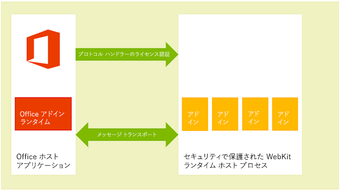
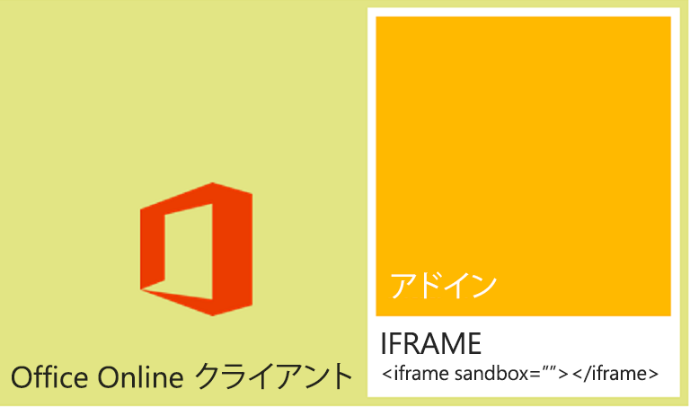

# <a name="privacy-and-security-for-office-add-ins"></a>Office アドインのプライバシーとセキュリティ

## <a name="understanding-the-add-in-runtime"></a>アドインのランタイムについて

Office アドインは、アドインのランタイム環境、複数層のアクセス許可モデル、およびパフォーマンス ガバナーによって保護されます。 このフレームワークは、次の方法でユーザーのエクスペリエンスを保護します。

- クライアント アプリケーションOffice UI フレームへのアクセスが管理されます。

- クライアント アプリケーションの UI Officeへの間接的なアクセスのみ許可されます。

- モーダル操作は許可されません 。たとえば、JavaScript の呼び出し、およびモーダルなので関数 `alert` `confirm` `prompt` は許可されません。

さらに、ランタイム フレームワークには、次の利点があります。これにより、Officeアドインがユーザーの環境を損なう可能性があります。

- アドインが実行されるプロセスを分離します。

- .dll や .exe の置き換えも、ActiveX コンポーネントも必要ありません。

- アドインのインストールとアンインストールが容易になります。

また、Office アドインによるメモリ、CPU、およびネットワーク リソースの使用が管理可能になり、良好なパフォーマンスと信頼性が確保されます。

以下のセクションでは、ランタイム アーキテクチャが Office ベースのデバイス、Mac OS X デバイス、および Web ブラウザーでの Windows Office クライアントでのアドインの実行をサポートする方法について簡単に説明します。

### <a name="clients-on-windows-and-os-x-devices"></a>Windows および OS X のデバイス用のクライアント

Windows 版の Excel、Windows 版および Mac 版の Outlook など、デスクトップおよびタブレット デバイス用のサポート対象クライアントでは、インプロセス コンポーネントである Office アドイン ランタイムを統合することで、Office アドインをサポートしています。このランタイムは、アドインのライフサイクルを管理し、アドインとクライアント アプリケーションの相互運用を可能にします。アドインの Web ページ自体は、プロセスの外部にホストされます。図 1 に示すように、Windows のデスクトップ デバイスやタブレット デバイスでは、[アドインの Web ページは Internet Explorer または Microsoft Edge コントロール内にホストされ](browsers-used-by-office-web-add-ins.md)、この Internet Explorer または Microsoft Edge コントロールのほうはアドインのランタイム プロセス内にホストされます。そのようにして、セキュリティとパフォーマンスの分離が実現されます。

Windows デスクトップの場合は、制限付きサイト ゾーンに対して Internet Explorer の保護モードを有効にする必要があります。これは通常、既定で有効にされています。無効になっている場合、アドインを起動しようとすると[エラーが発生](https://support.microsoft.com/help/2761180/apps-for-office-don-t-start-if-you-disable-protected-mode-for-the-restricted-sites-zone-in-internet-explorer)します。

*図 1.Windows ベースのデスクトップおよびタブレットのクライアントにおける Office アドインのランタイム環境*


次の図に示すように、Mac OS X デスクトップでは、アドイン Web ページがサンドボックス WebKit ランタイム ホスト プロセス内でホストされ、同様のレベルのセキュリティとパフォーマンス保護を実現できます。

*図 2.OfficeMac OS X クライアントのアドインランタイム環境*



Office アドイン ランタイムは、プロセス間通信、JavaScript API 呼び出しとイベントの固有形式への変換、および UI リモート処理サポートを管理し、アドインがドキュメント内や作業ウィンドウ内、あるいは電子メール メッセージ、会議出席依頼、予定の隣に表示されるようにします。

### <a name="web-clients"></a>Web クライアント

サポートされている Web クライアントでは、Officeアドインは HTML5 サンドボックス属性を使用して実行される **iframe** で **ホスト** されます。 ActiveX コンポーネントや Web クライアントのメイン ページでのナビゲーションは許可されていません。 Office アドインのサポートは、JavaScript API for Office の統合によって Web クライアント内で有効になっています。 デスクトップ クライアント アプリケーションの場合と同様、JavaScript API はアドインのライフサイクルや、アドインと Web クライアントの間の相互運用性を管理します。 この相互運用性は、特別なクロスフレーム ポスト メッセージ通信インフラストラクチャを使用して実現されています。 Web クライアントとの対話には、デスクトップ クライアント上で使用されるのと同じ JavaScript ライブラリ (Office.js) を使用できます。 次の図は、ブラウザーで実行されている Office のアドインをサポートするインフラストラクチャと、それらをサポートするために必要な関連コンポーネント (Web クライアント **、iframe、Office** アドイン ランタイム、および Office 用 JavaScript API) を示しています。

*図 3.Office Web クライアント内で Office アドインをサポートするインフラストラクチャ*



## <a name="add-in-integrity-in-appsource"></a>AppSource でのアドインの整合性

Office アドインは、AppSource で公開することで利用可能にできます。 AppSource は、アドインの整合性を維持するために、次の措置を適用します。

- Office アドインのホスト サーバーでは、通信に必ず Secure Socket Layer (SSL) を使用する必要があります。

- 開発者はアドインを提出する際に、ID の証明、契約上の合意、および法規制に準拠したプライバシー ポリシーを提供する必要があります。

- 使用可能なアドインに対するユーザーレビュー システムをサポートしてコミュニティの自己管理を促します。

## <a name="optional-connected-experiences"></a>オプションの接続エクスペリエンス

エンド ユーザーと IT 管理者は、[Office のデスクトップ クライアントとモバイル クライアントでオプションの接続エクスペリエンスを](/deployoffice/privacy/optional-connected-experiences) オフにすることができます。 アドインOffice、オプションの接続エクスペリエンスの設定を無効にした場合の影響は、ユーザーがこれらのクライアントを介してアドインまたは Office ストアにアクセスできなくなった場合です。 ただし、必須またはビジネスクリティカルと見なされる特定の Microsoft アドインと、組織の IT 管理者が集中展開を通じて展開する[](../publish/centralized-deployment.md)アドインは引き続き利用できます。 また、アドインとストアは、設定の状態に関係Outlook on the web、アプリ内で引き続き使用できます。

ユーザー固有の動作Outlook詳細については、「プライバシー、アクセス許可、セキュリティ」を参照Outlook[してください](../outlook/privacy-and-security.md#optional-connected-experiences)。

IT 管理者が Office で接続[](/deployoffice/privacy/manage-privacy-controls#policy-setting-for-most-connected-experiences)エクスペリエンスの使用を無効にした場合、オプションの接続エクスペリエンスをオフにした場合と同じ効果がアドインに及ぼす点に注意してください。

## <a name="addressing-end-users-privacy-concerns"></a>エンド ユーザーのプライバシー問題への対応

ここでは、Office アドイン プラットフォームから提供される保護を顧客 (エンド ユーザー) の視点から説明し、ユーザーの期待に応える方法とユーザーの個人情報 (PII) を安全に取り扱う方法に関するガイドラインを提供します。

### <a name="end-users-perspective"></a>エンド ユーザーの認知

Office アドインは、ブラウザー コントロールまたは **iframe** 内で実行する Web テクノロジを使用して構築されています。そのため、アドインの使用は、インターネットまたはイントラネット上で Web サイトを閲覧することと似ています。アドインは、組織の外部に存在することも (AppSource からアドインを入手する場合)、内部に存在することも (Exchange Server アドイン カタログ、SharePoint アプリ カタログ、または組織のネットワーク上のファイル共有からアドインを入手する場合) あります。アドインはネットワークへのアクセスが制限されますが、ほとんどのアドインは作業中のドキュメントやメール アイテムの読み書きができます。ユーザーや管理者がアドインをインストールまたは起動する前に、アドイン プラットフォームによって特定の制約が課されます。ただし、拡張性モデルと同様に、未知のアドインの起動は慎重に行う必要があります。

> [!NOTE]
> ユーザーは、アドインが初めて読み込まれると、ドメインを信頼するセキュリティ プロンプトが表示される場合があります。 これは、アドインのドメイン ホストがオンプレミスまたはオンプレミスのドメインのExchange外にある場合に発生Office Online Server。

アドイン プラットフォームは、次の方法でエンド ユーザーのプライバシーに関する懸念に対応します。

- コンテンツ アドイン、Outlook アドイン、または作業ウィンドウ アドインをホストする Web サーバーとやり取りされるデータ、およびアドインとそれが使用する Web サービス間の通信は、Secure Socket Layer (SSL) プロトコルを使用して暗号化する必要があります。

- ユーザーは、AppSource からアドインをインストールする前に、そのアドインのプライバシー ポリシーと要件を表示できます。さらに、ユーザーのメールボックスとやり取りする Outlook アドインでは、アドインに必要なアクセス許可が具体的に表示されます。ユーザーは Outlook アドインをインストールする前に、使用条件、要求されるアクセス許可、およびプライバシー ポリシーを確認できます。

- ドキュメントを共有する場合、ユーザーはそのドキュメントに挿入されているアドインまたはそのドキュメントに関連付けられているアドインも共有することになります。 ユーザーが以前に使用したことがないアドインを含むドキュメントを開くと、Office クライアント アプリケーションは、ドキュメントで実行するアドインのアクセス許可をユーザーに付与するように求めるメッセージを表示します。 組織環境では、Officeクライアント アプリケーションは、ドキュメントが外部ソースから取得された場合にもユーザーにメッセージを表示します。

- ユーザーは、AppSource へのアクセスを有効または無効にすることができます。 コンテンツ アドインと作業ウィンドウ アドインの場合、ユーザーはホスト Office クライアントの信頼センターから信頼できるアドインとカタログへのアクセスを管理します (ファイル オプションセキュリティ センター セキュリティ センター 設定 信頼できるアドイン カタログから開きます  >    >    >    >  )。 Outlookアドインでは、[アドインの管理] ボタンを選択してアドインを管理できます。Windowsの Outlook で、[ファイル管理アドイン] を選択します。   >  Mac Outlookで、アドイン バーの **[** アドインの管理] ボタンを選択します。 Outlook on the web では、**[設定]** メニュー (歯車アイコン) > **[アドインを管理する]** を選択します。管理者は [グループ ポリシーを使用することによって](/previous-versions/office/office-2013-resource-kit/jj219429(v=office.15)#using-group-policy-to-manage-how-users-can-install-and-use-apps-for-office)、このようなアクセスも管理することができます。

- アドイン プラットフォームの設計は、次の方法でエンド ユーザーにセキュリティとパフォーマンスを提供します。

  - アドインOfficeは、アドイン のランタイム環境でホストされる Web ブラウザー コントロールで、クライアント アプリケーションとは別Office実行されます。 この設計は、クライアント アプリケーションからのセキュリティとパフォーマンスの両方の分離を提供します。

  - アドインは Web ブラウザー コントロール下で動作するため、ブラウザーで動作する通常の Web ページとほぼ同じ処理を実行できますが、同時に、ドメイン分離のための同一生成元ポリシーとセキュリティ ゾーンを遵守するように制限されます。

Outlook アドイン固有のリソース使用量監視機能により、Outlook アドインはセキュリティとパフォーマンスの追加の機能を提供します。詳細については、「[Outlook アドインに関するプライバシー、アクセス許可、セキュリティ](../outlook/privacy-and-security.md)」を参照してください。

### <a name="developer-guidelines-to-handle-pii"></a>PII の取り扱いに関する開発ガイドライン

次に、アドインの開発者として特定の PII 保護Office示します。

- [Settings](/javascript/api/office/office.settings) オブジェクトは、コンテンツ アドインまたは作業ウィンドウ アドインに関する設定やセッション間の状態データの永続化に使用できますが、パスワードやその他の機密性の高い PII を **Settings** オブジェクトに保存してはいけません。**Settings** オブジェクト内のデータはエンド ユーザーには表示されませんが、容易にアクセスできるドキュメントのファイル形式の一部として保存されます。アドインの PII の使用を制限し、アドインに必要な PII はユーザー保護リソースとしてアドインをホストするサーバーに保存する必要があります。

- 一部のアプリケーションを使用すると PII が公開されてしまう可能性があります。ユーザーの ID、所在、アクセス時間、およびその他の資格情報に関するデータが安全に保存されていて、アドインの他のユーザーが使用できないことを確認してください。

- アドインが AppSource で入手可能な場合は、AppSource の HTTPS 要件によって Web サーバーとクライアント コンピューターまたはデバイスとの間で転送される PII が保護されます。ただし、データを他のサーバーに再転送する場合は、これと同レベルの保護が適用されることを確認してください。

- ユーザーの PII を保存する場合は、その事実を公開し、ユーザーがそれを検査して削除できる方法を提供します。アドインを AppSource に送信する場合は、収集するデータとその用途をプライバシーに関する声明の中で説明できます。

## <a name="developers-permission-choices-and-security-practices"></a>開発者によるアクセス許可の選択とセキュリティ手法

Office アドインのセキュリティ モデルをサポートするための以下の一般的なガイドラインを踏まえたうえで、アドインの種類ごとの詳細について調べます。

### <a name="permissions-choices"></a>アクセス許可の選択

アドイン プラットフォームは、その機能で必要なユーザー データへのアクセス レベルを宣言する、アドインが使用するアクセス許可のモデルを提供します。 それぞれのアクセス許可レベルは、アドインがその機能で使用することが許可されている JavaScript API for Office のサブセットに対応しています。 たとえば、コンテンツ アドインと作業ウィンドウ アドインの **WriteDocument** アクセス許可を使用すると、ユーザーのドキュメントへの書き込みをアドインに許可する [Document.setSelectedDataAsync](/javascript/api/office/office.document) メソッドにアクセスできますが、ドキュメントからデータを読み取るメソッドへのアクセスは許可されません。 このアクセス許可レベルは、ユーザーのドキュメントにデータを挿入するためにユーザーが照会できるアドインなど、ドキュメントに書き込みのみを行う必要があるアドインに適しています。

ベスト プラクティスとしては、_最小限の特権_ の原則に基づいてアクセス許可を要求するべきです。つまり、アドインが正しく機能するために必要な最小限の API サブセットにのみアクセスする許可を要求します。たとえば、ユーザーのドキュメントのデータさえ読み込めばアドインが正しく機能する場合、**ReadDocument** 以外のアクセス許可を要求しません。(ただし、要求したアクセス許可が不十分な場合は、アドイン プラットフォームによってアドインによる一部の API の使用がブロックされ、ランタイム エラーが発生する可能性があることに注意してください)。

次の例に示すように、アドインのマニフェストでアクセス許可を指定すれば、エンド ユーザーは、アドインを初めてインストールまたはアクティブにする前に、アドインの要求されたアクセス許可レベルを確認できます。 さらに **、ReadWriteMailbox** Outlook要求するアドインをインストールするには、明示的な管理者特権が必要です。

次の例は、作業ウィンドウ アドインがマニフェストで **ReadDocument** アクセス許可を指定する方法を示しています。 アクセス許可に注目できるようにマニフェスト内の他の要素は省略しています。

```xml
<?xml version="1.0" encoding="utf-8"?>
<OfficeApp xmlns="http://schemas.microsoft.com/office/appforoffice/1.0"
           xmlns:xsi="http://www.w3.org/2001/XMLSchema-instance" 
           xmlns:ver="http://schemas.microsoft.com/office/appforoffice/1.0"
           xsi:type="TaskPaneApp">

... <!-- To keep permissions as the focus, not displaying other elements. -->
  <Permissions>ReadDocument</Permissions>
...
</OfficeApp>
```

作業ウィンドウ アドインとコンテンツ アドインのアクセス許可の詳細については、「[アドインでの API 使用についてアクセス許可を要求する](../develop/requesting-permissions-for-api-use-in-content-and-task-pane-add-ins.md)」を参照してください。

アドインのアクセス許可のOutlookについては、次のトピックを参照してください。

- [Outlook アドインに関するプライバシー、アクセス許可、セキュリティ](../outlook/privacy-and-security.md)

- [Outlook アドインのアクセス許可を理解する](../outlook/understanding-outlook-add-in-permissions.md)

### <a name="same-origin-policy"></a>同一生成元ポリシー

アドインOffice Web ブラウザー コントロールで実行される Web ページなので、ブラウザーによって適用される同じオリジン ポリシーに従う必要があります。 既定では、あるドメインの Web ページでは、ホストされているドメイン以外の別のドメインに対して [XmlHttpRequest](https://www.w3.org/TR/XMLHttpRequest/) Web サービス呼び出しを行うことはできません。

この制限を克服する方法の 1 つは、JSON/P を使用する方法の 1 つで、別のドメインでホストされているスクリプトを示す **src** 属性を含むスクリプト タグを含めて、Web サービスのプロキシを提供します。  スクリプト タグをプログラムで作成し **、src** 属性をポイントする URL を動的に作成し、URI クエリ パラメーターを使用して URL にパラメーターを渡します。 Web サービス プロバイダーは、固有の URL で JavaScript コードを作成およびホストし、URI クエリ パラメーターに応じて異なるスクリプトを返します。 それらのスクリプトは挿入された場所で実行され、想定どおりに動作します。

Outlook アドインでの JSON/P の例を次に示します。 

```js
// Dynamically create an HTML SCRIPT element that obtains the details for the specified video.
function loadVideoDetails(videoIndex) {
    // Dynamically create a new HTML SCRIPT element in the webpage.
    var script = document.createElement("script");
    // Specify the URL to retrieve the indicated video from a feed of a current list of videos,
    // as the value of the src attribute of the SCRIPT element. 
    script.setAttribute("src", "https://gdata.youtube.com/feeds/api/videos/" + 
        videos[videoIndex].Id + "?alt=json-in-script&amp;callback=videoDetailsLoaded");
    // Insert the SCRIPT element at the end of the HEAD section.
    document.getElementsByTagName('head')[0].appendChild(script);
}
```

Exchange と SharePoint は、クロス ドメイン アクセスを可能にするためにクライアント側のプロキシを提供します。一般に、イントラネット上の同一生成元ポリシーは、インターネット上のポリシーほど厳密ではありません。詳細については、「[同一生成元ポリシー第 1 部: ピーク禁止](/archive/blogs/ieinternals/same-origin-policy-part-1-no-peeking)」および「[Office アドインにおける同一生成元ポリシーの制限事項に対応する](../develop/addressing-same-origin-policy-limitations.md)」を参照してください。

### <a name="tips-to-prevent-malicious-cross-site-scripting"></a>悪意のあるクロスサイト スクリプティングを回避するヒント

悪意のあるユーザーが、ドキュメントやアドインのフィールドを経由して悪意のあるスクリプトを入力し、アドインの入手元を攻撃する場合があります。 開発者は、ドメイン内で悪意のあるユーザーの JavaScript が実行されないようにユーザー入力を処理する必要があります。 ドキュメントまたはメール メッセージからのユーザー入力、またはアドインのフィールドを使用してユーザー入力を処理する場合は、次の方法に従ってください。

- 可能であれば、DOM プロパティの [innerHTML](https://developer.mozilla.org/docs/Web/API/Element/innerHTML) ではなく、[innerText](https://developer.mozilla.org/docs/Web/API/Node/innerText) および [textContent](https://developer.mozilla.org/docs/DOM/Node.textContent) プロパティを使用します。 ブラウザーと Firefox のクロスInternet Explorerサポートについては、次の手順を実行します。

    ```js
     var text = x.innerText || x.textContent
    ```

    **innerText** と **textContent** の違いについては [、「Node.textContent」を参照してください](https://developer.mozilla.org/docs/DOM/Node.textContent)。 一般的なブラウザー間での DOM の互換性の詳細については、「[W3C DOM 互換性](https://www.quirksmode.org/dom/w3c_html.html#t07)」を参照してください。

- innerHTML を使用 **する必要** がある場合は、ユーザーの入力に悪意のあるコンテンツが含まれているのを確認してから **、innerHTML に渡してください**。 **innerHTML** を安全に使用する方法とその例については、[innerHTML](https://developer.mozilla.org/docs/Web/API/Element/innerHTML) プロパティを参照してください。

- jQuery を使用している場合は、[.html()](https://api.jquery.com/text/) メソッドの代わりに [.text()](https://api.jquery.com/html/) メソッドを使用してください。

- 
  [toStaticHTML](https://developer.mozilla.org/en-US/docs/Web/HTML/Reference) メソッドを使用して、ユーザーの入力から動的な HTML 要素と属性を削除したうえで、**innerHTML** に入力を渡してください。

- 
  [encodeURIComponent](https://developer.mozilla.org/docs/Web/JavaScript/Reference/Global_Objects/encodeuricomponent) または [encodeURI](https://developer.mozilla.org/docs/Web/JavaScript/Reference/Global_Objects/encodeuri) 関数を使用して、参照元 URL またはユーザーの入力を含む URL として使用できるようにテキストをエンコードしてください。

- より安全に使用できる Web ソリューションを作成するためのその他のベスト プラクティスについては、「[セキュリティで保護されたアドインを開発する](/previous-versions/windows/apps/hh849625(v=win.10))」を参照してください。

### <a name="tips-to-prevent-clickjacking"></a>「クリックジャック」を防止するためのヒント

Office アドインは、Office クライアント アプリケーションを使用してブラウザーで実行する場合に iframe でレンダリングされます。次のヒントを使用して、クリックジャックのリスクを最小限[](https://en.wikipedia.org/wiki/Clickjacking)に抑える-つまり、ハッカーがユーザーをだまして機密情報を明らかにする手法を使用します。

まず、アドインが実行できる機密性の高いアクションを特定します。これには、未承認のユーザーが悪用できる、財務トランザクションの開始や機密データの公開などのアクションが含まれます。たとえば、アドインが支払いをユーザー定義の受信者に送信できる場合があります。

2 番目に、機密性の高いアクションでは、アドインがアクションを実行する前に、ユーザーに確認を求める必要があります。この確認では、アクションの影響を詳細に示す必要があります。また、「許可しない」と書かれた特定のボタンを選択するか、確認を無視することで、必要に応じてユーザーがアクションを止める方法も詳細に示す必要があります。

3 番目に、潜在的な攻撃者が確認を非表示にしたり覆い隠したりする可能性がないようにするため、確認をアドインのコンテキストの外部 (HTML ダイアログ ボックスの外部) に表示する必要があります。

確認を取得する方法の例を次に示します。

- 確認のリンクが含まれている電子メールをユーザーに送信します。

- ユーザーがアドインで入力できる確認コードが含まれているテキスト メッセージをユーザーに送信します。

- iframe に対応していないページについて、新しいブラウザー ウィンドウで確認ダイアログを開きます。これは通常、ログイン ページで使用するパターンです。新しいダイアログを作成するには、[ダイアログ API](../develop/dialog-api-in-office-add-ins.md) を使用します。

また、ユーザーへの連絡に使用されているアドレスが、潜在的な攻撃者によって提供されている可能性がないことを確認してください。たとえば、支払いの確認には、承認されたユーザーのアカウントに関するファイル内のアドレスを使用します。

### <a name="other-security-practices"></a>その他のセキュリティ手法

開発者は、次のセキュリティプラクティスにも注意する必要があります。

- ActiveX コントロールはアドイン プラットフォームのクロス プラットフォームの特性をサポートしていないため、開発者は Office アドインで ActiveX コントロールを使用しないでください。

- コンテンツ アドインと作業ウィンドウ アドインは、ブラウザーが既定で使用するものと同じ SSL 設定を使用することを前提としているため、ほとんどのコンテンツは SSL でのみ提供されていても問題ありません。Outlook アドインは、すべてのコンテンツが SSL で提供されている必要があります。開発者は、アドインの HTML ファイルの場所を示すときに、アドイン マニフェストの **SourceLocation** 要素で HTTPS を使用する URL を指定する必要があります。

  アドインが HTTP を使用してコンテンツを配信していない場合は、アドインをテストするときに、開発者はコントロール パネルの [インターネット オプション] で次の設定が選択され、テスト シナリオにセキュリティ警告が表示されない必要があります。

  - インターネット ゾーンのセキュリティ設定 [**混在コンテンツの表示**] が [プロンプト] に設定されている必要 **があります**。  これを行うには、[インターネット **オプション:]** の [セキュリティ] タブで、[インターネットゾーン] を選択し、[カスタム レベル] を選択し、スクロールして [混在コンテンツの表示] を探し、まだ選択されていない場合は [プロンプト] を選択します。  

  - **[インターネット オプション]** ダイアログ ボックスの **[詳細設定]** タブで、**[保護付き/保護なしのサイト間を移動する場合に警告する]** が選択されていることを確認します。

- アドインで CPU コアやメモリ リソースが過剰に使用され、クライアント コンピューターでサービス拒否が発生しないように、アドイン プラットフォームにはリソース使用量の上限が設けられています。開発者はテストの一環として、アドイン プラットフォームがリソース使用量の上限を超えていないかどうかを確認する必要があります。

- 開発者はアドインを発行する前に、アドイン ファイルで公開される個人を識別できる情報が保護されていることを確認する必要があります。

- 開発者は、アドインの HTML ページ内で直接サード パーティ API やサービス (Bing、Google、Facebook など) にアクセスするためのキーを埋め込まないようにしてください。代わりに、カスタム Web サービスを作成するか、キーを安全な Web ストレージの他の形態で保存して、キー値をアドインに渡すために呼び出すことができるようにする必要があります。

- 開発者は、AppSource にアドインを提出するときに次の操作を行う必要があります。

  - SSL をサポートする Web サーバーで、提出するアドインをホストする。
  - 法規制に準拠したプライバシー ポリシーを記載した声明を作成する。
  - アドインの提出時に契約合意書に署名する。

Outlook アドインの開発者は、リソース使用量のルール以外に、アクティブ化ルールの指定と JavaScript API の使用に関する制限についてもアドインが遵守していることを確認する必要があります。詳細については、「[Outlook アドインのアクティブ化と JavaScript API に関する制限事項](../outlook/limits-for-activation-and-javascript-api-for-outlook-add-ins.md)」を参照してください。

## <a name="it-administrators-control"></a>IT 管理者による制御

企業の設定では、IT 管理者は、AppSource とプライベート カタログへのアクセスの有効化または無効化に対して最終的な権限を持ちます。

Office 設定の管理と適用はグループ ポリシー設定で行われます。 これらは、[Office カスタマイズ ツール](/deployoffice/overview-of-the-office-customization-tool-for-click-to-run)と共に [Office 展開ツール](/deployoffice/overview-of-the-office-2016-deployment-tool)を介して構成できます。

| 設定名 | 説明 |
|--------------|-------------|
| セキュリティで保護されていないアドインとカタログの許可 | セキュリティで保護されていないアドインをユーザーが実行できるようにします。セキュリティで保護されていないアドインとは、SSL でセキュリティ保護 (https://) されていない、ユーザーのインターネット ゾーンにない、Web ページまたはカタログの場所が含まれるアドインです。 |
| Web アドインのブロック | ユーザーが Web アドインを使用できないようにします。 |
| Office ストアのブロック |  Office ストアから入手した Web アドインをユーザーが使用または挿入できないようにします。 |

> [!IMPORTANT]
> 作業グループが複数のリリースの Office を使用している場合は、リリースごとにグループ ポリシー設定を構成する必要があります。 Office 2013 のグループ ポリシー設定の詳細については、記事「[Office 2013 用アプリの概要](/previous-versions/office/office-2013-resource-kit/jj219429(v%3doffice.15))」の「[グループ ポリシーを使用して、ユーザーが Office 用アプリをインストールおよび使用する方法を管理する](/previous-versions/office/office-2013-resource-kit/jj219429(v=office.15)#using-group-policy-to-manage-how-users-can-install-and-use-apps-for-office)」を参照してください。

## <a name="see-also"></a>関連項目

- [アドインでの API 使用についてアクセス許可を要求する](../develop/requesting-permissions-for-api-use-in-content-and-task-pane-add-ins.md)
- [Outlook アドインに関するプライバシー、アクセス許可、セキュリティ](../outlook/privacy-and-security.md)
- [Outlook アドインのアクセス許可を理解する](../outlook/understanding-outlook-add-in-permissions.md)
- [Outlook アドインのアクティブ化と JavaScript API の制限](../outlook/limits-for-activation-and-javascript-api-for-outlook-add-ins.md)
- [Office アドインにおける同一生成元ポリシーの制限への対処](../develop/addressing-same-origin-policy-limitations.md)
- [同一生成元ポリシー](https://www.w3.org/Security/wiki/Same_Origin_Policy)
- [同一生成元ポリシー パート 1:ピーク禁止](/archive/blogs/ieinternals/same-origin-policy-part-1-no-peeking)
- [JavaScript の同一生成元ポリシー](https://developer.mozilla.org/docs/Web/Security/Same-origin_policy)
- [IE 保護モード](https://support.microsoft.com/help/2761180/apps-for-office-don-t-start-if-you-disable-protected-mode-for-the-restricted-sites-zone-in-internet-explorer)
- [Microsoft 365 アプリのプライバシー コントロール](/deployoffice/privacy/overview-privacy-controls)
