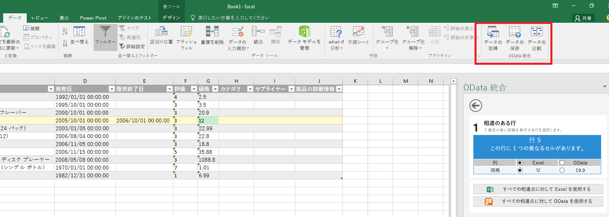

# Excel、PowerPoint、Word のアドイン コマンド

アドイン コマンドは、Office UI を拡張し、アドインでアクションを開始する UI 要素です。アドイン コマンドを使用すると、リボン上のボタンやアイテムをコンテキスト メニューに追加できます。ユーザーがアドイン コマンドを選択すると、JavaScript コードを実行したり、アドインのページを作業ウィンドウに表示するなどのアクションが開始されます。アドイン コマンドは、ユーザーがアドインを検索して使用ために役立ちます。これにより、アドインの導入と再利用を促進し、顧客維持率を向上させることができます。

機能の概要については、ビデオ「[Office アプリ リボンのアドイン コマンド](https://channel9.msdn.com/events/Build/2016/P551)」を参照してください。

> [!NOTE]
> SharePoint カタログは、アドイン コマンドをサポートしていません。 [統合アプリ](/microsoft-365/admin/manage/test-and-deploy-microsoft-365-apps)または [AppSource](/office/dev/store/submit-to-appsource-via-partner-center) でアドイン コマンドを展開するか、[サイドロード](../testing/create-a-network-shared-folder-catalog-for-task-pane-and-content-add-ins.md)を使用してテスト用のアドイン コマンドを展開できます。

> [!IMPORTANT]
> アドイン コマンドは、Outlook でもサポートされています。 詳細については、「[Outlook のアドイン コマンド](../outlook/add-in-commands-for-outlook.md)」を参照してください。

*図 1. Excel デスクトップで実行するコマンドを含むアドイン*

*図 2. Excel on the web で実行するコマンドを含むアドイン*

## コマンドの機能

現在は、次のコマンド機能がサポートされています。

> [!NOTE]
> 現在、コンテンツ アドインは、アドイン コマンドをサポートしていません。

### 拡張点

- リボン タブ: 組み込みのタブを拡張するか、新しいカスタム タブを作成します。
- コンテキスト メニュー: 選択されたコンテキスト メニューを拡張します。

### コントロールの種類

- 単純なボタン: 特定のアクションをトリガーします。
- メニュー: アクションをトリガーするボタン付きの単純なメニューのドロップダウン。

### アクション

- ShowTaskpane: カスタムの HTML ページをロードする 1 つまたは複数のウィンドウを表示します。
- ExecuteFunction: 非表示の HTML ページをロードして、JavaScript 関数を実行します。関数内で UI を表示するには (エラー、進行状況、追加入力など)、[displayDialog](/javascript/api/office/office.ui) API を使用できます。  

### 既定で有効または無効になっている状態 

アドイン起動時にコマンドを有効にするか無効にするかを指定したり、プログラムによって設定を変更したりできます。

> [!NOTE]
> この機能はすべての Office アプリケーションまたはシナリオでサポートされてはいません。 詳細については、「[アドイン コマンドを有効または無効にする](disable-add-in-commands.md)」を参照してください。

### リボンの位置 (プレビュー)

「ホームタブのすぐ右側」など、Office アプリケーションのリボンのどこにカスタム タブを表示するかを指定できます。

> [!NOTE]
> この機能はすべての Office アプリケーションまたはシナリオでサポートされてはいません。 詳細については、「[リボンにカスタムタブを配置する](custom-tab-placement.md)」を参照してください。

### 組み込みの Office ボタンの統合 (プレビュー)

組み込みの Office リボン ボタンをカスタム コマンド グループとカスタム リボン タブに挿入できます。

> [!NOTE]
> この機能はすべての Office アプリケーションまたはシナリオでサポートされてはいません。 詳細については、「[組み込みの Office ボタンをカスタム タブに統合する](built-in-button-integration.md)」を参照してください。

### コンテキスト タブ (プレビュー)

Excel でグラフが選択されている場合など、特定のコンテキストでのみタブがリボンに表示されるように指定できます。

> [!NOTE]
> この機能はすべての Office アプリケーションまたはシナリオでサポートされてはいません。 詳細については、「[Office アドインでカスタム コンテキスト タブを作成する (プレビュー)](contextual-tabs.md)」を参照してください。

## サポートされるプラットフォーム

現在アドイン コマンドは、以前に[コマンドの機能](#command-capabilities)のサブ セクションで指定された制限を除いて、次のプラットフォームでサポートされています。

- Windows 上の Office (ビルド 16.0.6769 以降、Microsoft 365 サブスクリプションに接続済み)
- Windows 版 Office 2019
- Mac 上の Office (ビルド 15.33 以降、Microsoft 365 サブスクリプションに接続済み)
- Mac 上の Office 2019
- Office on the web

> [!NOTE]
> Outlook でのサポートについては、「[Outlook のアドイン コマンド](../outlook/add-in-commands-for-outlook.md)」をご覧ください。

## デバッグ

アドイン コマンドをデバッグするには、Office on the web で実行する必要があります。 詳細については、「[Office on the web でアドインをデバッグする](../testing/debug-add-ins-in-office-online.md)」を参照してください。

## ベスト プラクティス

アドイン コマンドを開発するときは、次のベスト プラクティスを適用します。

- ユーザーに対して、特定のアクションとともにアクションの結果を明確かつ具体的に表すコマンドを使用します。複数のアクションを 1 つのボタンにまとめないでください。
- アドイン内の一般的なタスクをより効率的に実行できるように、アクションは細分化して提供します。1 つのアクションを完了するまでのステップ数は最小限に抑えます。
- Office アプリ リボンにコマンドを配置するために。
  - 提供する機能が適応する場合は既存のタブ (挿入、レビューなど) にコマンドを配置します。たとえば、アドインを使用することでユーザーがメディアを挿入できる場合は、[挿入] タブにグループを追加します。Office のすべてのバージョンで、すべてのタブが使用可能なわけではない点に注意してください。詳細については、「[Office アドイン XML マニフェスト](../develop/add-in-manifests.md)」を参照してください。
  - 別のタブに機能が適応せず、トップ レベル コマンドが 6 個未満の場合は、[ホーム] タブにコマンドを配置します。Office on the web やデスクトップなど、Office の複数のバージョン間でアドインを操作する必要があり、タブがどのバージョンでも利用できるわけではない場合 (たとえば、[デザイン] タブは Office on the web にはありません) は、[ホーム] タブにコマンドを追加できます。  
  - 6 個以上のトップ レベル コマンドがある場合は、コマンドをカスタム タブに配置します。
  - グループに、アドインの名前と一致する名前を指定します。グループが複数ある場合は、そのグループのコマンドが提供する機能に基づいた名前を各グループに付けます。
  - アドインの使用スペースを増やす余分なボタンを追加しないでください。
  - ユーザーがドキュメントを操作する主な方法がアドインである場合を除き、カスタムタブを [ホーム] タブの左側に配置したり、ドキュメントを開いたときに既定でフォーカスを設定したりしないでください。 アドインの不便さを過度に目立たせ、ユーザーや管理者を悩ませます。
  - アドインがユーザーがドキュメントを操作する主な方法であり、カスタム リボン タブがある場合は、ユーザーが頻繁に必要とする Office 機能のボタンをタブに統合することを検討してください。
  - カスタム タブで提供される機能を特定のコンテキストでのみ使用できるようにする必要がある場合は、[カスタム コンテキスト タブ](contextual-tabs.md)を使用します。 カスタム コンテキスト タブを使用する場合は、[カスタム コンテキスト タブをサポートしていないプラットフォームでアドインを実行する場合のフォールバック エクスペリエンス](contextual-tabs.md#implement-an-alternate-ui-experience-when-custom-contextual-tabs-are-not-supported)を実装します。

  > [!NOTE]
  > 占有領域が大きすぎるアドインは [AppSource 検証](/legal/marketplace/certification-policies)を通過しない場合があります。

- すべてのアイコンについては、[アイコン デザインのガイドライン](add-in-icons.md)に従ってください。
- コマンドをサポートしていない Office アプリケーションでも動作するアドインのバージョンを提供します。1 つのアドインのマニフェストは、コマンド対応 (コマンドを使用) アプリケーションとコマンド非対応 (作業ウィンドウとして) アプリケーションの両方で動作します。

   *図 3. Office 2013 の作業ウィンドウのアドインと、Office 2016 のアドイン コマンドを使用する同じアドイン*

   

## 次の手順

アドイン コマンドの使用を開始するために最適な方法は、GitHub の「[Office-Add-in-Commands-Samples](https://github.com/OfficeDev/Office-Add-in-Commands-Samples/)」を参照することです。

マニフェストでのアドイン コマンドの指定の詳細については、「[マニフェストでアドイン コマンドを作成する](../develop/create-addin-commands.md)」と「[VersionOverrides 要素](../reference/manifest/versionoverrides.md)」のリファレンス資料をご覧ください。
