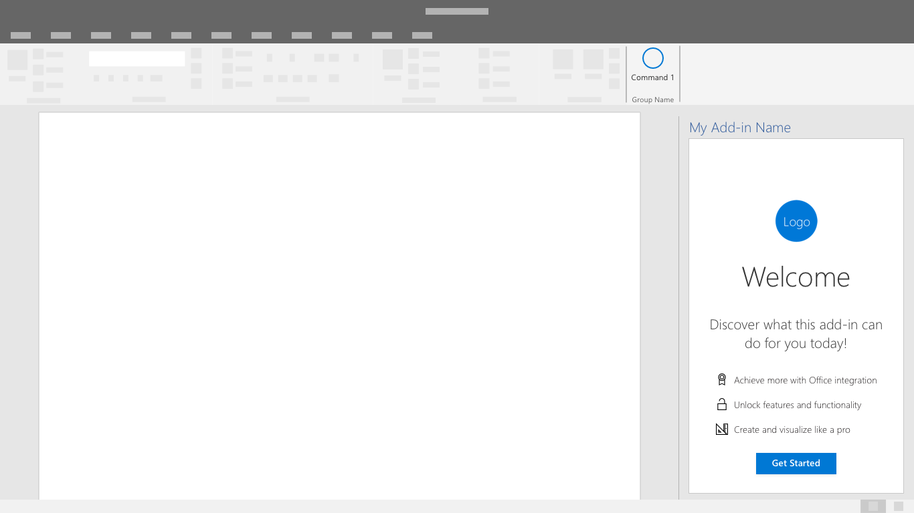

# 認証パターンAuthentication patterns

アドインの機能にユーザーがアクセスするには、サインインまたはサインアップする必要があります。Add-ins may require users to sign-in or sign-up in order to access features and functionality. 認証時の典型的なインターフェイス コントロールには、ユーザー名とパスワードの入力ボックスやサードパーティの資格情報フローを開始するボタンがあります。Input boxes for username and password or buttons that start third party credential flows are common interface controls in authentication experiences. ユーザーにアドインの使用を開始してもらうには、簡単で効率的に認証を導入することが重要な最初の一歩となります。A simple and efficient authentication experience is an important first step to getting users started with your add-in.

## ベスト プラクティスBest practices

|するべきことDo|してはいけないことDon't|
|:----|:----|
|サインインの前に、アドインの価値について説明し、アカウントを要求せずにこの機能を実際に使用します。Prior to sign-in, describe the value of your add-in or demonstrate functionality without requiring an account. |アドインの価値と長所を理解せずにサインインすることをユーザーに期待します。Expect users to sign-in without understanding the value and benefits of your add-in.|
|各画面に目立つ第 1 のボタンを配置し、ユーザーに認証フローを段階的に説明します。Guide users through authentication flows with a primary, highly visible button on each screen. |ボタンや行動喚起が競合する第 2 のタスクや第 3 のタスクに注意を向けさせます。Draw attention to secondary and tertiary tasks with competing buttons and calls to action.|
|"サインイン" や "アカウント作成" など、特定のタスクを説明するわかりやすいボタン ラベルを使用します。Use clear button labels that describe specific tasks like "Sign in" or "Create account". |認証フローでユーザーを誘導するとき、"送信" や "開始" のようなあいまいなボタン ラベルを使用します。Use vague button labels like "Submit" or "Get started" to guide users through authentication flows.|
|ダイアログを使用し、ユーザーの注意を認証フォームに向けさせます。Use a dialog to focus users' attention on authentication forms. |最初の実行エクスペリエンスと認証フォームで作業ウィンドウをあふれさせます。Overcrowd your task pane with a first run experience and authentication forms.|
|入力ボックスの自動フォーカスなど、フローの中に小さな効率性を見つけます。Find small efficiencies in the flow like auto-focusing on input boxes. |クリックしてフォーム フィールドに入るようにユーザーに要求するなど、操作に不要な手順を追加します。Add unnecessary steps to the interaction like requiring users to click into form fields.|
|ユーザーがサインアウトして再認証する方法を提供します。Provide a way for users to sign out and reauthenticate. |ID を切り替える際、アンインストールをユーザーに強制します。Force users to uninstall to switch identities.|

## 認証フローAuthentication flow

1. 初回実行プレースマット - アドインの最初の実行エクスペリエンス内にわかりやすい行動喚起としてサインイン ボタンを配置します。First Run Placemat - Place your sign-in button as a clear call-to action inside your add-in's first run experience.

    

1. ID プロバイダーの選択肢ダイアログ - ID プロバイダーのわかりやすい一覧を表示します。該当する場合、ユーザー名やパスワードのフォームも含めます。Identity Provider Choices Dialog - Display a clear list of identity providers including a username and password form if applicable. 認証ダイアログが開いているとき、アドイン UI はブロックされることがあります。Your add-in UI may be blocked while the authentication dialog is open.

    ![アプリケーションの [ID プロバイダーの選択肢] ダイアログをOfficeスクリーンショット](../images/add-in-auth-choices-dialog.png)

1. ID プロバイダーのサインイン - ID プロバイダーによって独自の UI が提供されます。Identity Provider Sign-in - The identity provider will have their own UI. Microsoft Azure Active Directory を使用すると、サインイン ページとアクセス パネル ページをカスタマイズして、サービスと一貫性のある外観を維持できます。Microsoft Azure Active Directory allows customization of sign-in and access panel pages for consistent look and feel with your service. [詳細を参照してください](/azure/active-directory/fundamentals/customize-branding)。[Learn More](/azure/active-directory/fundamentals/customize-branding).

    

1. 進捗状況 - 設定や UI の読み込みの進行状況を示します。Progress - Indicate progress while settings and UI load.

    

> [!NOTE]
> Microsoft の ID サービスを使用すると、商標付きのサインイン ボタンを使用できます。このボタンは淡色テーマまたは濃色テーマにカスタマイズできます。When using Microsoft's Identity service you'll have the opportunity to use a branded sign-in button that is customizable to light and dark themes. 詳細情報。Learn more.

## 単一Sign-On認証フローSingle Sign-On authentication flow

> [!NOTE]
> シングル サインオン API は現在、Word、Excel、Outlook、PowerPoint でサポートされています。The single sign-on API is currently supported for Word, Excel, Outlook, and PowerPoint. シングル サインオンのサポートの詳細については [、「IdentityAPI 要件セット」を参照してください](../reference/requirement-sets/identity-api-requirement-sets.md)。For more information about single sign-on support, see [IdentityAPI requirement sets](../reference/requirement-sets/identity-api-requirement-sets.md). Outlook アドインで作業している場合は、Microsoft 365 テナントの先進認証が有効になっていることを確認してください。If you are working with an Outlook add-in, be sure to enable Modern Authentication for the Microsoft 365 tenancy. この方法の詳細については、「[Exchange Online: テナントの先進認証を有効にする方法](https://social.technet.microsoft.com/wiki/contents/articles/32711.exchange-online-how-to-enable-your-tenant-for-modern-authentication.aspx)」を参照してください。For information about how to do this, see [Exchange Online: How to enable your tenant for modern authentication](https://social.technet.microsoft.com/wiki/contents/articles/32711.exchange-online-how-to-enable-your-tenant-for-modern-authentication.aspx).

シングル サインオンを使用すると、エンドユーザーのエクスペリエンスを円滑に実現できます。Use single sign-on for a smoother end-user experience. アドインへのサインインには、Office内のユーザーの ID (Microsoft アカウントまたは Microsoft 365 ID) が使用されます。The user's identity within Office (either a Microsoft Account or a Microsoft 365 identity) is used to sign in to your add-in. その結果、ユーザーは 1 回だけサインインします。As a result users only sign in once. お客様は途中で止められることなく、簡単に利用を開始できます。This removes friction in the experience making it easier for your customers to get started.

1. アドインがインストールされている間、ユーザーには次のような同意ウィンドウが表示されます。As an add-in is being installed, a user will see a consent window similar to the one following:

    

    > [!NOTE]
    > この同意ウィンドウに含まれるロゴ、文字列、アクセス許可の範囲については、アドインの発行元が制御します。The add-in publisher will have control over the logo, strings and permission scopes included in the consent window. UI は Microsoft が事前に構成したものです。The UI is pre-configured by Microsoft.

1. アドインはユーザーが同意した後で読み込まれます。The add-in will load after the user consents. ユーザーがカスタマイズした情報が必要であれば、それを抽出し、表示できます。It can extract and display any necessary user customized information.

    

## 関連項目See also

- SSO アドイン [の開発の詳細](../develop/sso-in-office-add-ins.md)Learn more about [developing SSO Add-ins](../develop/sso-in-office-add-ins.md)
