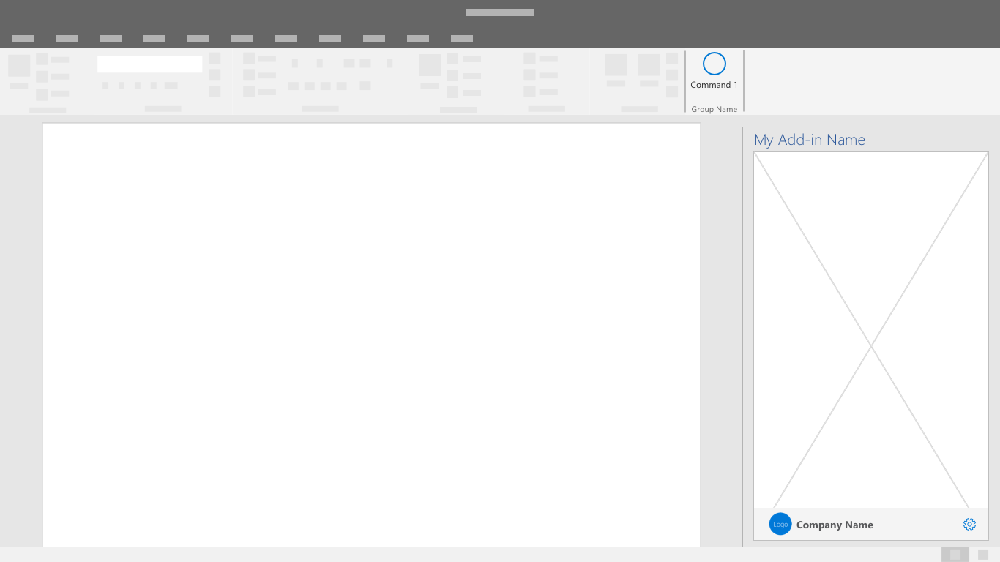

# ブランディング パターンBranding patterns

これらのパターンは、アドイン ユーザーにブランドの視認性とコンテキストを提供します。These patterns provide brand visibilty and context to your add-in users. 

## ベスト プラクティスBest practices

|するべきことDo |してはいけないことDon't|
|:---- |:----|
| 文字体裁や色など、ブランディング アクセントを適用した使い慣れた UI コンポーネントを使用してください。Use familiar UI components with applied branding accents like typography and color. | 確立された Office UI と矛盾する新しい UI コンポーネントを考案しないでください。Don't invent new UI components that contradict established Office UI. | 
| アドインのブランディングを UI の下部にあるブランドバーのフッターに配置してください。Place your add-in branding in a brand bar footer at the bottom of your UI. | UI 上部にあるすぐ隣のブランドバーで作業ウィンドウ名を繰り返さないでください。Don't repeat your task pane name in an immediately adjacent brand bar at the top of your UI. |
| ブランド要素を多用しないでください。Use brand elements sparingly. ソリューションが補完的なものとなるように Office に合わせてください。Fit your solution into Office such that is complementary. | 顧客にとって紛らわしく混乱するような、過剰にブランド化した要素を Office UI に挿入しないでください。Don't insert excessively branded elements into Office UI that distract and confuse customers. |
| ソリューションを認識可能にし、一貫性のあるビジュアル要素で画面を接続してください。Make your solution recognizable and connect your screens together with consistent visual elements. | 認識できない、また一貫性なく適用されたビジュアル要素でソリューションを隠さないでください。Don't hide your solution with unrecognizable and inconsistently applied visual elements. |
| 親サービスまたはビジネスとの接続を構築して、顧客がソリューションを把握し、信頼できるようにしてください。Build connection with a parent service or business to ensure that customers know and trust your solution. | 信頼と価値を築くために活用できる有用で理解しやすい関係がある場合は、顧客が新しいブランドコンセプトを習得しないようにしてください。Don't make customers learn a new brand concept if there is a useful and understandable relationship that can be leveraged to build trust and value. |

ユーザーがアドインの完全なユーティリティを使用できるように、以下のパターンとコンポーネントを適用します。Apply the following patterns and components as applicable to allow users to embrace the full utility of your add-in.

## ブランド バーBrand Bar

ブランドバーは、ブランド名とロゴを入れるためのフッターにあるスペースです。The brand bar is a space in the footer to include your brand name and logo. また、ブランドのウェブサイトへのリンクとオプションのアクセス場所としても機能します。It also serves as a link to your brand's website and an optional access location.

## スプラッシュ スクリーンSplash Screen

この画面を使用して、アドインの読み込み中または UI から UI への移行中にブランディングを表示します。Use this screen to display your branding while the add-in is loading or transitioning between UI states.

