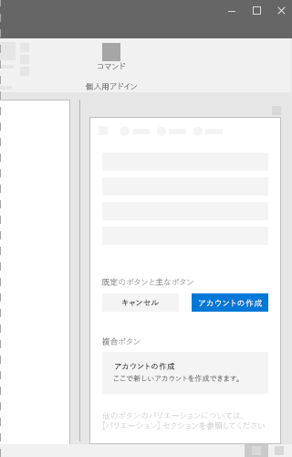

# Office UI Fabric のボタン コンポーネント

Office アドインでボタンを使用すると、ユーザーが変更をコミットしたり、タスクの手順を完了したりすることができます。ボタンのテキストが相互作用の目的を伝えていることを確認してください。ボタンは作業ウィンドウ、ダイアログ、またはコンテンツ ウィンドウの UI コンテナーの下部に配置します。たとえば、ボタンを使用することで、ユーザーはフォームを送信したり、ダイアログを閉じたり、次のページに移動することができます。
  
#### 例: 作業ウィンドウ内のボタン

## ベスト プラクティス

|**するべきこと**|**使用不可**|
|:-----|:--------|
|既定のボタンは、アドインで常に安全な操作を実行する必要があります。 |データを破棄するボタンに既定のフォーカスを配置しないでください。その代わりに、安全な操作を実行するボタンか、アクションをキャンセルするボタンにフォーカスを置きます。|
|ボタンのラベルには 1 行のテキスト以外は使用しないでください。テキストは最小限にします。|ボタンにテキスト以外ものを入れないでください。|
|ラベルがボタンの明確な目的をユーザーに伝えていることを確認してください。簡潔で具体的な、わかりやすいラベルを使用してください。1 つの単語のみを使用してください。|**[戻る]** と **[次へ]** の手順以外は、ボタンをナビゲーションに使用しないでください。ナビゲーションにはリンクを使用してください。|
|ユーザーには、1 つまたは 2 つのボタン (アクション) のみを公開します。たとえば、**[承諾]** や **[キャンセル]** などです。その他のアクションを公開する必要がある場合は、チェックボックスかラジオ ボタンを使用してユーザーがアクションを選択するようにします。また、選択したアクションを開始するためのボタンを 1 つ用意します。||
|**[送信]**、**[OK]**、**[適用]** のボタンをプライマリ ボタンとしてスタイル設定します。これらのいずれかの横に **[リセット]** または **[キャンセル]** ボタンが表示される場合は、それらを既定のボタンとしてスタイル設定します。| |

## バリアント

|**バリエーション**|**説明**|**例**|
|:------------|:--------------|:----------|
|**プライマリ ボタン**|プライマリ ボタンは静止状態でテーマの色を継承します。プライマリ ボタンを使用して、アクションのメインの呼び出しを強調表示します。||
|**既定のボタン**|既定のボタンは常に安全な操作を実行する必要があり、削除しないでください。||
|**複合ボタン**|複合ボタンを使用して、タスクを完了するアクションを発生させたり、一時的なタスクを発生させたりします。||

## 実装

詳細については、「[ボタン](https://dev.office.com/fabric#/components/button)」と「[Fabric React のコード サンプルの使用にあたって](https://github.com/OfficeDev/Word-Add-in-GettingStartedFabricReact)」を参照してください。

## 関連項目

- [UX 設計パターン](https://github.com/OfficeDev/Office-Add-in-UX-Design-Patterns-Code)
- [Office アドインの Office UI Fabric](office-ui-fabric.md)
