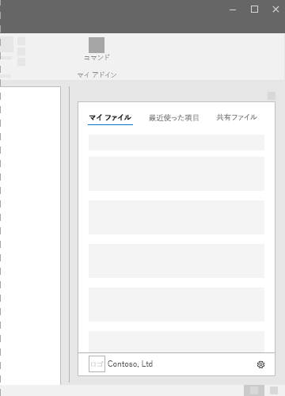

# Office アドインの作業ウィンドウTask panes in Office Add-ins

作業ウィンドウは、通常 Word、PowerPoint、Excel、Outlook 内のウィンドウの右側に表示されるインターフェイスのサーフェスです。作業ウィンドウにより、ユーザーはコードを実行してドキュメントや電子メールを修正したり、データ ソースからデータを表示したりするインターフェイス コントロールにアクセスできます。機能を直接ドキュメントに埋め込む必要がない場合は、作業ウィンドウを使用します。Task panes are interface surfaces that typically appear on the right side of the window within Word, PowerPoint, Excel, and Outlook. Task panes give users access to interface controls that run code to modify documents or emails, or display data from a data source. Use task panes when you don't need to embed functionality directly into the document.

*図 1. 一般的な作業ウィンドウのレイアウト**Figure 1. Typical task pane layout*

## ベスト プラクティスBest practices

|するべきことDo|してはいけないことDon't|
|:-----|:--------|
|<ul><li>タイトルにアドインの名前を含めます。Include the name of your add-in in the title.</li></ul>|<ul><li>タイトルには会社名を追加しません。Don't append your company name to the title.</li></ul>|
|<ul><li>タイトルには短くわかりやすい名前を使用します。Use short descriptive names in the title.</li></ul>|<ul><li>アドインのタイトルには、"アドイン"、"for Word"、"for Office" などの文字列を追加しません。Don't append strings such as "add-in," "for Word," or "for Office" to the title of your add-in.</li></ul>|
|<ul><li>アドインの上部に CommandBar や Pivot などのナビゲーション要素やコマンド要素を含めます。Include some navigational or commanding element such as the CommandBar or Pivot at the top of your add-in.</li></ul>||
|<ul><li>アドインを Outlook 内で使用する場合を除き、アドインの下部に BrandBar などのブランド化の要素を含めます。Include a branding element such as the BrandBar at the bottom of your add-in unless your add-in is to be used within Outlook.</li></ul>||

## バリアントVariants

次の図は、1366x768 解像度のリボンOffice アプリ作業ウィンドウのサイズを示しています。The following images show the various task pane sizes with the Office app ribbon at a 1366x768 resolution. Excel では、数式バーを収容するための縦のスペースが必要です。For Excel, additional vertical space is required to accommodate the formula bar.  

*図 2. Office 2016 デスクトップ作業ウィンドウのサイズ**Figure 2. Office 2016 desktop task pane sizes*

- Excel - 320x455 ピクセルExcel - 320x455 pixels
- PowerPoint - 320x531 ピクセルPowerPoint - 320x531 pixels
- Word - 320x531 ピクセルWord - 320x531 pixels
- Outlook - 348x535 ピクセルOutlook - 348x535 pixels

 

*図 3.Office作業ウィンドウのサイズ**Figure 3. Office task pane sizes*

- Excel - 350x378 ピクセルExcel - 350x378 pixels
- PowerPoint - 348x391 ピクセルPowerPoint - 348x391 pixels
- Word - 329x445 ピクセルWord - 329x445 pixels
- Outlook (web 上) - 320x570 ピクセルOutlook (on the web) - 320x570 pixels

## パーソナル メニューPersonality menu

パーソナル メニューは、アドインの右上付近にあるナビゲーション要素やコマンド要素の妨げになる可能性があります。Windows と Mac でのパーソナル メニューの現在のサイズを次に示します。Personality menus can obstruct navigational and commanding elements located near the top right of the add-in. The following are the current dimensions of the personality menu on Windows and Mac.

Windows の場合、パーソナル メニューは 12x32 ピクセルを測定します (図を参照)。For Windows, the personality menu measures 12x32 pixels, as shown.

*図 4. Windows のパーソナル メニュー**Figure 4. Personality menu on Windows*

Mac の場合、パーソナル メニューは 26x26 ピクセルを測定しますが、右から 8 ピクセル内側、上から 6 ピクセルの位置にフロートします。これにより、スペースは 34x32 ピクセルに増加します (図を参照)。For Mac, the personality menu measures 26x26 pixels, but floats 8 pixels in from the right and 6 pixels from the top, which increases the space to 34x32 pixels, as shown.

*図 5. Mac のパーソナル メニュー**Figure 5. Personality menu on Mac*

## 実装Implementation

作業ウィンドウを実装するサンプルについては、GitHub の「[Excel アドインの JS WoodGrove Expense Trends](https://github.com/OfficeDev/Excel-Add-in-WoodGrove-Expense-Trends)」を参照してください。For a sample that implements a task pane, see [Excel Add-in JS WoodGrove Expense Trends](https://github.com/OfficeDev/Excel-Add-in-WoodGrove-Expense-Trends) on GitHub.

## 関連項目See also

- [Office アドインの Fabric CoreFabric Core in Office Add-ins](fabric-core.md)
- [Office アドインの UX 設計パターンUX design patterns for Office Add-ins](../design/ux-design-pattern-templates.md)
