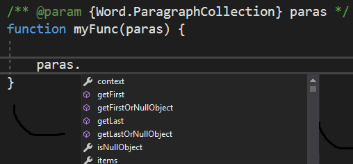
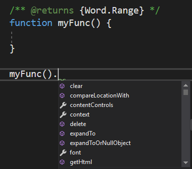

# <a name="get-javascript-intellisense-in-visual-studio-2019"></a><span data-ttu-id="d7772-103">Visual Studio 2019 で JavaScript IntelliSense を利用できるようにする</span><span class="sxs-lookup"><span data-stu-id="d7772-103">Get JavaScript IntelliSense in Visual Studio 2019</span></span>

<span data-ttu-id="d7772-p101">Visual Studio 2019 を使用して Office アドインを開発する場合は、JSDoc を使用することで、JavaScript の変数、オブジェクト、パラメーター、および戻り値の IntelliSense を有効にできます。この記事では、JSDoc の概要と、JSDoc を使用して Visual Studio の IntellSense を作成する方法について説明します。詳細については、「[JavaScript IntelliSense](/visualstudio/ide/javascript-intellisense)」および「[JSDoc support in JavaScript](https://github.com/Microsoft/TypeScript/wiki/JsDoc-support-in-JavaScript)」を参照してください。</span><span class="sxs-lookup"><span data-stu-id="d7772-p101">When you use Visual Studio 2019 to develop Office Add-ins, you can use JSDoc to enable IntelliSense for your JavaScript variables, objects, parameters, and return values. This article provides an overview of JSDoc and how you can use it to create IntellSense in Visual Studio. For more details, see [JavaScript IntelliSense](/visualstudio/ide/javascript-intellisense) and [JSDoc support in JavaScript](https://github.com/Microsoft/TypeScript/wiki/JsDoc-support-in-JavaScript).</span></span> 

## <a name="officejs-type-definitions"></a><span data-ttu-id="d7772-107">Office.js の型定義</span><span class="sxs-lookup"><span data-stu-id="d7772-107">Office.js type definitions</span></span>

<span data-ttu-id="d7772-p102">Visual Studio に Office.js の型の定義を提供する必要があります。そのために、次の操作を実行します。</span><span class="sxs-lookup"><span data-stu-id="d7772-p102">You need to provide the definitions of the types in Office.js to Visual Studio. To do this, you can:</span></span>

- <span data-ttu-id="d7772-p103">`\Office\1\` という名前のソリューションのフォルダーに Office.js ファイルのローカル コピーを用意します。アドイン プロジェクトの作成時に、Visual Studio の Office アドイン プロジェクト テンプレートにより、このローカル コピーが追加されます。</span><span class="sxs-lookup"><span data-stu-id="d7772-p103">Have a local copy of the Office.js files in a folder in your solution named `\Office\1\`. The Office Add-in project templates in Visual Studio add this local copy when you create an add-in project.</span></span> 
- <span data-ttu-id="d7772-p104">アドイン ソリューションの Web アプリケーション プロジェクトのルートに、tsconfig.json ファイルを追加することで、Office.js のオンライン バージョンを使用します。ファイルには、次のコンテンツが含まれている必要があります。</span><span class="sxs-lookup"><span data-stu-id="d7772-p104">Use an online version of Office.js by adding a tsconfig.json file to the root of the web application project in the add-in solution. The file should include the following content.</span></span>

    ```json
        {
            "compilerOptions": {
                "allowJs": true,            // These settings apply to JavaScript files also.
                "noEmit":  true             // Do not compile the JS (or TS) files in this project.
            },
            "exclude": [
                "node_modules",             // Don't include any JavaScript found under "node_modules".
                "Scripts/Office/1"          // Suppress loading all the JavaScript files from the Office NuGet package.
            ],
            "typeAcquisition": {
                "enable": true,             // Enable automatic fetching of type definitions for detected JavaScript libraries.
                "include": [ "office-js" ]  // Ensure that the "Office-js" type definition is fetched.
            }
        }
    ```

## <a name="jsdoc-syntax"></a><span data-ttu-id="d7772-114">JSDoc 構文</span><span class="sxs-lookup"><span data-stu-id="d7772-114">JSDoc syntax</span></span>

<span data-ttu-id="d7772-p105">基本的な手法として、変数 (またはパラメーターなど) の前に、データ型を識別するコメントを付けます。これにより、Visual Studio の IntelliSense は、そのメンバーを推測できるようになります。次に例を示します。</span><span class="sxs-lookup"><span data-stu-id="d7772-p105">The basic technique is to precede the variable (or parameter, and so on) with a comment that identifies its data type. This allows IntelliSense in Visual Studio to infer its members. The following are examples.</span></span>

### <a name="variable"></a><span data-ttu-id="d7772-118">可変</span><span class="sxs-lookup"><span data-stu-id="d7772-118">Variable</span></span>

```js
/** @type {Excel.Range} */
var subsetRange;
```


### <a name="parameter"></a><span data-ttu-id="d7772-120">パラメーター</span><span class="sxs-lookup"><span data-stu-id="d7772-120">Parameter</span></span>

```js
/** @param {Word.ParagraphCollection} paragraphs */
function myFunc(paragraphs){

}
```


### <a name="return-value"></a><span data-ttu-id="d7772-122">戻り値</span><span class="sxs-lookup"><span data-stu-id="d7772-122">Return value</span></span>

```js
/** @returns {Word.Range} */
function myFunc() {

}
```


### <a name="complex-types"></a><span data-ttu-id="d7772-124">複合型</span><span class="sxs-lookup"><span data-stu-id="d7772-124">Complex types</span></span>

```js
/** @typedef {{range: Word.Range, paragraphs: Word.ParagraphCollection}} MyType

/** @returns {MyType} */
function myFunc() {

}
```


## <a name="see-also"></a><span data-ttu-id="d7772-126">関連項目</span><span class="sxs-lookup"><span data-stu-id="d7772-126">See also</span></span>

- [<span data-ttu-id="d7772-127">Visual Studio を使用して Office アドインを開発する</span><span class="sxs-lookup"><span data-stu-id="d7772-127">Develop Office Add-ins with Visual Studio</span></span>](develop-add-ins-visual-studio.md)
- [<span data-ttu-id="d7772-128">Visual Studio で Office アドインをデバッグする</span><span class="sxs-lookup"><span data-stu-id="d7772-128">Debug Office Add-ins in Visual Studio</span></span>](debug-office-add-ins-in-visual-studio.md)
