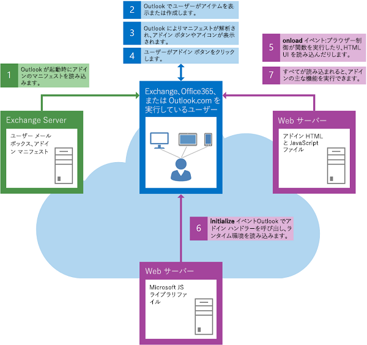

# <a name="loading-the-dom-and-runtime-environment"></a><span data-ttu-id="eedac-102">DOM とランタイム環境を読み込む</span><span class="sxs-lookup"><span data-stu-id="eedac-102">Loading the DOM and runtime environment</span></span>


<span data-ttu-id="eedac-103">アドインでは、DOM と Office アドイン両方のランタイム環境が、独自のカスタム ロジックを実行する前に読み込まれていることを確認する必要があります。</span><span class="sxs-lookup"><span data-stu-id="eedac-103">An add-in must ensure that both the DOM and the Office Add-ins runtime environment are loaded before running its own custom logic.</span></span> 

## <a name="startup-of-a-content-or-task-pane-add-in"></a><span data-ttu-id="eedac-104">コンテンツまたは作業ウィンドウ アドインの起動</span><span class="sxs-lookup"><span data-stu-id="eedac-104">Startup of a content or task pane add-in</span></span>

<span data-ttu-id="eedac-105">次の図は、Excel、PowerPoint、Project、Word、または Access でコンテンツ アドインまたは作業ウィンドウ アドインの起動に関連するイベントのフローを示しています。</span><span class="sxs-lookup"><span data-stu-id="eedac-105">The following figure shows the flow of events involved in starting a content or task pane add-in in Excel, PowerPoint, Project, Word, or Access.</span></span>


<span data-ttu-id="eedac-107">コンテンツ アドインまたは作業ウィンドウ アドインが起動すると、次のイベントが発生します。</span><span class="sxs-lookup"><span data-stu-id="eedac-107">The following events occur when a content or task pane add-in starts:</span></span> 


1. <span data-ttu-id="eedac-108">ユーザーは、既にアドインが含まれているドキュメントを開くか、ドキュメントにアドインを挿入します。</span><span class="sxs-lookup"><span data-stu-id="eedac-108">The user opens a document that already contains an add-in or inserts an add-in in the document.</span></span>
    
2. <span data-ttu-id="eedac-109">Office ホスト アプリケーションが、アドインの XML マニフェストを AppSource、SharePoint のアドイン カタログ、またはアドインの発生元である共有フォルダー カタログから読み取ります。</span><span class="sxs-lookup"><span data-stu-id="eedac-109">The Office host application reads the add-in's XML manifest from AppSource, an add-in catalog on SharePoint, or the shared folder catalog it originates from.</span></span>
    
3. <span data-ttu-id="eedac-110">Office ホスト アプリケーションが、ブラウザー コントロールにアドインの HTML ページを開きます。</span><span class="sxs-lookup"><span data-stu-id="eedac-110">The Office host application opens the add-in's HTML page in a browser control.</span></span>
    
    <span data-ttu-id="eedac-p101">次の手順 4. と 5. は、同時に実行されることも、同時に実行されないこともあります。したがって、次の処理に進む前に、DOM とアドイン ランタイム環境の両方の読み込みが完了したことをアドインのコードで確認する必要があります。</span><span class="sxs-lookup"><span data-stu-id="eedac-p101">The next two steps, steps 4 and 5, occur asynchronously and in parallel. For this reason, your add-in's code must make sure that both the DOM and the add-in runtime environment have finished loading before proceeding.</span></span>
    
4. <span data-ttu-id="eedac-113">ブラウザー コントロールが、DOM と HTML 本文を読み込み、 **window.onload** イベントに対するイベント ハンドラーを呼び出します。</span><span class="sxs-lookup"><span data-stu-id="eedac-113">The browser control loads the DOM and HTML body, and calls the event handler for the  **window.onload** event.</span></span>
    
5. <span data-ttu-id="eedac-114">Office ホスト アプリケーションがランタイム環境を読み込みます (このランタイム環境は、コンテンツ配布ネットワーク (CDN) サーバーから JavaScript API for JavaScript ライブラリ ファイルをダウンロードしてキャッシュします)。その後、 [Office](https://docs.microsoft.com/javascript/api/office?view=office-js) オブジェクトの [initialize](https://docs.microsoft.com/javascript/api/office?view=office-js) イベントに対するアドインのイベント ハンドラーを呼び出します。</span><span class="sxs-lookup"><span data-stu-id="eedac-114">The Office host application loads the runtime environment, which downloads and caches the JavaScript API for JavaScript library files from the content distribution network (CDN) server, and then calls the add-in's event handler for the [initialize](https://docs.microsoft.com/javascript/api/office?view=office-js) event of the [Office](https://docs.microsoft.com/javascript/api/office?view=office-js) object.</span></span>
    
6. <span data-ttu-id="eedac-115">DOM と HTML 本文の読み込み、およびアドインの初期化が完了すると、アドインのメイン関数は処理を続行できます。</span><span class="sxs-lookup"><span data-stu-id="eedac-115">When the DOM and HTML body finish loading and the add-in finishes initializing, the main function of the add-in can proceed.</span></span>
    

## <a name="startup-of-an-outlook-add-in"></a><span data-ttu-id="eedac-116">Outlook アドインの起動</span><span class="sxs-lookup"><span data-stu-id="eedac-116">Startup of an Outlook add-in</span></span>


<span data-ttu-id="eedac-117">次の図は、デスクトップ、タブレット、スマートフォンで実行される Outlook アドインの起動に関係するイベントのフローを示しています。</span><span class="sxs-lookup"><span data-stu-id="eedac-117">The following figure shows the flow of events involved in starting an Outlook add-in running on the desktop, tablet, or smartphone.</span></span>



<span data-ttu-id="eedac-119">Outlook アドインが起動すると、次のイベントが発生します。</span><span class="sxs-lookup"><span data-stu-id="eedac-119">The following events occur when an Outlook add-in starts:</span></span> 


1. <span data-ttu-id="eedac-120">Outlook は起動時に、ユーザーの電子メール アカウント用にインストールされている Outlook アドインの XML マニフェストを読み取ります。</span><span class="sxs-lookup"><span data-stu-id="eedac-120">When Outlook starts, Outlook reads the XML manifests for Outlook add-ins that have been installed for the user's email account.</span></span>
    
2. <span data-ttu-id="eedac-121">ユーザーが Outlook でアイテムを選択します。</span><span class="sxs-lookup"><span data-stu-id="eedac-121">The user selects an item in Outlook.</span></span>
    
3. <span data-ttu-id="eedac-122">選択されたアイテムが Outlook アドインのアクティブ化条件を満たしている場合は、Outlook がアドインをアクティブにし、ボタンを UI に表示します。</span><span class="sxs-lookup"><span data-stu-id="eedac-122">If the selected item satisfies the activation conditions of an Outlook add-in, Outlook activates the add-in and makes its button visible in the UI.</span></span>
    
4. <span data-ttu-id="eedac-p102">ユーザーがボタンをクリックして Outlook アドインを起動すると、Outlook がアプリの HTML ページをブラウザー コントロール内に表示します。次の手順 5 と 6 は同時に行われます。</span><span class="sxs-lookup"><span data-stu-id="eedac-p102">If the user clicks the button to start the Outlook add-in, Outlook opens the HTML page in a browser control. The next two steps, steps 5 and 6, occur in parallel.</span></span>
    
5. <span data-ttu-id="eedac-125">ブラウザー コントロールが DOM と HTML 本文を読み込んで、 **onload** イベントに対するイベント ハンドラーを呼び出します。</span><span class="sxs-lookup"><span data-stu-id="eedac-125">The browser control loads the DOM and HTML body, and calls the event handler for the  **onload** event.</span></span>
    
6. <span data-ttu-id="eedac-126">Outlook がアドインの [Office](https://docs.microsoft.com/javascript/api/office?view=office-js) オブジェクトの [initialize](https://docs.microsoft.com/javascript/api/office?view=office-js) イベントに対するイベント ハンドラーを呼び出します。</span><span class="sxs-lookup"><span data-stu-id="eedac-126">Outlook calls the event handler for the [initialize](https://docs.microsoft.com/javascript/api/office?view=office-js) event of the [Office](https://docs.microsoft.com/javascript/api/office?view=office-js) object of the add-in.</span></span>
    
7. <span data-ttu-id="eedac-127">DOM および HTML 本文の読み込みが終わると、アドインは初期化を完了し、アドインのメイン関数は処理を続行できます。</span><span class="sxs-lookup"><span data-stu-id="eedac-127">When the DOM and HTML body finish loading and the add-in finishes initializing, the main function of the add-in can proceed.</span></span>
    

## <a name="checking-the-load-status"></a><span data-ttu-id="eedac-128">読み込み状態のチェック</span><span class="sxs-lookup"><span data-stu-id="eedac-128">Checking the load status</span></span>


<span data-ttu-id="eedac-p103">DOM と ランタイム環境の両方の読み込みが完了したことを確認する方法の 1 つに、jQuery [.ready()](https://api.jquery.com/ready/)関数の  `$(document).ready()` を使用する方法があります。たとえば、次の **initialize** イベント ハンドラー関数は、アプリを初期化する固有のコードを実行する前に、DOM が読み込まれていることを確認します。その後、 **initialize** イベント ハンドラーは [mailbox.item](https://docs.microsoft.com/javascript/api/outlook/office.mailbox?view=office-js) プロパティを使用して、Outlook で現在選択されているアイテムを取得し、アプリのメイン関数 `initDialer` を呼び出します。</span><span class="sxs-lookup"><span data-stu-id="eedac-p103">One way to check that both the DOM and the runtime environment have finished loading is to use the jQuery [.ready()](https://api.jquery.com/ready/) function: `$(document).ready()`. For example, the following  **initialize** event handler function makes sure the DOM is first loaded before the code specific to initializing the add-in runs. Subsequently, the **initialize** event handler proceeds to use the [mailbox.item](https://docs.microsoft.com/javascript/api/outlook/office.mailbox?view=office-js) property to obtain the currently selected item in Outlook, and calls the main function of the add-in, `initDialer`.</span></span>


```js
Office.initialize = function () {
    // Checks for the DOM to load.
    $(document).ready(function () {
        // After the DOM is loaded, add-in-specific code can run.
        var mailbox = Office.context.mailbox;
        _Item = mailbox.item;
        initDialer();
    });
}
```

<span data-ttu-id="eedac-132">この方法は、任意の Office アドインの  **initialize** ハンドラーで使用できます。</span><span class="sxs-lookup"><span data-stu-id="eedac-132">This same technique can be used in the  **initialize** handler of any Office Add-in.</span></span>

<span data-ttu-id="eedac-133">ダイヤラー サンプル Outlook アドインでは、JavaScript のみを使用してこれらと同じ条件を確認するという少し異なる方法を使用しています。</span><span class="sxs-lookup"><span data-stu-id="eedac-133">The phone dialer sample Outlook add-in shows a slightly different approach using only JavaScript to check these same conditions.</span></span> 

> [!IMPORTANT]
> <span data-ttu-id="eedac-134">アドインに実行する初期化タスクがない場合でも、次の例のような最小のイベント ハンドラー関数 **Office.initialize** が少なくとも 1 つ含まれている必要があります。</span><span class="sxs-lookup"><span data-stu-id="eedac-134">Even if your add-in has no initialization tasks to perform, you must include at least a minimal **Office.initialize** event handler function like the following example.</span></span>

```js
Office.initialize = function () {
};
```

<span data-ttu-id="eedac-p104">イベント ハンドラー  **Office.initialize** を含めていないと、アドインの起動時にエラーが発生するおそれがあります。また、ユーザーが Excel Online、PowerPoint Online、または Outlook Web App などの Office Online Web クライアントでアドインを使用しようとする場合、アプリの実行が失敗します。</span><span class="sxs-lookup"><span data-stu-id="eedac-p104">If you fail to include an  **Office.initialize** event handler, your add-in may raise an error when it starts. Also, if a user attempts to use your add-in with an Office Online web client, such as Excel Online, PowerPoint Online, or Outlook Web App, it will fail to run.</span></span>

<span data-ttu-id="eedac-137">アドインに複数のページが含まれる場合、新しいページが読み込まれるときに、そのページに  **Office.initialize** イベント ハンドラーが含まれるか、そのページからこのイベント ハンドラーを呼び出されなければなりません。</span><span class="sxs-lookup"><span data-stu-id="eedac-137">If your add-in includes more than one page, whenever it loads a new page that page must include or call an  **Office.initialize** event handler.</span></span>


## <a name="see-also"></a><span data-ttu-id="eedac-138">関連項目</span><span class="sxs-lookup"><span data-stu-id="eedac-138">See also</span></span>

- [<span data-ttu-id="eedac-139">JavaScript API for Office について</span><span class="sxs-lookup"><span data-stu-id="eedac-139">Understanding the JavaScript API for Office</span></span>](understanding-the-javascript-api-for-office.md)
    
