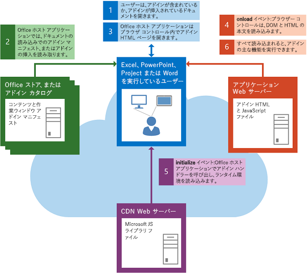

# <a name="loading-the-dom-and-runtime-environment"></a>DOM とランタイム環境を読み込む


アドインでは、DOM と Office アドイン両方のランタイム環境が、独自のカスタム ロジックを実行する前に読み込まれていることを確認する必要があります。 

## <a name="startup-of-a-content-or-task-pane-add-in"></a>コンテンツまたは作業ウィンドウ アドインの起動

次の図は、Excel、PowerPoint、Project、Word、または Access でコンテンツ アドインまたは作業ウィンドウ アドインの起動に関連するイベントのフローを示しています。



コンテンツ アドインまたは作業ウィンドウ アドインが起動すると、次のイベントが発生します。 


1. ユーザーは、既にアドインが含まれているドキュメントを開くか、ドキュメントにアドインを挿入します。
    
2. Office ホスト アプリケーションが、アドインの XML マニフェストを AppSource、SharePoint のアドイン カタログ、またはアドインの発生元である共有フォルダー カタログから読み取ります。
    
3. Office ホスト アプリケーションが、ブラウザー コントロールにアドインの HTML ページを開きます。
    
    次の手順 4. と 5. は、同時に実行されることも、同時に実行されないこともあります。したがって、次の処理に進む前に、DOM とアドイン ランタイム環境の両方の読み込みが完了したことをアドインのコードで確認する必要があります。
    
4. ブラウザー コントロールが、DOM と HTML 本文を読み込み、 **window.onload** イベントに対するイベント ハンドラーを呼び出します。
    
5. Office ホスト アプリケーションがランタイム環境を読み込みます (このランタイム環境は、コンテンツ配布ネットワーク (CDN) サーバーから JavaScript API for JavaScript ライブラリ ファイルをダウンロードしてキャッシュします)。その後、 [Office](https://docs.microsoft.com/javascript/api/office?view=office-js) オブジェクトの [initialize](https://docs.microsoft.com/javascript/api/office?view=office-js) イベントに対するアドインのイベント ハンドラーを呼び出します。
    
6. DOM と HTML 本文の読み込み、およびアドインの初期化が完了すると、アドインのメイン関数は処理を続行できます。
    

## <a name="startup-of-an-outlook-add-in"></a>Outlook アドインの起動


次の図は、デスクトップ、タブレット、スマートフォンで実行される Outlook アドインの起動に関係するイベントのフローを示しています。


Outlook アドインが起動すると、次のイベントが発生します。 


1. Outlook は起動時に、ユーザーの電子メール アカウント用にインストールされている Outlook アドインの XML マニフェストを読み取ります。
    
2. ユーザーが Outlook でアイテムを選択します。
    
3. 選択されたアイテムが Outlook アドインのアクティブ化条件を満たしている場合は、Outlook がアドインをアクティブにし、ボタンを UI に表示します。
    
4. ユーザーがボタンをクリックして Outlook アドインを起動すると、Outlook がアプリの HTML ページをブラウザー コントロール内に表示します。次の手順 5 と 6 は同時に行われます。
    
5. ブラウザー コントロールが DOM と HTML 本文を読み込んで、 **onload** イベントに対するイベント ハンドラーを呼び出します。
    
6. Outlook がアドインの [Office](https://docs.microsoft.com/javascript/api/office?view=office-js) オブジェクトの [initialize](https://docs.microsoft.com/javascript/api/office?view=office-js) イベントに対するイベント ハンドラーを呼び出します。
    
7. DOM および HTML 本文の読み込みが終わると、アドインは初期化を完了し、アドインのメイン関数は処理を続行できます。
    

## <a name="checking-the-load-status"></a>読み込み状態のチェック


DOM と ランタイム環境の両方の読み込みが完了したことを確認する方法の 1 つに、jQuery [.ready()](http://api.jquery.com/ready/)関数の  `$(document).ready()` を使用する方法があります。たとえば、次の **initialize** イベント ハンドラー関数は、アプリを初期化する固有のコードを実行する前に、DOM が読み込まれていることを確認します。その後、 **initialize** イベント ハンドラーは [mailbox.item](https://docs.microsoft.com/javascript/api/outlook/office.mailbox?view=office-js) プロパティを使用して、Outlook で現在選択されているアイテムを取得し、アプリのメイン関数 `initDialer` を呼び出します。


```js
Office.initialize = function () {
    // Checks for the DOM to load.
    $(document).ready(function () {
        // After the DOM is loaded, add-in-specific code can run.
        var mailbox = Office.context.mailbox;
        _Item = mailbox.item;
        initDialer();
    });
}
```

この方法は、任意の Office アドインの  **initialize** ハンドラーで使用できます。

ダイヤラー サンプル Outlook アドインでは、JavaScript のみを使用してこれらと同じ条件を確認するという少し異なる方法を使用しています。 

> [!IMPORTANT]
> アドインに実行する初期化タスクがない場合でも、次の例のような最小のイベント ハンドラー関数 **Office.initialize** が少なくとも 1 つ含まれている必要があります。

```js
Office.initialize = function () {
};
```

イベント ハンドラー  **Office.initialize** を含めていないと、アドインの起動時にエラーが発生するおそれがあります。また、ユーザーが Excel Online、PowerPoint Online、または Outlook Web App などの Office Online Web クライアントでアドインを使用しようとする場合、アプリの実行が失敗します。

アドインに複数のページが含まれる場合、新しいページが読み込まれるときに、そのページに  **Office.initialize** イベント ハンドラーが含まれるか、そのページからこのイベント ハンドラーを呼び出されなければなりません。


## <a name="see-also"></a>関連項目

- [JavaScript API for Office について](understanding-the-javascript-api-for-office.md)
    
