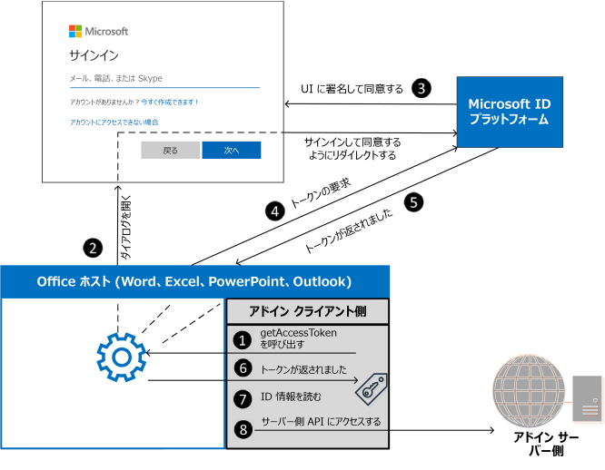

# <a name="enable-single-sign-on-sso-in-an-office-add-in"></a>Office アドインでシングル サインオン (SSO) を有効にする

ユーザーは個人用の Microsoft アカウントまたは Microsoft 365 Education または職場アカウントのいずれかを使用して、Office (オンライン、モバイル、およびデスクトップ プラットフォーム) にサインインします。これを利用して、さらにシングル サインオン (SSO) も使用すれば、ユーザーに 2 度目のサインインを求めずに、ご自分のアドインに対してユーザーの認証および許可を実行できます。


## <a name="how-sso-works-at-runtime"></a>実行時の SSO の動作のしくみ

次の図は、SSO の動作のしくみを示しています。 青い要素は、Office または Microsoft ID プラットフォームを表します。 灰色の要素は、書き込むコードを表し、アドインのクライアント側コード (作業ウィンドウ) とサーバー側コードを含みます。



1. アドインでは、JavaScript コードは Office.js API である [getAccessToken Office.js](/javascript/api/office-runtime/officeruntime.auth#office-runtime-officeruntime-auth-getaccesstoken-member(1)) を呼び出します。 ユーザーが既に Office にサインインしている場合、Office ホストは、サインインしているユーザーの要求を含むアクセス トークンを返します。
2. ユーザーがサインインしていない場合、ユーザーにサインインを求めるダイアログ ボックスが Office ホスト アプリケーションによって開かれます。 サインイン プロセスを完了するために、Office は Microsoft ID プラットフォームにリダイレクトします。
3. 現在のユーザーが初めてアドインを使用する場合は、そのユーザーに同意を求めるダイアログが表示されます。
4. Office ホスト アプリケーションは、Microsoft Identity プラットフォームから現在のユーザーの **アクセス トークン** を要求します。
5. Microsoft ID プラットフォームは、アクセス トークンを Office に返します。 Office はユーザーの代わりにトークンをキャッシュし、**getAccessToken** への今後の呼び出しが、キャッシュされたトークンを返すようにします。
6. Office ホスト アプリケーションが、 `getAccessToken` 呼び出しによって返される結果オブジェクトの一部として、アドインに **アクセス トークン** を送信します。
7. トークンは、**アクセス トークン** と **ID トークン** の両方です。ID トークンとして使用して、ユーザーの名前や電子メール アドレスなど、ユーザーに関する要求を解析して調べることができます。
8. 必要に応じて、アドインはトークンを **アクセス トークン** として使用して、サーバー側の API に対して認証された HTTPS 要求を行うことができます。 アクセス トークンには ID 要求が含まれているため、サーバーはユーザー設定などのユーザーの ID に関連付けられた情報を格納できます。

## <a name="requirements-and-best-practices"></a>要件とベスト プラクティス

### <a name="dont-cache-the-access-token"></a>アクセス トークンをキャッシュしない

クライアント側のコードにアクセス トークンをキャッシュしたり格納したりしないでください。 アクセス トークンが必要な場合は、常に [getAccessToken](/javascript/api/office-runtime/officeruntime.auth#office-runtime-officeruntime-auth-getaccesstoken-member(1)) を呼び出します。 Office はアクセス トークンをキャッシュします (または、有効期限が切れた場合は新しいトークンを要求します)。これにより、誤ってアドインからトークンが漏洩するのを防ぐことができます。

### <a name="enable-modern-authentication-for-outlook"></a>Outlook の先進認証を有効にする

**Outlook** アドインで作業している場合は、Microsoft 365 テナントの先進認証が有効になっていることを確認してください。 この方法の詳細については、「[Exchange Online: テナントの先進認証を有効にする方法](https://social.technet.microsoft.com/wiki/contents/articles/32711.exchange-online-how-to-enable-your-tenant-for-modern-authentication.aspx)」を参照してください。

### <a name="implement-a-fallback-authentication-system"></a>フォールバック認証システムを実装する

SSO をアドインの唯一の認証方法と *しない* ようにする必要があります。 特定のエラー状況でアドインが切り替えることができる、別の認証システムを実装する必要があります。 たとえば、SSO をサポートしていない以前のバージョンの Office にアドインが読み込まれている場合、 `getAccessToken` 呼び出しは失敗します。

Excel、Word、PowerPoint アドインの場合は、通常、Microsoft ID プラットフォームを使用するためにフォールバックする必要があります。 詳細情報については、 「[Microsoft ID プラットフォームを使用して認証する](overview-authn-authz.md#authenticate-with-the-microsoft-identity-platform)」を参照してください。

Outlook アドインの場合は、推奨されるフォールバック システムがあります。 詳細については、「[シナリオ: Outlook アドインでサービスにシングル サインオンを実装する](../outlook/implement-sso-in-outlook-add-in.md)」を参照してください。

ユーザー テーブルと認証のシステムを使用するか、ソーシャル ログイン プロバイダーの 1 つを活用することもできます。 Office アドインでこれを実行する方法の詳細については、「[Office アドインで外部サービスを承認する](auth-external-add-ins.md)」を参照してください。

代替システムとして Microsoft ID プラットフォームを使用するコード サンプルについては、「[Office アドイン NodeJS SSO](https://github.com/OfficeDev/PnP-OfficeAddins/tree/main/Samples/auth/Office-Add-in-NodeJS-SSO)」と「[Office アドイン ASP.NET SSO](https://github.com/OfficeDev/PnP-OfficeAddins/tree/main/Samples/auth/Office-Add-in-ASPNET-SSO)」を参照してください。

## <a name="develop-an-sso-add-in"></a>SSO アドインの開発

このセクションでは、SSO を使用する Office アドインの作成に関連するタスクについて説明します。 これらのタスクについては、言語やフレームワークとは別に説明します。 詳しい手順については、次のトピックを参照してください。

- [シングル サインオンを使用する Node.js Office アドインを作成する](create-sso-office-add-ins-nodejs.md)
- [シングル サインオンを使用する ASP.NET Office アドインを作成する](create-sso-office-add-ins-aspnet.md)

> [!NOTE]
> SSO が有効な Node.js Office アドインの作成に Yeoman ジェネレーターを使用することができます。 Yeoman ジェネレーターは、Azure 内で SSO を構成するために必要な手順を自動化し、SSO を使用するために必要なコードを生成することで、SSO が有効なアドインの作成プロセスを簡素化します。 詳細については、「[シングル サインオン (SSO) のクイック スタート](../quickstarts/sso-quickstart.md)」を参照してください。

### <a name="register-your-add-in-with-the-microsoft-identity-platform"></a>Microsoft ID プラットフォームにアドインを登録する

SSO を使用するには、Microsoft ID プラットフォームにアドインを登録する必要があります。 これにより、Microsoft ID プラットフォームがアドインの認証サービスと認可サービスを提供できるようになります。 アプリ登録の作成には、次のタスクが含まれます。

- Microsoft ID プラットフォームへのアドインを識別するアプリケーション (クライアント) ID を取得します。
- トークンを要求するときにアドインのパスワードとして機能するクライアント シークレットを生成します。
- アドインに必要なアクセス許可を指定します。 Microsoft Graph "プロファイル" および "openid"のアクセス許可は常に必要です。 アドインの実行内容によっては、追加のアクセス許可が必要になる場合があります。
- Office アプリケーションにアドインへの信頼を付与します。
- 既定のスコープ *access_as_user* を使用して、Office アプリケーションのアドインへのアクセスを事前承認します。

この手順の詳細については、「[Microsoft ID プラットフォームに SSO を使用する Office アドインを登録する](register-sso-add-in-aad-v2.md)」をご覧ください。

### <a name="configure-the-add-in"></a>アドインを構成する

新しいマークアップをアドイン マニフェストに追加します。

- **WebApplicationInfo** - 次の要素の親。
- **ID** - アドインを Microsoft ID プラットフォームに登録したときに受け取ったアプリケーション (クライアント) ID。 詳細情報については、「[Microsoft ID プラットフォームに SSO を使用する Office アドインを登録する](register-sso-add-in-aad-v2.md)」をご覧ください。
- **リソース** - アドインの URI。 これは、Microsoft ID プラットフォームを使ってアドインを登録したときに使用したのと同じ URI (`api:` プロトコルを含む) です。 この URI のドメイン部分は、アドインのマニフェストの `<Resources>` セクションの URL で使用されている任意のサブドメインを含むドメインと一致し、URI の末尾が `<Id>` 要素内で指定されたクライアント ID で終了している必要があります。
- **Scopes** - 1 つ以上の **Scope** 要素の親。
- **スコープ** - アドインに必要なアクセス許可を指定します。 `profile` と `openID` のアクセス許可は常に必要であり、これは唯一必要なアクセス許可である場合があります。 アドインが Microsoft Graph またはその他の Microsoft 365 リソースにアクセスする必要がある場合は、追加の **スコープ** 要素が必要です。 たとえば、Microsoft Graph のアクセス許可の場合は、 `User.Read` と `Mail.Read` のスコープを要求できます。 コードで使用している、Microsoft Graph にアクセスするためのライブラリでは、他にもアクセス許可が必要な場合があります。 詳細については、「[Office アドインで Microsoft Graph へ承認](authorize-to-microsoft-graph.md)」を参照してください。

Word、Excel、PowerPoint のアドインでは、`<VersionOverrides ... xsi:type="VersionOverridesV1_0">` セクションの末尾にマークアップを追加します。Outlook アドインでは、`<VersionOverrides ... xsi:type="VersionOverridesV1_1">` セクションの末尾にマークアップを追加します。

マークアップの例を次に示します。

```xml
<WebApplicationInfo>
    <Id>5661fed9-f33d-4e95-b6cf-624a34a2f51d</Id>
    <Resource>api://addin.contoso.com/5661fed9-f33d-4e95-b6cf-624a34a2f51d</Resource>
    <Scopes>
        <Scope>openid</Scope>
        <Scope>user.read</Scope>
        <Scope>files.read</Scope>
        <Scope>profile</Scope>
    </Scopes>
</WebApplicationInfo>
```

> [!NOTE]
> SSO 用マニフェストのフォーマット要件に従わない場合、アドインはフォーマット要件を満たすまで AppSource から拒否されます。

### <a name="include-the-identity-api-requirement-set"></a>Identity API 要件セットを含める

SSO を使用するには、アドインに Identity API 1.3 要件セットが必要です。詳細については、「[IdentityAPI](/javascript/api/requirement-sets/common/identity-api-requirement-sets)」を参照してください。

### <a name="add-client-side-code"></a>クライアント側のコードを追加する

アドインに次のために JavaScript を追加します。

- [getAccessToken](/javascript/api/office-runtime/officeruntime.auth#office-runtime-officeruntime-auth-getaccesstoken-member(1)) を呼び出します。
- アクセス トークンを解析するか、それをアドインのサーバー側コードに渡す。

次のコードは、 `getAccessToken` を呼び出し、ユーザー名やその他の資格情報のトークンを解析する簡単な例を示しています。

> [!NOTE]
> この例では、1 種類のエラーのみを明示的に処理します。 より複雑なエラー処理の例については、「[Office アドイン NodeJS SSO](https://github.com/OfficeDev/Office-Add-in-samples/tree/main/Samples/auth/Office-Add-in-NodeJS-SSO)」と「[Office アドイン ASP.NET SSO](https://github.com/OfficeDev/Office-Add-in-samples/tree/main/Samples/auth/Office-Add-in-ASPNET-SSO)」を参照してください。

```js
async function getUserData() {
    try {
        let userTokenEncoded = await OfficeRuntime.auth.getAccessToken();
        let userToken = jwt_decode(userTokenEncoded); // Using the https://www.npmjs.com/package/jwt-decode library.
        console.log(userToken.name); // user name
        console.log(userToken.preferred_username); // email
        console.log(userToken.oid); // user id     
    }
    catch (exception) {
        if (exception.code === 13003) {
            // SSO is not supported for domain user accounts, only
            // Microsoft 365 Education or work account, or a Microsoft account.
        } else {
            // Handle error
        }
    }
}
```


#### <a name="when-to-call-getaccesstoken"></a>getAccessToken を呼び出す場合

アドインにサインイン済みのユーザーが必要な場合は、`Office.initialize` 内から `getAccessToken` を呼び出す必要があります。 `getAccessToken` の `options` パラメーターにも `allowSignInPrompt: true` を渡す必要があります。 たとえば、`OfficeRuntime.auth.getAccessToken( { allowSignInPrompt: true });` これにより、ユーザーがまだサインインしていない場合は、Office が UI からユーザーに今すぐサインインするように求めます。

ユーザーのサインインを必要としない機能がアドインにある場合は、ユーザーのサインインを必要とする操作をユーザーが行った時に `getAccessToken` *を呼び出せます*。`getAccessToken` の重複呼び出しによってパフォーマンスが大幅に低下することはありません。これは、Office ではアクセス トークンがキャッシュされ、それが期限切れになるまで、`getAccessToken` が呼び出されても [Microsoft ID プラットフォーム](/azure/active-directory/develop/)が再度呼び出されずに再利用されるためです。 このため、`getAccessToken` の呼び出しを、このトークンが必要とされる場所でアクションを開始するすべての関数とハンドラーに追加できます。

> [!IMPORTANT]
> ベスト セキュリティプラクティスとして、アクセス トークンが必要な場合は常に `getAccessToken` を呼び出します。 Office によってキャッシュされます。 独自のコードを使用してアクセス トークンをキャッシュまたは格納しないでください。

### <a name="pass-the-access-token-to-server-side-code"></a>アクセス トークンをサーバー側のコードに渡す

サーバー上の Web API や Microsoft Graph などの追加サービスにアクセスする必要がある場合は、アクセス トークンをサーバー側のコードに渡す必要があります。 アクセス トークンは、(認証されたユーザー用の) Web API へのアクセスを提供します。 また、サーバー側のコードは、必要に応じてトークンを解析して ID 情報を取得することもできます。 (以下の「**アクセス トークンを ID トークンとして使用する**」を参照してください)。さまざまな言語やプラットフォームで使用できるライブラリが多数あり、記述するコードを簡略化するのに役立ちます。 詳細については、「[Microsoft 認証ライブラリ (MSAL)](/azure/active-directory/develop/msal-overview) の概要」を参照してください。

Microsoft Graph データにアクセスする必要がある場合は、サーバー側のコードで次の操作を行う必要があります。

- アクセス トークンを検証します (以下の「**アクセス トークンを検証する**」を参照)。
- Microsoft ID プラットフォームを呼び出して、[OAuth 2.0 On-Behalf-Of flow](/azure/active-directory/develop/v2-oauth2-on-behalf-of-flow) フローを開始します。これには、アクセス トークン、ユーザーに関するメタデータ、およびアドインの資格情報 (ID とシークレット) を含めます。 Microsoft ID プラットフォームは、Microsoft Graph へのアクセスに使用できる新しいアクセス トークンを返します。
- 新しいトークンを使用して Microsoft Graph からデータを取得します。
- 複数の呼び出しに対して新しいアクセス トークンをキャッシュする必要がある場合は、[[MSAL.NET でトークン キャッシュのシリアル化する](/azure/active-directory/develop/msal-net-token-cache-serialization?tabs=aspnet)] を使用することをお勧めします。

> [!IMPORTANT]
> ベスト セキュリティ プラクティスとして、常にサーバー側のコードを使用して、Microsoft Graph 呼び出し、またはアクセス トークンを渡す必要があるその他の呼び出しを行います。 クライアントから Microsoft Graph への直接呼び出しを有効にするために、クライアントに OBO トークンを返しません。 これにより、トークンが傍受またはリークされないように保護できます。 適切なプロトコル フローの詳細については、「[OAuth 2.0 プロトコルの図](/azure/active-directory/develop/v2-oauth2-on-behalf-of-flow#protocol-diagram)」を参照してください。

次のコードは、アクセス トークンをサーバー側に渡す例を示しています。 トークンは、サーバー側の Web API に要求を送信するときに `Authorization` ヘッダーに渡されます。 この例では JSON データを送信するため、`POST` メソッドを使用していますが、サーバーに書き込まない場合は、アクセス トークンの送信には `GET` で十分です。

```js
$.ajax({
    type: "POST",
    url: "/api/DoSomething",
    headers: {
        "Authorization": "Bearer " + accessToken
    },
    data: { /* some JSON payload */ },
    contentType: "application/json; charset=utf-8"
}).done(function (data) {
    // Handle success
}).fail(function (error) {
    // Handle error
}).always(function () {
    // Cleanup
});
```

ユーザーの Microsoft Graph のデータへのアクセス許可を取得するには、「[Microsoft Graph への認証](authorize-to-microsoft-graph.md)」を参照してください。

#### <a name="validate-the-access-token"></a>アクセス トークンを検証する

サーバー上の WebAPI は、アクセストークンがクライアントから送信された場合、それを検証する必要があります。  このトークンは、JSON Web トークン (JWT) です。そのため、この検証は最も標準的な OAuth でのトークンの検証とまったく同様に動作します。 JWT の検証を処理できるライブラリが複数入手可能ですが、その基本は次のとおりです。

- トークンが整形式であることを確認する
- トークンが意図した証明機関から発行されたことを確認する
- トークンが Web API を対象にしていることを確認する

トークンの検証時には、次のガイドラインに留意してください。

- 有効な SSO トークンは Azure 証明機関 `https://login.microsoftonline.com` から発行されます。 トークン内の `iss` クレームは、この値で始まっている必要があります。
- トークンの `aud` パラメーターは、アドインの Azure アプリ登録のアプリケーション ID に設定されます。
- トークンの `scp` パラメーターは `access_as_user` に設定します。

トークンの検証の詳細については、「[Microsoft ID プラットフォーム アクセス トークン](/azure/active-directory/develop/access-tokens#validating-tokens)」参照してください。

#### <a name="use-the-access-token-as-an-identity-token"></a>アクセス トークンを ID トークンとして使用する

アドインでユーザーの ID を検証する必要がある場合、`getAccessToken()` から返されたアクセス トークンには ID を確定するために使用できる情報が含まれています。ID に関連するトークン内のクレームは次のとおりです。

- `name`: ユーザーの表示名。
- `preferred_username`: ユーザーの電子メール アドレス。
- `oid` - Microsoft ID システム内のユーザーの ID を表す GUID。
- `tid` - ユーザーがサインインしているテナントを表す GUID。

これらのクレームと他のクレームの詳細については、「[Microsoft ID プラットフォーム の ID トークン](/azure/active-directory/develop/id-tokens)」を参照してください。 システム内のユーザーを表す一意の ID を作成する必要がある場合は、「[クレームを使用してユーザーを確実に識別する](/azure/active-directory/develop/id-tokens#using-claims-to-reliably-identify-a-user-subject-and-object-id)」を参照してください。

### <a name="example-access-token"></a>アクセス トークンの例

アクセス トークンの標準的なデコードされたペイロードを次に示します。 プロパティの詳細情報については、「[Microsoft ID プラットフォームのアクセス トークン](/azure/active-directory/develop/active-directory-v2-tokens)」を参照してください。

```js
{
    aud: "2c3caa80-93f9-425e-8b85-0745f50c0d24",
    iss: "https://login.microsoftonline.com/fec4f964-8bc9-4fac-b972-1c1da35adbcd/v2.0",
    iat: 1521143967,
    nbf: 1521143967,
    exp: 1521147867,
    aio: "ATQAy/8GAAAA0agfnU4DTJUlEqGLisMtBk5q6z+6DB+sgiRjB/Ni73q83y0B86yBHU/WFJnlMQJ8",
    azp: "e4590ed6-62b3-5102-beff-bad2292ab01c",
    azpacr: "0",
    e_exp: 262800,
    name: "Mila Nikolova",
    oid: "6467882c-fdfd-4354-a1ed-4e13f064be25",
    preferred_username: "milan@contoso.com",
    scp: "access_as_user",
    sub: "XkjgWjdmaZ-_xDmhgN1BMP2vL2YOfeVxfPT_o8GRWaw",
    tid: "fec4f964-8bc9-4fac-b972-1c1da35adbcd",
    uti: "MICAQyhrH02ov54bCtIDAA",
    ver: "2.0"
}
```

## <a name="using-sso-with-an-outlook-add-in"></a>Outlook のアドインで SSO を使用する

Excel、PowerPoint、または Word のアドインで SSO を使用する場合と Outlook のアドインでそれを使用する場合とでは、小さいけれど重要な違いがいくつかあります。 「[Authenticate a user with a single sign-on token in an Outlook add-in](../outlook/authenticate-a-user-with-an-sso-token.md)」 (Outlook アドインでシングル サインオン トークンを使用してユーザーを認証する) と「[シナリオ: Outlook アドインでサービスにシングル サインオンを実装する](../outlook/implement-sso-in-outlook-add-in.md)」を参照してください。

## <a name="see-also"></a>関連項目

- [Microsoft ID プラットフォームのドキュメント](/azure/active-directory/develop/)
- [要件セット](specify-office-hosts-and-api-requirements.md)
- [IdentityAPI](/javascript/api/requirement-sets/common/identity-api-requirement-sets)