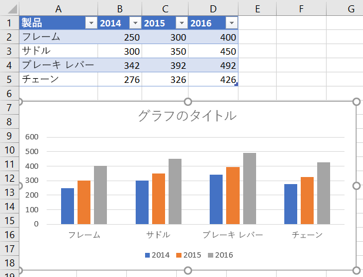
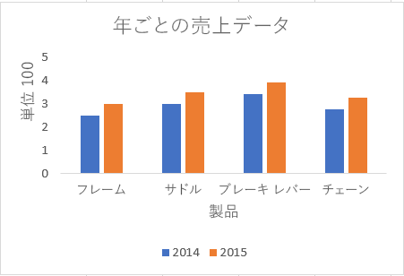

# <a name="work-with-charts-using-the-excel-javascript-api"></a><span data-ttu-id="136c4-103">Excel JavaScript API を使用してグラフを操作する</span><span class="sxs-lookup"><span data-stu-id="136c4-103">Work with charts using the Excel JavaScript API</span></span>

<span data-ttu-id="136c4-104">この記事では、Excel JavaScript API を使用して、グラフの一般的なタスクを実行する方法のサンプル コードを提供します。</span><span class="sxs-lookup"><span data-stu-id="136c4-104">This article provides code samples that show how to perform common tasks with charts using the Excel JavaScript API.</span></span>
<span data-ttu-id="136c4-105">and オブジェクトがサポートするプロパティとメソッドの完全な一覧については、「Chart `Chart` `ChartCollection` Object [(JavaScript API for Excel)」](/javascript/api/excel/excel.chart)および「Chart [Collection Object (JavaScript API for](/javascript/api/excel/excel.chartcollection)Excel)」を参照してください。</span><span class="sxs-lookup"><span data-stu-id="136c4-105">For the complete list of properties and methods that the `Chart` and `ChartCollection` objects support, see [Chart Object (JavaScript API for Excel)](/javascript/api/excel/excel.chart) and [Chart Collection Object (JavaScript API for Excel)](/javascript/api/excel/excel.chartcollection).</span></span>

## <a name="create-a-chart"></a><span data-ttu-id="136c4-106">グラフの作成</span><span class="sxs-lookup"><span data-stu-id="136c4-106">Create a chart</span></span>

<span data-ttu-id="136c4-p102">次のコード サンプルでは、**Sample** というワークシートにグラフを作成します。 グラフは、範囲 **A1:B13** のデータに基づいた **折れ線** グラフです。</span><span class="sxs-lookup"><span data-stu-id="136c4-p102">The following code sample creates a chart in the worksheet named **Sample**. The chart is a **Line** chart that is based upon data in the range **A1:B13**.</span></span>

```js
Excel.run(function (context) {
    var sheet = context.workbook.worksheets.getItem("Sample");
    var dataRange = sheet.getRange("A1:B13");
    var chart = sheet.charts.add("Line", dataRange, "auto");

    chart.title.text = "Sales Data";
    chart.legend.position = "right"
    chart.legend.format.fill.setSolidColor("white");
    chart.dataLabels.format.font.size = 15;
    chart.dataLabels.format.font.color = "black";

    return context.sync();
}).catch(errorHandlerFunction);
```

<span data-ttu-id="136c4-109">**新しい折れ線グラフ**</span><span class="sxs-lookup"><span data-stu-id="136c4-109">**New line chart**</span></span>


## <a name="add-a-data-series-to-a-chart"></a><span data-ttu-id="136c4-111">データ系列をグラフに追加する</span><span class="sxs-lookup"><span data-stu-id="136c4-111">Add a data series to a chart</span></span>

<span data-ttu-id="136c4-p103">次のコード サンプルは、ワークシートの最初のグラフにデータ系列を追加します。 新しいデータ系列は **2016** という名前の列に対応し、範囲 **D2:D5** のデータに基づいています。</span><span class="sxs-lookup"><span data-stu-id="136c4-p103">The following code sample adds a data series to the first chart in the worksheet. The new data series corresponds to the column named **2016** and is based upon data in the range **D2:D5**.</span></span>

```js
Excel.run(function (context) {
    var sheet = context.workbook.worksheets.getItem("Sample");
    var chart = sheet.charts.getItemAt(0);
    var dataRange = sheet.getRange("D2:D5");

    var newSeries = chart.series.add("2016");
    newSeries.setValues(dataRange);

    return context.sync();
}).catch(errorHandlerFunction);
```

<span data-ttu-id="136c4-114">**2016 データ系列が追加される前のグラフ**</span><span class="sxs-lookup"><span data-stu-id="136c4-114">**Chart before the 2016 data series is added**</span></span>


<span data-ttu-id="136c4-116">**2016 データ系列が追加された後のグラフ**</span><span class="sxs-lookup"><span data-stu-id="136c4-116">**Chart after the 2016 data series is added**</span></span>



## <a name="set-chart-title"></a><span data-ttu-id="136c4-118">グラフ タイトルを設定する</span><span class="sxs-lookup"><span data-stu-id="136c4-118">Set chart title</span></span>

<span data-ttu-id="136c4-119">次のコード サンプルは、ワークシートの最初のグラフのタイトルを **Sales Data by Year** に設定します。</span><span class="sxs-lookup"><span data-stu-id="136c4-119">The following code sample sets the title of the first chart in the worksheet to **Sales Data by Year**.</span></span>

```js
Excel.run(function (context) {
    var sheet = context.workbook.worksheets.getItem("Sample");

    var chart = sheet.charts.getItemAt(0);
    chart.title.text = "Sales Data by Year";

    return context.sync();
}).catch(errorHandlerFunction);
```

<span data-ttu-id="136c4-120">**タイトル設定後のグラフ**</span><span class="sxs-lookup"><span data-stu-id="136c4-120">**Chart after title is set**</span></span>


## <a name="set-properties-of-an-axis-in-a-chart"></a><span data-ttu-id="136c4-122">グラフの軸のプロパティを設定する</span><span class="sxs-lookup"><span data-stu-id="136c4-122">Set properties of an axis in a chart</span></span>

<span data-ttu-id="136c4-p104">縦棒グラフ、横棒グラフ、散布図などの[デカルト座標系](https://en.wikipedia.org/wiki/Cartesian_coordinate_system)を使用するグラフには、項目軸と数値軸が含まれています。 次の例で、タイトルを設定し、グラフの軸の単位を表示する方法を示します。</span><span class="sxs-lookup"><span data-stu-id="136c4-p104">Charts that use the [Cartesian coordinate system](https://en.wikipedia.org/wiki/Cartesian_coordinate_system) such as column charts, bar charts, and scatter charts contain a category axis and a value axis. These examples show how to set the title and display unit of an axis in a chart.</span></span>

### <a name="set-axis-title"></a><span data-ttu-id="136c4-125">軸のタイトルを設定する</span><span class="sxs-lookup"><span data-stu-id="136c4-125">Set axis title</span></span>

<span data-ttu-id="136c4-126">次のコード サンプルは、ワークシートの最初のグラフの、項目軸のタイトルを **Product** に設定します。</span><span class="sxs-lookup"><span data-stu-id="136c4-126">The following code sample sets the title of the category axis for the first chart in the worksheet to **Product**.</span></span>

```js
Excel.run(function (context) {
    var sheet = context.workbook.worksheets.getItem("Sample");

    var chart = sheet.charts.getItemAt(0);
    chart.axes.categoryAxis.title.text = "Product";

    return context.sync();
}).catch(errorHandlerFunction);
```

<span data-ttu-id="136c4-127">**項目軸のタイトルが設定された後のグラフ**</span><span class="sxs-lookup"><span data-stu-id="136c4-127">**Chart after title of category axis is set**</span></span>


### <a name="set-axis-display-unit"></a><span data-ttu-id="136c4-129">軸の表示単位を設定する</span><span class="sxs-lookup"><span data-stu-id="136c4-129">Set axis display unit</span></span>

<span data-ttu-id="136c4-130">次のコード サンプルは、ワークシートの最初のグラフの、数値軸の表示単位を **Hundreds** に設定します。</span><span class="sxs-lookup"><span data-stu-id="136c4-130">The following code sample sets the display unit of the value axis for the first chart in the worksheet to **Hundreds**.</span></span>

```js
Excel.run(function (context) {
    var sheet = context.workbook.worksheets.getItem("Sample");

    var chart = sheet.charts.getItemAt(0);
    chart.axes.valueAxis.displayUnit = "Hundreds";

    return context.sync();
}).catch(errorHandlerFunction);
```

<span data-ttu-id="136c4-131">**数値軸の表示単位が設定された後のグラフ**</span><span class="sxs-lookup"><span data-stu-id="136c4-131">**Chart after display unit of value axis is set**</span></span>


## <a name="set-visibility-of-gridlines-in-a-chart"></a><span data-ttu-id="136c4-133">グラフの枠線の表示/非表示を設定する</span><span class="sxs-lookup"><span data-stu-id="136c4-133">Set visibility of gridlines in a chart</span></span>

<span data-ttu-id="136c4-134">次のコード サンプルは、ワークシートの最初のグラフの、数値軸の主な枠線を非表示にします。</span><span class="sxs-lookup"><span data-stu-id="136c4-134">The following code sample hides the major gridlines for the value axis of the first chart in the worksheet.</span></span> <span data-ttu-id="136c4-135">に設定すると、グラフの値軸の大きなグリッド線を表示 `chart.axes.valueAxis.majorGridlines.visible` できます `true` 。</span><span class="sxs-lookup"><span data-stu-id="136c4-135">You can show the major gridlines for the value axis of the chart, by setting `chart.axes.valueAxis.majorGridlines.visible` to `true`.</span></span>

```js
Excel.run(function (context) {
    var sheet = context.workbook.worksheets.getItem("Sample");

    var chart = sheet.charts.getItemAt(0);
    chart.axes.valueAxis.majorGridlines.visible = false;

    return context.sync();
}).catch(errorHandlerFunction);
```

<span data-ttu-id="136c4-136">**枠線が非表示にされたグラフ**</span><span class="sxs-lookup"><span data-stu-id="136c4-136">**Chart with gridlines hidden**</span></span>



## <a name="chart-trendlines"></a><span data-ttu-id="136c4-138">グラフの近似曲線</span><span class="sxs-lookup"><span data-stu-id="136c4-138">Chart trendlines</span></span>

### <a name="add-a-trendline"></a><span data-ttu-id="136c4-139">近似曲線を追加する</span><span class="sxs-lookup"><span data-stu-id="136c4-139">Add a trendline</span></span>

<span data-ttu-id="136c4-p106">次のコード サンプルは、**Sample** という名前のワークシートの、最初のグラフの最初の系列に移動平均の近似曲線を追加します。近似曲線は 5 期間にわたる移動平均を示します。</span><span class="sxs-lookup"><span data-stu-id="136c4-p106">The following code sample adds a moving average trendline to the first series in the first chart in the worksheet named **Sample**. The trendline shows a moving average over 5 periods.</span></span>

```js
Excel.run(function (context) {
    var sheet = context.workbook.worksheets.getItem("Sample");

    var chart = sheet.charts.getItemAt(0);
    var seriesCollection = chart.series;
    seriesCollection.getItemAt(0).trendlines.add("MovingAverage").movingAveragePeriod = 5;

    return context.sync();
}).catch(errorHandlerFunction);
```

<span data-ttu-id="136c4-142">**移動平均の近似曲線が記入されたグラフ**</span><span class="sxs-lookup"><span data-stu-id="136c4-142">**Chart with moving average trendline**</span></span>


### <a name="update-a-trendline"></a><span data-ttu-id="136c4-144">近似曲線を更新する</span><span class="sxs-lookup"><span data-stu-id="136c4-144">Update a trendline</span></span>

<span data-ttu-id="136c4-145">次のコード サンプルでは、Sample という名前のワークシートの最初のグラフの最初の系列に対して、傾向線 `Linear` を入力します。 </span><span class="sxs-lookup"><span data-stu-id="136c4-145">The following code sample sets the trendline to type `Linear` for the first series in the first chart in the worksheet named **Sample**.</span></span>

```js
Excel.run(function (context) {
    var sheet = context.workbook.worksheets.getItem("Sample");

    var chart = sheet.charts.getItemAt(0);
    var seriesCollection = chart.series;
    var series = seriesCollection.getItemAt(0);
    series.trendlines.getItem(0).type = "Linear";

    return context.sync();
}).catch(errorHandlerFunction);
```

<span data-ttu-id="136c4-146">**線形の近似曲線が記入されたグラフ**</span><span class="sxs-lookup"><span data-stu-id="136c4-146">**Chart with linear trendline**</span></span>


## <a name="export-a-chart-as-an-image"></a><span data-ttu-id="136c4-148">グラフを画像としてエクスポートする</span><span class="sxs-lookup"><span data-stu-id="136c4-148">Export a chart as an image</span></span>

<span data-ttu-id="136c4-149">グラフを Excel の外部で画像としてレンダリングできます。</span><span class="sxs-lookup"><span data-stu-id="136c4-149">Charts can be rendered as images outside of Excel.</span></span> <span data-ttu-id="136c4-150">`Chart.getImage` からは、グラフを JPEG 画像として表す base 64 エンコード文字列が返されます。</span><span class="sxs-lookup"><span data-stu-id="136c4-150">`Chart.getImage` returns the chart as a base64-encoded string representing the chart as a JPEG image.</span></span> <span data-ttu-id="136c4-151">次のコードでは、画像の文字列を取得してコンソールに表示する方法を示します。</span><span class="sxs-lookup"><span data-stu-id="136c4-151">The following code shows how to get the image string and log it to the console.</span></span>

```js
Excel.run(function (ctx) {
    var chart = ctx.workbook.worksheets.getItem("Sheet1").charts.getItem("Chart1");
    var imageAsString = chart.getImage();
    return context.sync().then(function () {
        console.log(imageAsString.value);
        // Instead of logging, your add-in may use the base64-encoded string to save the image as a file or insert it in HTML.
    });
}).catch(errorHandlerFunction);
```

<span data-ttu-id="136c4-152">`Chart.getImage` は、省略可能なパラメーターとして幅、高さ、自動調整モードの 3 つを受け取ります。</span><span class="sxs-lookup"><span data-stu-id="136c4-152">`Chart.getImage` takes three optional parameters: width, height, and the fitting mode.</span></span>

```typescript
getImage(width?: number, height?: number, fittingMode?: Excel.ImageFittingMode): OfficeExtension.ClientResult<string>;
```

<span data-ttu-id="136c4-153">これらのパラメーターにより、画像のサイズが決まります。</span><span class="sxs-lookup"><span data-stu-id="136c4-153">These parameters determine the size of the image.</span></span> <span data-ttu-id="136c4-154">画像は常に同じ縦横比でスケーリングされます。</span><span class="sxs-lookup"><span data-stu-id="136c4-154">Images are always proportionally scaled.</span></span> <span data-ttu-id="136c4-155">幅と高さのパラメーターにより、スケーリングされた画像の上端または下端が設定されます。</span><span class="sxs-lookup"><span data-stu-id="136c4-155">The width and height parameters put upper or lower bounds on the scaled image.</span></span> <span data-ttu-id="136c4-156">`ImageFittingMode` 次の動作を持つ 3 つの値があります。</span><span class="sxs-lookup"><span data-stu-id="136c4-156">`ImageFittingMode` has three values with the following behaviors.</span></span>

- <span data-ttu-id="136c4-157">`Fill`: イメージの最小の高さまたは幅は、指定された高さまたは幅です (イメージのスケーリング時に最初に到達した方)。</span><span class="sxs-lookup"><span data-stu-id="136c4-157">`Fill`: The image's minimum height or width is the specified height or width (whichever is reached first when scaling the image).</span></span> <span data-ttu-id="136c4-158">これは、自動調整モードが指定されていない場合の既定の動作です。</span><span class="sxs-lookup"><span data-stu-id="136c4-158">This is the default behavior when no fitting mode is specified.</span></span>
- <span data-ttu-id="136c4-159">`Fit`: イメージの最大の高さまたは幅は、指定された高さまたは幅です (イメージのスケーリング時に最初に到達した方)。</span><span class="sxs-lookup"><span data-stu-id="136c4-159">`Fit`: The image's maximum height or width is the specified height or width (whichever is reached first when scaling the image).</span></span>
- <span data-ttu-id="136c4-160">`FitAndCenter`: イメージの最大の高さまたは幅は、指定された高さまたは幅です (イメージのスケーリング時に最初に到達した方)。</span><span class="sxs-lookup"><span data-stu-id="136c4-160">`FitAndCenter`: The image's maximum height or width is the specified height or width (whichever is reached first when scaling the image).</span></span> <span data-ttu-id="136c4-161">結果の画像は、他の寸法について中央に配置されます。</span><span class="sxs-lookup"><span data-stu-id="136c4-161">The resulting image is centered relative to the other dimension.</span></span>

## <a name="see-also"></a><span data-ttu-id="136c4-162">関連項目</span><span class="sxs-lookup"><span data-stu-id="136c4-162">See also</span></span>

- [<span data-ttu-id="136c4-163">Office アドインの Excel JavaScript オブジェクト モデル</span><span class="sxs-lookup"><span data-stu-id="136c4-163">Excel JavaScript object model in Office Add-ins</span></span>](excel-add-ins-core-concepts.md)
