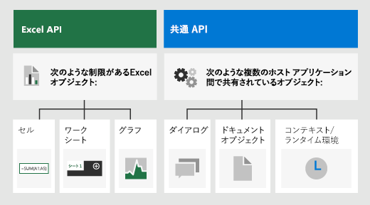

# <a name="excel-javascript-object-model-in-office-add-ins"></a>Office アドインの Excel JavaScript オブジェクト モデル

この記事では、[Excel JavaScript API](../reference/overview/excel-add-ins-reference-overview.md) を使用して Excel 2016 以降のアドインをビルドする方法について説明します。 ここでは API の使用の基本となる中心概念について説明し、広い範囲に対する読み取り、書き込み、一定範囲内すべてのセルの更新など、特定のタスクを実行するためのガイダンスを提供します。

> [!IMPORTANT]
> Excel API の非同期性とブックでの動作方法については、「[Using the application-specific API model (アプリケーション固有の API モデルの使用)](../develop/application-specific-api-model.md)」を参照してください。  

## <a name="officejs-apis-for-excel"></a>Excel 用の Office.js API

Excel アドインは、次の 2 つの JavaScript オブジェクト モデルを含む Office JavaScript API を使用して、Excel のオブジェクトを操作します。

* **Excel JavaScript API**:Office 2016 で導入された [Excel JavaScript API](../reference/overview/excel-add-ins-reference-overview.md) には、ワークシート、範囲、表、グラフなどへのアクセスに使用できる、厳密に型指定されたオブジェクトが用意されています。

* **共通 API**: Office 2013 で導入された [共通 API](/javascript/api/office) を使用すると、複数の種類の Office アプリケーション間で共通の UI、ダイアログ、クライアント設定などの機能にアクセスすることができます。

Excel 2016 以降を対象にしたアドインでは、機能の大部分を Excel JavaScript API を使用して開発する可能性がありますが、共通 API のオブジェクトも使用します。次に例を示します。

* [Context](/javascript/api/office/office.context): `Context`Context`contentLanguage` オブジェクトは、アドインのランタイム環境を表し、API の主要なオブジェクトへのアクセスを提供します。 これは `officeTheme` や `host` などのブック構成の詳細で構成され、`platform` や `requirements.isSetSupported()` などのアドインのランタイム環境に関する情報も提供します。 さらに、 メソッドも提供されます。これを使用すると、指定した要件セットが、アドインが実行されている Excel アプリケーションでサポートされているかどうかを確認できます。
* [Document](/javascript/api/office/office.document): `Document` オブジェクトは `getFileAsync()` メソッドを提供します。これを使用すると、アドインが実行されている Excel ファイルをダウンロードできます。

次の図は、Excel JavaScript API または共通 API を使用するタイミングを示しています。



## <a name="excel-specific-object-model"></a>Excel 固有のオブジェクト モデル

Excel API について理解するには、ブックの構成要素が互いにどのように関連しているかを理解する必要があります。

* **ブック** には、1 つ以上の **ワークシート** が含まれます。
* **ワークシート** には、個々のシートに存在するデータ オブジェクトのコレクションが含まれており、**Range** オブジェクトを介してセルにアクセスできます。
* **Range** は、連続したセルのグループを表します。
* **Range** は、**表**、**グラフ**、**図形**、およびその他のデータ可視化や組織オブジェクトを作成して配置するために使用されます。
* **ブック** には、**ブック** 全体のデータ オブジェクト (**表** など) の一部のコレクションが含まれます。

[!include[Excel cells and ranges note](../includes/note-excel-cells-and-ranges.md)]

### <a name="ranges"></a>範囲

範囲とは、ブック内の連続したセルのグループのことです。 アドインでは、範囲を定義するのに通常 A1 形式の表記が使用されます (例: **B3** は、列 **B**、行 **3** の単一のセルで、**C2:F4** は、列 **C** から **F**、行 **2** から **4** までのセル)。

範囲には `values`、`formulas`、`format` の 3 つの主要なプロパティがあります。 これらのプロパティで、セルの値、評価する数式、およびセルの視覚的な書式設定を取得または設定します。

#### <a name="range-sample"></a>サンプル範囲

次のサンプルで、売上記録の作成方法を示します。 この関数は、`Range` オブジェクトを使用して、値、数式、書式を設定します。

```js
Excel.run(function (context) {
    var sheet = context.workbook.worksheets.getActiveWorksheet();

    // Create the headers and format them to stand out.
    var headers = [
      ["Product", "Quantity", "Unit Price", "Totals"]
    ];
    var headerRange = sheet.getRange("B2:E2");
    headerRange.values = headers;
    headerRange.format.fill.color = "#4472C4";
    headerRange.format.font.color = "white";

    // Create the product data rows.
    var productData = [
      ["Almonds", 6, 7.5],
      ["Coffee", 20, 34.5],
      ["Chocolate", 10, 9.56],
    ];
    var dataRange = sheet.getRange("B3:D5");
    dataRange.values = productData;

    // Create the formulas to total the amounts sold.
    var totalFormulas = [
      ["=C3 * D3"],
      ["=C4 * D4"],
      ["=C5 * D5"],
      ["=SUM(E3:E5)"]
    ];
    var totalRange = sheet.getRange("E3:E6");
    totalRange.formulas = totalFormulas;
    totalRange.format.font.bold = true;

    // Display the totals as US dollar amounts.
    totalRange.numberFormat = [["$0.00"]];

    return context.sync();
});
```

このサンプルは、現在のワークシートに次のデータを作成します。


詳細については、「[Excel JavaScript API を使用した範囲値、テキスト、または数式の設定と取得](excel-add-ins-ranges-set-get-values.md)」を参照してください。

### <a name="charts-tables-and-other-data-objects"></a>グラフ、表、およびその他のデータ オブジェクト

Excel JavaScript API を使用することにより、Excel 内でデータ構造やビジュアル化を作成および操作できます。 表とグラフの 2 つのオブジェクトが頻繁に使用されますが、API はピボットテーブル、図形、画像などもサポートしています。

#### <a name="creating-a-table"></a>表の作成

データ入力範囲を使ってテーブルを作成します。書式設定とテーブル コントロール (フィルターなど) が自動的に範囲に適用されます。

次のサンプルでは、前のサンプルの範囲を使用して表を作成します。

```js
Excel.run(function (context) {
    var sheet = context.workbook.worksheets.getActiveWorksheet();
    sheet.tables.add("B2:E5", true);
    return context.sync();
});
```

前のデータを含むワークシート上でこのサンプル コードを使用すると、次のテーブルが作成されます。


詳細については、「[Excel JavaScript API を使用して表を操作する](excel-add-ins-tables.md)」を参照してください。

#### <a name="creating-a-chart"></a>グラフの作成

グラフを作成すると、範囲内のデータを視覚化できます。 この API は、さまざまな種類のグラフをサポートしています。いずれのグラフも、必要に応じてカスタマイズできます。

次のサンプルでは 3 つの品目の簡単な縦棒グラフが作成され、ワークシートの上端から 100 ピクセル下に配置されます。

```js
Excel.run(function (context) {
    var sheet = context.workbook.worksheets.getActiveWorksheet();
    var chart = sheet.charts.add(Excel.ChartType.columnStacked, sheet.getRange("B3:C5"));
    chart.top = 100;
    return context.sync();
});
```

前の表を含むワークシート上でこのサンプルを実行すると、次のグラフが作成されます。


詳細については、「[Excel JavaScript API を使用してグラフを操作する](excel-add-ins-charts.md)」を参照してください。

## <a name="see-also"></a>関連項目

* [最初の Excel アドインをビルドする](../quickstarts/excel-quickstart-jquery.md)
* [Excel アドインのコード サンプル](https://developer.microsoft.com/office/gallery/?filterBy=Samples,Excel)
* [Excel の JavaScript API を使用した、パフォーマンスの最適化](../excel/performance.md)
* [Excel JavaScript API リファレンス](../reference/overview/excel-add-ins-reference-overview.md)
