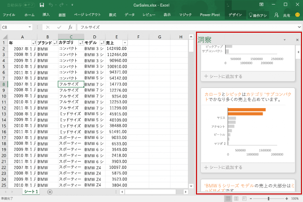
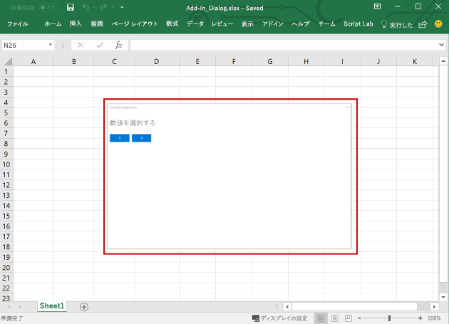
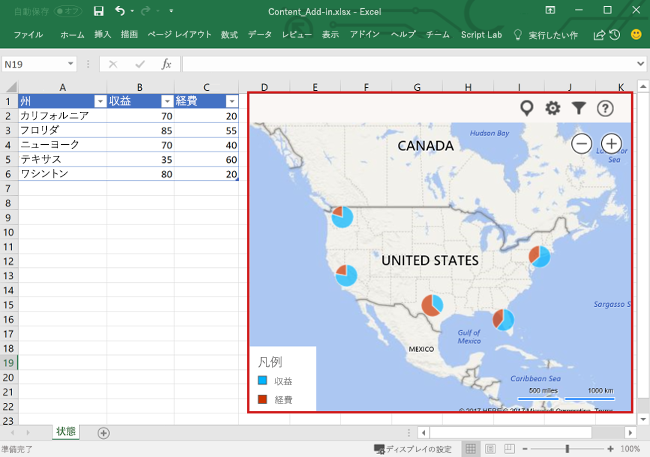

# Excel アドインの概要Excel add-ins overview

Excel アドインを使用すると、Office for Windows、Office Online、Office for the Mac、Office for the iPad など、複数のプラットフォームにわたって Excel アプリケーションの機能を拡張できます。ブック内で Excel アドインを使用すると、次の操作を実行できます。An Excel add-in allows you to extend Excel application functionality across multiple platforms including Office for Windows, Office Online, Office for the Mac, and Office for the iPad. Use Excel add-ins within a workbook to:

- Excel オブジェクトを操作して Excel データを読み書きします。Interact with Excel objects, read and write Excel data. 
- Web ベースの作業ウィンドウまたはコンテンツ ウィンドウを使用して機能を拡張しますExtend functionality using web based task pane or content pane 
- カスタム リボン ボタンやコンテキスト メニューの項目を追加しますAdd custom ribbon buttons or contextual menu items
- ダイアログ ウィンドウを使用して充実した操作を提供しますProvide richer interaction using dialog window 

Office アドインのプラットフォームには、Excel アドインの作成と実行を可能にするフレームワークと Office.js JavaScript API が用意されています。Office アドインのプラットフォームを使用した Excel アドインの作成には、次の利点があります。The Office Add-ins platform provides the framework and Office.js JavaScript APIs that enable you to create and run Excel add-ins. By using the Office Add-ins platform to create your Excel add-in, you'll get the following benefits:

* **クロスプラットフォーム サポート**: Excel アドインは、Windows 版、Mac 版、iOS 版の Office と Office Online で実行できます。**Cross-platform support**: Excel add-ins run in Office for Windows, Mac, iOS, and Office Online.
* **一元展開**: 管理者は、組織全体のユーザーに Excel アドインをすばやく簡単に展開できます。**Centralized deployment**: Admins can quickly and easily deploy Excel add-ins to users throughout an organization.
* **シングル サインオン (SSO)**: Excel のアドインを Microsoft Graph に簡単に統合できます。**Single sign on (SSO)**: Easily integrate your Excel add-in with the Microsoft Graph.
* **標準の Web テクノロジの使用**: HTML、CSS、JavaScript などの一般的な Web テクノロジを使用する Excel アドインを作成します。**Use of standard web technology**: Create your Excel add-in using familiar web technologies such as HTML, CSS, and JavaScript.
* **AppSource を経由した配布**: Excel アドインを [AppSource](https://appsource.microsoft.com/marketplace/apps?product=office&page=1&src=office&corrid=53245fad-fcbe-41f8-9f97-b0840264f97c&omexanonuid=4a0102fb-b31a-4b9f-9bb0-39d4cc6b789d) に公開することで、広範囲のユーザーと共有します。**Distribution via AppSource**: Share your Excel add-in with a broad audience by publishing it to [AppSource](https://appsource.microsoft.com/marketplace/apps?product=office&page=1&src=office&corrid=53245fad-fcbe-41f8-9f97-b0840264f97c&omexanonuid=4a0102fb-b31a-4b9f-9bb0-39d4cc6b789d).

> [!NOTE]
> Excel アドインは、Office for Windows上でのみ実行する、以前のOffice統合ソリューションである COM および VSTO アドインとは異なります。COM アドインとは異なり、 Excel アドインではユーザーのデバイスや Excel 内にコードをインストールする必要はありません。Excel add-ins are different from COM and VSTO add-ins, which are earlier Office integration solutions that run only on Office for Windows. Unlike COM add-ins, Excel add-ins do not require you to install any code on a user's device, or within Excel. 

## Excel アドインのコンポーネントComponents of an Excel add-in 

Excel アドインには 2 つの基本コンポーネントが含まれています。Web アプリケーションと、マニフェスト ファイルと呼ばれる構成ファイルです。An Excel add-in includes two basic components: a web application and a configuration file, called a manifest file. 

Web アプリケーションは、 [ JavaScript API for Office](https://docs.microsoft.com/javascript/office/javascript-api-for-office?view=office-js) を使用して Excel のオブジェクトを操作します。また、オンライン リソースとの相互操作を簡単にすることもできます。たとえば、アドインは次の全てのタスクを実行可能です。The web application uses the [JavaScript API for Office](https://docs.microsoft.com/javascript/office/javascript-api-for-office?view=office-js) to interact with objects in Excel, and can also facilitate interaction with online resources. For example, an add-in can perform any of the following tasks:

* ブック内のデータ (ワークシート、範囲、テーブル、グラフ、名前付きの項目など) を作成、読み込み、更新、および削除します。Create, read, update, and delete data in the workbook (worksheets, ranges, tables, charts, named items, and more).
* 標準の OAuth 2.0 のフローを使用して、オンライン サービスでユーザー認証を実行します。Perform user authorization with an online service by using the standard OAuth 2.0 flow.
* Microsoft Graph やその他の API に、API 要求を発行します。Issue API requests to Microsoft Graph or any other API.

Web アプリケーションは、任意の Web サーバー上でホストできます。また、クライアント側のフレームワーク (Angular、React、jQuery など) や、サーバー側のテクノロジ (ASP.NET、Node.js、PHP など) を使用して構築できます。The web application can be hosted on any web server, and can be built using client-side frameworks (such as Angular, React, jQuery) or server-side technologies (such as ASP.NET, Node.js, PHP).

[マニフェスト](../develop/add-in-manifests.md)は XML 構成ファイルであり、次のような設定と機能を指定することによって、アドインと Office クライアントを統合する方法を定義します。The [manifest](../develop/add-in-manifests.md) is an XML configuration file that defines how the add-in integrates with Office clients by specifying settings and capabilities such as: 

* アドインの Web アプリケーションの URL。The URL of the add-in's web application.
* アドインの表示名、説明、ID、バージョン、および既定のロケール。The add-in's display name, description, ID, version, and default locale.
* アドインと Excel を統合する方法。アドインが作成する任意のカスタム UI (リボンのボタン、コンテキスト メニューなど) の統合を含む。How the add-in integrates with Excel, including any custom UI that the add-in creates (ribbon buttons, context menus, and so on).
* ドキュメントの読み取り、書き込みなど、アドインに必要なアクセス許可。Permissions that the add-in requires, such as reading and writing to the document.

エンドユーザーが Excel アドインをインストールして使用できるようにするには、そのマニフェストを AppSource かアドイン カタログに公開する必要があります。To enable end-users to install and use an Excel add-in, you must publish its manifest either to AppSource or to an Add-ins catalog. 

## Excel アドインの機能Capabilities of an Excel add-in

ブック内のコンテンツの操作の他に、Excel アドインでは、カスタム リボンのボタンやメニュー コマンドを追加したり、作業ウィンドウを挿入したり、ダイアログ ボックスを開いたり、グラフや対話型のビジュアル化などの豊富な Web ベースのオブジェクトをワークシート内に埋め込むことができます。In addition to interacting with the content in the workbook, Excel add-ins can add custom ribbon buttons or menu commands, insert task panes, open dialog boxes, and even embed rich, web-based objects such as charts or interactive visualizations within a worksheet.

### アドイン コマンドAdd-in commands

アドイン コマンドは、Excel UI を拡張する UI 要素であり、アドインのアクションを開始します。アドイン コマンドを使って、Excel のリボンにボタンを追加したり、コンテキスト メニューに項目を追加したりできます。ユーザーがアドイン コマンドを選択するときは、JavaScript コードの実行や、作業ウィンドウでのアドインのページの表示といったアクションを開始します。Add-in commands are UI elements that extend the Excel UI and start actions in your add-in. You can use add-in commands to add a button on the ribbon or an item to a context menu in Excel. When users select an add-in command, they initiate actions such as running JavaScript code, or showing a page of the add-in in a task pane. 

**アドイン コマンド****Add-in commands**

コマンドの機能、サポートされているプラットフォーム、およびアドイン コマンド開発のベスト プラクティスについては、「[Excel、Word、および PowerPoint のアドイン コマンド](../design/add-in-commands.md)」を参照してください。For more information about command capabilities, supported platforms, and best practices for developing add-in commands, see [Add-in commands for Excel, Word, and PowerPoint](../design/add-in-commands.md).

### 作業ウィンドウTask panes

作業ウィンドウは、通常 Excel 内のウィンドウの右側に表示されるインターフェイスのサーフェスです。作業ウィンドウにより、ユーザーはコードを実行して Excel ドキュメントを修正したり、データ ソースからデータを表示したりするインターフェイス コントロールにアクセスできます。Task panes are interface surfaces that typically appear on the right side of the window within Excel. Task panes give users access to interface controls that run code to modify the Excel document or display data from a data source. 

**作業ウィンドウ****Task pane**

作業ウィンドウの詳細については、「[Office アドインの作業ウィンドウ](../design/task-pane-add-ins.md)」を参照してください。Excel の作業ウィンドウを実装するサンプルについては、「[Excel アドインの JS WoodGrove Expense Trends](https://github.com/OfficeDev/Excel-Add-in-WoodGrove-Expense-Trends)」を参照してください。For more information about task panes, see [Task panes in Office Add-ins](../design/task-pane-add-ins.md). For a sample that implements a task pane in Excel, see [Excel Add-in JS WoodGrove Expense Trends](https://github.com/OfficeDev/Excel-Add-in-WoodGrove-Expense-Trends).

### ダイアログ ボックスDialog boxes

ダイアログ ボックスは、有効な Excel アプリケーション ウィンドウ前にフロートするサーフェスです。作業ウィンドウで直接開くことができないサインイン ページの表示、ユーザーによるアクションを確認するための要求、作業ウィンドウ内で再生すると小さすぎるビデオのホストなどの作業に使用できます。ダイアログ ボックスを 使用中の Excel アドインで開くには、[ Dialog API](https://docs.microsoft.com/javascript/api/office/office.ui?view=office-js)を使用してください。Dialog boxes are surfaces that float above the active Excel application window. You can use dialog boxes for tasks such as displaying sign-in pages that can't be opened directly in a task pane, requesting that the user confirm an action, or hosting videos that might be too small if confined to a task pane. To open dialog boxes in your Excel add-in, use the [Dialog API](https://docs.microsoft.com/javascript/api/office/office.ui?view=office-js).

**ダイアログ ボックス****Dialog box**

ダイアログ ボックスとダイアログ API の詳細については、「[Office アドインのダイアログ ボックス](../design/dialog-boxes.md)」と「[Office アドインでダイアログ API を使用する](../develop/dialog-api-in-office-add-ins.md)」を参照してください。For more information about dialog boxes and the Dialog API, see [Dialog boxes in Office Add-ins](../design/dialog-boxes.md) and [Use the Dialog API in your Office Add-ins](../develop/dialog-api-in-office-add-ins.md).

### コンテンツ アドインContent add-ins

コンテンツ アドインは、Excel ドキュメントに直接埋め込むことができるサーフェイスです。コンテンツ アドインを使用すると、グラフ、データのビジュアル化、メディアなど豊富な Web ベース オブジェクトをワークシートに埋め込んだり、Excel ドキュメントの変更またはデータ ソースのデータ表示のためのコードを実行するインターフェイス コントロールへのアクセスをユーザーに提供したりできます。機能を直接ドキュメントに埋め込む場合は、コンテンツ アドインを使用します。Content add-ins are surfaces that you can embed directly into Excel documents. You can use content add-ins to embed rich, web-based objects such as charts, data visualizations, or media into a worksheet or to give users access to interface controls that run code to modify the Excel document or display data from a data source. Use content add-ins when you want to embed functionality directly into the document.

**コンテンツ アドイン****Content add-in**

コンテンツ アドインの詳細については、「[コンテンツ Office アドイン](../design/content-add-ins.md)」を参照してください。Excel のコンテンツ アドインの実装サンプルについては、GitHub の「[Excel コンテンツ アドイン Humongous Insurance](https://github.com/OfficeDev/Excel-Content-Add-in-Humongous-Insurance)」を参照してください。For more information about content add-ins, see [Content Office Add-ins](../design/content-add-ins.md). For a sample that implements a content add-in in Excel, see [Excel Content Add-in Humongous Insurance](https://github.com/OfficeDev/Excel-Content-Add-in-Humongous-Insurance) in GitHub.

## ブックのコンテンツを操作する JavaScript APIJavaScript APIs to interact with workbook content

Excel アドインは、次の 2 つの JavaScript オブジェクト モデルを含む [JavaScript API for Office](https://docs.microsoft.com/javascript/office/javascript-api-for-office?view=office-js) を使用して、Excel のオブジェクトを操作します。An Excel add-in interacts with objects in Excel by using the [JavaScript API for Office](https://docs.microsoft.com/javascript/office/javascript-api-for-office?view=office-js), which includes two JavaScript object models:

* **Excel JavaScript API**: Office 2016 で導入された [Excel JavaScript API](https://docs.microsoft.com/javascript/office/overview/excel-add-ins-reference-overview?view=office-js) には、ワークシート、範囲、表、グラフなどへのアクセスに使用できる、厳密に型指定された Excel オブジェクトが用意されています。**Excel JavaScript API**: Introduced with Office 2016, the [Excel JavaScript API](https://docs.microsoft.com/javascript/office/overview/excel-add-ins-reference-overview?view=office-js) provides strongly-typed Excel objects that you can use to access worksheets, ranges, tables, charts, and more. 

* **Shared API**: Office 2013 で導入された共有 API を使用すると、Word、Excel、PowerPoint など複数の種類のホスト アプリケーションに共通する UI、ダイアログ、クライアント設定などの機能にアクセスできます。共有 API はExcelでの相互作用機能が制限されているため、 Excel 2013上でアドインを実行しなければいけない場合に使用できます。**Shared API**: Introduced with Office 2013, the shared API enables you to access features such as UI, dialogs, and client settings that are common across multiple types of host applications such as Word, Excel, and PowerPoint. Because the shared API does provide limited functionality for Excel interaction, you can use it if your add-in needs to run on Excel 2013.

## 次の手順Next steps

 [最初の Excel アドインを作成する](excel-add-ins-get-started-overview.md)ことから始めます。次に、Excel アドイン構築の[中心概念](excel-add-ins-core-concepts.md)について説明します。Get started by [creating your first Excel add-in](excel-add-ins-get-started-overview.md). Then, learn about the [core concepts](excel-add-ins-core-concepts.md) of building Excel add-ins.

## 関連項目See also

- [Office アドイン プラットフォームの概要Office Add-ins platform overview](../overview/office-add-ins.md)
- [Office アドイン開発のベスト プラクティスBest practices for developing Office Add-ins](../concepts/add-in-development-best-practices.md)
- [Office アドインの設計ガイドラインDesign guidelines for Office Add-ins](../design/add-in-design.md)
- [Excel の JavaScript API を使用した基本的なプログラミングの概念Fundamental programming concepts with the Excel JavaScript API](excel-add-ins-core-concepts.md)
- [Excel JavaScript API リファレンスExcel JavaScript API reference](https://docs.microsoft.com/javascript/office/overview/excel-add-ins-reference-overview?view=office-js)
