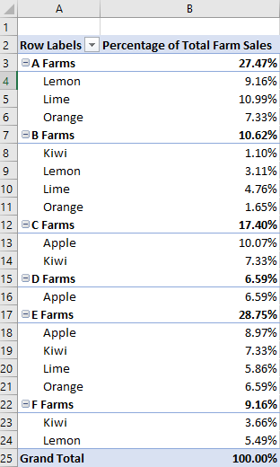

# <a name="work-with-pivottables-using-the-excel-javascript-api"></a>Excel の JavaScript API を使用してピボット テーブルで作業します

ピボット テーブルより大きなデータ セットを合理化します。 グループ化されたデータのクイック操作が可能です。 Excel の JavaScript API では、アドインにピボット テーブルを作成させ、それらのコンポーネントと対話することができます。 

ピボット テーブルの機能に慣れていない場合は、エンド ユーザーとしてこれらの操作を検討してください。 これらのツールの良い入門書については、[ピボットテーブルを作成してワークシートのデータを分析する ](https://support.office.com/en-us/article/Import-and-analyze-data-ccd3c4a6-272f-4c97-afbb-d3f27407fcde#ID0EAABAAA=PivotTables) を参照してください。 

この記事では、一般的なシナリオのコード サンプルを提供します。 ピボットテーブルAPI の理解をさらに深めるには、 [**PivotTable**](https://docs.microsoft.com/javascript/api/excel/excel.pivottable) と [**PivotTableCollection**](https://docs.microsoft.com/javascript/api/excel/excel.pivottable)を参照してください。

> [!IMPORTANT]
> OLAP で作成されたピボット テーブルは、現在サポートされていません。

## <a name="hierarchies"></a>階層

ピボット テーブルは、行、列、データ、フィルターの 4 つの階層カテゴリに基づいて構成されています。 この記事全体を通して、さまざまな農場の果物の売り上げを記述した次のデータを使用します。


このデータには **農家**、 **種類**、 **分類**、**農場で販売された箱数**、および **卸売りで販売された箱数** の 5 つの階層があります。 各階層は、4 つの分類項目のうちの 1 つにのみ存在することができます。 **種類** が 列の階層に追加され、さらに行の階層に追加された場合、行の階層にのみ残ります。

行と列の階層は、データをグループ化する方法を定義します。 たとえば、 **農場** の行の階層は、同じ農場のすべてのデータ セットをまとめてグループ化します。 行と列の階層から選択すると、ピボット テーブルの向きが定義されます。

データ階層は、行と列の階層に基づいて集計される値です。 **農場** の行の階層と **卸売りで販売された木箱** のデータ階層からなるピボット テーブルは、各農場のさまざまな種類の果物の総計 (既定) を示します。

フィルター階層は、フィルターされた種類の中の値に基づいてピボットにデータを取り込むか、取り除きます。 **分類** のフィルター階層で **有機栽培** を選択すると、有機栽培の果物のデータのみが表示されます。

これで再び農場のデータができ、ピボット テーブルに表示されます。 ピボット テーブルは、**農場** と **種類**を行階層、 **農場で販売された箱数** と**卸売りで販売された箱数** をデータ階層 (既定の合計の集計関数)、**分類**  をフィルター階層 (**有機栽培**を選択) として使用しています。 


このピボットテーブルは、 JavaScript API  または Excel  の UI を用いて生成できました。 両方のオプションで、アドインでさらに操作することができます。

## <a name="create-a-pivottable"></a>ピボット テーブルの作成

ピボット テーブルには、名前、ソース、同期先が必要です。 ソースは、範囲アドレス、またはテーブル名を指定できます ( `Range`、 `string`、`Table` 型として渡されます)。 同期先は、範囲アドレスです (`Range` または `string` のいずれかとして付与されます)。 次のサンプルでは、さまざまなピボット テーブルの作成方法を示します。

### <a name="create-a-pivottable-with-range-addresses"></a>範囲アドレスを使用してピボット テーブルを作成

```typescript
await Excel.run(async (context) => {
    // creating a PivotTable named "Farm Sales" on the current worksheet at cell A22 with data from the range A1:E21
    context.workbook.worksheets.getActiveWorksheet().pivotTables.add("Farm Sales", "A1:E21", "A22");

    await context.sync();
});
```

### <a name="create-a-pivottable-with-range-objects"></a>Range オブジェクトを使用してピボット テーブルを作成

```typescript
await Excel.run(async (context) => {    
    // creating a PivotTable named "Farm Sales" on a worksheet called "PivotWorksheet" at cell A2
    // the data comes from the worksheet "DataWorksheet" across the range A1:E21
    const rangeToAnalyze = context.workbook.worksheets.getItem("DataWorksheet").getRange("A1:E21");
    const rangeToPlacePivot = context.workbook.worksheets.getItem("PivotWorksheet").getRange("A2");
    context.workbook.worksheets.getItem("PivotWorksheet").pivotTables.add(
        "Farm Sales", rangeToAnalyze, rangeToPlacePivot);
    
    await context.sync();
});
```

### <a name="create-a-pivottable-at-the-workbook-level"></a>ワークブック レベルでピボット テーブルを作成

```typescript
await Excel.run(async (context) => {
    // creating a PivotTable named "Farm Sales" on a worksheet called "PivotWorksheet" at cell A2
    // the data is from the worksheet "DataWorksheet" across the range A1:E21
    context.workbook.pivotTables.add("Farm Sales", "DataWorksheet!A1:E21", "PivotWorksheet!A2");

    await context.sync();
});
```

## <a name="use-an-existing-pivottable"></a>既存のピボット テーブルの使用

手動で作成したピボット テーブルも、ブックのピボット テーブルのコレクションまたはここのワークシートを使用してアクセス可能です。 

次のコードは、ブックに最初のピボットテーブルを追加します。 以降に参照しやすくするため、テーブルに名前を付与します。

```typescript
await Excel.run(async (context) => {
    const pivotTable = context.workbook.pivotTables.getItem("My Pivot");
    await context.sync();
});
```

## <a name="add-rows-and-columns-to-a-pivottable"></a>ピボット テーブルに行と列を追加

行と列は、これらのフィールドの値の周りでデータをピボットします。

**農場** 列を追加すると、各農場のすべての売り上げをピボットします。 **種類** と **分類** 行を追加すると、どの果物が販売されたか、そしてそれが有機栽培かどうかに基づいて、データがさらに分解されます。


```typescript
await Excel.run(async (context) => {
    const pivotTable = context.workbook.worksheets.getActiveWorksheet().pivotTables.getItem("Farm Sales");

    pivotTable.rowHierarchies.add(pivotTable.hierarchies.getItem("Type"));
    pivotTable.rowHierarchies.add(pivotTable.hierarchies.getItem("Classification"));
    
    pivotTable.columnHierarchies.add(pivotTable.hierarchies.getItem("Farm"));

    await context.sync();
});
```

行または列のみを含むピボット テーブルも可能です。

```typescript
await Excel.run(async (context) => {
    const pivotTable = context.workbook.worksheets.getActiveWorksheet().pivotTables.getItem("Farm Sales");
    pivotTable.rowHierarchies.add(pivotTable.hierarchies.getItem("Farm"));
    pivotTable.rowHierarchies.add(pivotTable.hierarchies.getItem("Type"));
    pivotTable.rowHierarchies.add(pivotTable.hierarchies.getItem("Classification"));
    
    await context.sync();
});
```

## <a name="add-data-hierarchies-to-the-pivottable"></a>ピボット テーブルへのデータ階層の追加

データ階層は、行と列に基づいて組み合わせる情報でピボット テーブルを入力します。 **農場で販売された箱数** と **卸売りで販売された箱数** のデータ階層を追加すると、各行と列にそれらの数値の合計が表示されます。 

この例では、 **農場** と **種類** はともに行となり、箱の販売数をデータとして表示します。 


```typescript
await Excel.run(async (context) => {
    const pivotTable = context.workbook.worksheets.getActiveWorksheet().pivotTables.getItem("Farm Sales");

    // "Farm" and "Type" are the hierarchies on which the aggregation is based
    pivotTable.rowHierarchies.add(pivotTable.hierarchies.getItem("Farm"));
    pivotTable.rowHierarchies.add(pivotTable.hierarchies.getItem("Type"));

    // "Crates Sold at Farm" and "Crates Sold Wholesale" are the hierarchies
    // that will have their data aggregated (summed in this case)
    pivotTable.dataHierarchies.add(pivotTable.hierarchies.getItem("Crates Sold at Farm"));
    pivotTable.dataHierarchies.add(pivotTable.hierarchies.getItem("Crates Sold Wholesale"));

    await context.sync();
});
```

## <a name="change-aggregation-function"></a>集計関数を変更する

データの階層では、値を集計します。 数値のデータセットの場合、既定ではこれは合計となります。 タイプ `summarizeBy` に基づいてプロパティはこの動作を定義します 。`AggregrationFunction` 

現在サポートされている集計関数のタイプは、 `Sum`, `Count`, `Average`, `Max`, `Min`, `Product`, `CountNumbers`, `StandardDeviation`, `StandardDeviationP`, `Variance`, `VarianceP`,  `Automatic` (既定値) です。

次のコード サンプルでは、データの平均値を使用する集計を変更します。

```typescript
await Excel.run(async (context) => {
    const pivotTable = context.workbook.worksheets.getActiveWorksheet().pivotTables.getItem("Farm Sales");
    pivotTable.dataHierarchies.load("no-properties-needed");
    await context.sync();

    // changing the aggregation from the default sum to an average of all the values in the hierarchy
    pivotTable.dataHierarchies.items[0].summarizeBy = Excel.AggregationFunction.average;
    pivotTable.dataHierarchies.items[1].summarizeBy = Excel.AggregationFunction.average;
    await context.sync();
});
```

## <a name="change-calculations-with-a-showasrule"></a>ShowAsRule を使用して計算を変更します

ピボット テーブルでは、既定では、行と列の階層のデータを個別に集約します。 A `ShowAsRule` ピボット テーブル内の他の項目に基づいた値を出力するために、データの階層を変更します。

 `ShowAsRule` オブジェクトには次の 3 つのプロパティがあります。
-   `calculation`: データの階層に適用する相対的な計算の種類 (既定値は `none`)。
-   `baseField`: 計算が適用される前の基本データを含む階層内のフィールド。 通常、 `PivotField`は 親の階層と同じ名前を持ちます。
-   `baseItem`: 計算の種類に基づいた基本フィールドの値と比較した個々の項目。 すべての計算がこのフィールドを必要とするわけではありません。

列合計のパーセント値で指定する **ファームで販売される木箱の合計** データ階層の計算を設定する例を次に示します。 粒度を果物の種類レベルに拡張するため、 **種類** の行の階層と基になるフィールドを使用するようにします。 例では、最初の行の階層として **ファーム** も示しているため、ファームの合計エントリは、各ファームが生産の責任を負うパーセント値も表示します。



``` TypeScript
await Excel.run(async (context) => {
    const pivotTable = context.workbook.worksheets.getActiveWorksheet().pivotTables.getItem("Farm Sales");
    const farmDataHierarchy = pivotTable.dataHierarchies.getItem("Sum of Crates Sold at Farm");

    farmDataHierarchy.load("showAs");
    await context.sync();

    // show the crates of each fruit type sold at the farm as a percentage of the column's total
    let farmShowAs = farmDataHierarchy.showAs;
    farmShowAs.calculation = Excel.ShowAsCalculation.percentOfColumnTotal;
    farmShowAs.baseField = pivotTable.rowHierarchies.getItem("Type").fields.getItem("Type");
    farmDataHierarchy.showAs = farmShowAs; 
    farmDataHierarchy.name = "Percentage of Total Farm Sales";

    await context.sync();
});
```

以前の例では、個々の行の階層と比べて、列に計算を設定します。 計算が個々の項目に関連する場合は、 `baseItem` プロパティを使用します。 

次の例は、 `differenceFrom` 計算を示します。 「A ファーム」のファーム木箱販売データ階層エントリの差を表示します。  `baseField`は **ファーム**なので、各果物の種類のブレークダウン図形と同様に、他のファーム間の差がわかります (この例では**種類** も行の階層) 。


``` TypeScript
await Excel.run(async (context) => {
    const pivotTable = context.workbook.worksheets.getActiveWorksheet().pivotTables.getItem("Farm Sales");
    const farmDataHierarchy = pivotTable.dataHierarchies.getItem("Sum of Crates Sold at Farm");

    farmDataHierarchy.load("showAs");
    await context.sync();

    // show the difference between crate sales of the "A Farms" and the other farms
    // this difference is both aggregated and shown for individual fruit types (where applicable)
    let farmShowAs = farmDataHierarchy.showAs;
    farmShowAs.calculation = Excel.ShowAsCalculation.differenceFrom;
    farmShowAs.baseField = pivotTable.rowHierarchies.getItem("Farm").fields.getItem("Farm");
    farmShowAs.baseItem = pivotTable.rowHierarchies.getItem("Farm").fields.getItem("Farm").items.getItem("A Farms");
    farmDataHierarchy.showAs = farmShowAs;
    farmDataHierarchy.name = "Difference from A Farms";
    await context.sync();
});
```

## <a name="pivottable-layouts"></a>ピボット テーブルのレイアウト

ピボットテーブルのレイアウトは、階層とそのデータの配置を定義します。 データが保存されている範囲を決定するレイアウトにアクセスします。 

レイアウト関数を呼び出す次の図は、ピボット テーブルの範囲に対応します。


次のコードでは、レイアウトを使用するピボット テーブルのデータの最後の行を取得する方法を示します。 これらの値は、総計用にまとめて集計されます。

```typescript
await Excel.run(async (context) => {
    const pivotTable = context.workbook.worksheets.getActiveWorksheet().pivotTables.getItem("Farm Sales");

    // get the totals for each data hierarchy from the layout
    const range = pivotTable.layout.getDataBodyRange();
    const grandTotalRange = range.getLastRow();
    grandTotalRange.load("address");
    await context.sync();

    // sum the totals from the PivotTable data hierarchies and place them in a new range
    const masterTotalRange = context.workbook.worksheets.getActiveWorksheet().getRange("B27:C27");
    masterTotalRange.formulas = [["All Crates", "=SUM(" + grandTotalRange.address + ")"]];
    await context.sync();
});
```

ピボット テーブルには、3 つのレイアウト スタイル: コンパクト、アウトライン、および表形式があります。 前の例でコンパクトなスタイルを使用しました。 

次の例では、アウトライン、表形式のスタイルをそれぞれ使用します。 コード サンプルでは、さまざまなレイアウトが交互に表示する方法を示します。

### <a name="outline-layout"></a>アウトライン レイアウト表示


### <a name="tabular-layout"></a>表形式のレイアウト


## <a name="change-hierarchy-names"></a>階層名の変更

階層のフィールドは、編集できます。 次のコードでは、二つのデータ階層の表示された名前をどのように変更するかを説明します。

```typescript
await Excel.run(async (context) => {
    const dataHierarchies = context.workbook.worksheets.getActiveWorksheet()
        .pivotTables.getItem("Farm Sales").dataHierarchies;
    dataHierarchies.load("no-properties-needed");
    await context.sync();
    
    // changing the displayed names of these entries
    dataHierarchies.items[0].name = "Farm Sales";
    dataHierarchies.items[1].name = "Wholesale";
    await context.sync();
});
```

## <a name="delete-a-pivottable"></a>ピボット テーブルを削除します。

ピボットテーブルをその名前を用いて削除します。

```typescript
await Excel.run(async (context) => {
    context.workbook.worksheets.getItem("Pivot").pivotTables.getItem("Farm Sales").delete();

    await context.sync();
});
```

## <a name="see-also"></a>関連項目

- [Excel JavaScript API の中心概念](excel-add-ins-core-concepts.md)
- [Excel の JavaScript API リファレンス](https://docs.microsoft.com/javascript/api/excel)
