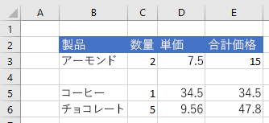

# <a name="work-with-ranges-using-the-excel-javascript-api"></a>Excel JavaScript API を使用して範囲を操作する

この記事では、Excel JavaScript API を使用して、範囲に関する一般的なタスクを実行する方法を示すコードサンプルを提供します。オブジェクトが`Range`サポートするプロパティとメソッドの完全な一覧については、「 [Range オブジェクト (JavaScript API for Excel)](/javascript/api/excel/excel.range)」を参照してください。

> [!NOTE]
> 範囲を指定してより詳細なタスクを実行する方法のサンプル コードについては、「[Excel JavaScript API を使用して範囲を操作する (詳細)](excel-add-ins-ranges-advanced.md)」を参照してください。

## <a name="get-a-range"></a>範囲を取得する

次の例では、ワークシート内の範囲への参照を取得する、さまざまな方法を示しています。

### <a name="get-range-by-address"></a>アドレスによって範囲を取得する

次のコードサンプルでは、 **sample**という名前のワークシートからアドレス**B2: C5**の`address`範囲を取得し、そのプロパティを読み込んで、コンソールにメッセージを書き込みます。

```js
Excel.run(function (context) {
    var sheet = context.workbook.worksheets.getItem("Sample");
    var range = sheet.getRange("B2:C5");
    range.load("address");

    return context.sync()
        .then(function () {
            console.log(`The address of the range B2:C5 is "${range.address}"`);
        });
}).catch(errorHandlerFunction);
```

### <a name="get-range-by-name"></a>名前によって範囲を取得する

次のコードサンプルでは、 **sample**という名前のワークシートから指定`address` `MyRange`された範囲を取得し、そのプロパティを読み込んで、コンソールにメッセージを書き込みます。

```js
Excel.run(function (context) {
    var sheet = context.workbook.worksheets.getItem("Sample");
    var range = sheet.getRange("MyRange");
    range.load("address");

    return context.sync()
        .then(function () {
            console.log(`The address of the range "MyRange" is "${range.address}"`);
        });
}).catch(errorHandlerFunction);
```

### <a name="get-used-range"></a>使用範囲を取得する

次のコードサンプルでは、 **sample**という名前のワークシートから使用`address`された範囲を取得し、そのプロパティを読み込み、コンソールにメッセージを書き込みます。使用されている範囲は、値または書式が割り当てられているワークシートのすべてのセルを含む最小の範囲です。ワークシート全体が空白の場合、 `getUsedRange()`このメソッドは、ワークシートの左上のセルのみで構成される範囲を返します。

```js
Excel.run(function (context) {
    var sheet = context.workbook.worksheets.getItem("Sample");
    var range = sheet.getUsedRange();
    range.load("address");

    return context.sync()
        .then(function () {
            console.log(`The address of the used range in the worksheet is "${range.address}"`);
        });
}).catch(errorHandlerFunction);
```

### <a name="get-entire-range"></a>範囲全体を取得する

次のコードサンプルでは、 **sample**という名前のワークシートからワークシート`address`の範囲全体を取得し、そのプロパティを読み込み、コンソールにメッセージを書き込みます。

```js
Excel.run(function (context) {
    var sheet = context.workbook.worksheets.getItem("Sample");
    var range = sheet.getRange();
    range.load("address");

    return context.sync()
        .then(function () {
            console.log(`The address of the entire worksheet range is "${range.address}"`);
        });
}).catch(errorHandlerFunction);
```

## <a name="insert-a-range-of-cells"></a>セルの範囲を挿入する

次のコードサンプルは、場所 **B4:E4** にセルの範囲を挿入し、他のセルを下にシフトして、新しいセルのためのスペースを提供します。

```js
Excel.run(function (context) {
    var sheet = context.workbook.worksheets.getItem("Sample");
    var range = sheet.getRange("B4:E4");

    range.insert(Excel.InsertShiftDirection.down);
    
    return context.sync();
}).catch(errorHandlerFunction);
```

**範囲を挿入する前のデータ**


**範囲を挿入した後のデータ**



## <a name="clear-a-range-of-cells"></a>セルの範囲をクリアする

次のコード サンプルは、範囲 **E2：E5** のセルの内容と書式をすべてクリアします。  

```js
Excel.run(function (context) {
    var sheet = context.workbook.worksheets.getItem("Sample");
    var range = sheet.getRange("E2:E5");

    range.clear();

    return context.sync();
}).catch(errorHandlerFunction);
```

**範囲をクリアする前のデータ**


**範囲をクリアした後のデータ**


## <a name="delete-a-range-of-cells"></a>セルの範囲を削除する

次のコード サンプルは、範囲 **B4:E4** のセルを削除し、他のセルを上にシフトして、削除されたセルのために空いたスペースに入力します。

```js
Excel.run(function (context) {
    var sheet = context.workbook.worksheets.getItem("Sample");
    var range = sheet.getRange("B4:E4");

    range.delete(Excel.DeleteShiftDirection.up);

    return context.sync();
}).catch(errorHandlerFunction);
```

**範囲を削除する前のデータ**


**範囲を削除した後のデータ**


## <a name="set-the-selected-range"></a>選択範囲を設定する

次のコード サンプルは、作業中のワークシートの範囲 **B2:E6** を選択します。

```js
Excel.run(function (context) {
    var sheet = context.workbook.worksheets.getActiveWorksheet();
    var range = sheet.getRange("B2:E6");

    range.select();

    return context.sync();
}).catch(errorHandlerFunction);
```

**選択範囲 B2:E6**


## <a name="get-the-selected-range"></a>選択範囲を取得する

次のコードサンプルでは、選択されて`address`いる範囲を取得し、そのプロパティを読み込み、コンソールにメッセージを書き込みます。 

```js
Excel.run(function (context) {
    var range = context.workbook.getSelectedRange();
    range.load("address");

    return context.sync()
        .then(function () {
            console.log(`The address of the selected range is "${range.address}"`);
        });
}).catch(errorHandlerFunction);
```

## <a name="set-values-or-formulas"></a>値または数式を設定する

次の例は、1 つのセルまたはセルの範囲の値と数式を設定する方法を示しています。

### <a name="set-value-for-a-single-cell"></a>1 つのセルの値を設定する

次のコード サンプルでは、セル **C3** の値を "5" に設定し、データに最も適した列の幅を設定します。

```js
Excel.run(function (context) {
    var sheet = context.workbook.worksheets.getItem("Sample");

    var range = sheet.getRange("C3");
    range.values = [[ 5 ]];
    range.format.autofitColumns();

    return context.sync();
}).catch(errorHandlerFunction);
```

**セルの値が更新される前のデータ**


**セルの値が更新された後のデータ**


### <a name="set-values-for-a-range-of-cells"></a>複数のセルの範囲の値を設定する

次のコード サンプルでは、範囲 **B5：D5** のセルの値を設定し、データに最も適した列の幅を設定します。

```js
Excel.run(function (context) {
    var sheet = context.workbook.worksheets.getItem("Sample");

    var data = [
        ["Potato Chips", 10, 1.80],
    ];
    
    var range = sheet.getRange("B5:D5");
    range.values = data;
    range.format.autofitColumns();

    return context.sync();
}).catch(errorHandlerFunction);
```

**複数のセルの値が更新される前のデータ**


**複数のセルの値が更新された後のデータ**


### <a name="set-formula-for-a-single-cell"></a>1 つのセルの数式を設定する

次のコード サンプルでは、セル **E3** の数式を設定し、データに最も適した列の幅を設定します。

```js
Excel.run(function (context) {
    var sheet = context.workbook.worksheets.getItem("Sample");

    var range = sheet.getRange("E3");
    range.formulas = [[ "=C3 * D3" ]];
    range.format.autofitColumns();

    return context.sync();
}).catch(errorHandlerFunction);
```

**セルの数式が設定される前のデータ**


**セルの数式が設定された後のデータ**


### <a name="set-formulas-for-a-range-of-cells"></a>セルの範囲の数式を設定する

次のコード サンプルでは、範囲 **E2:E6** のセルの数式を設定し、データに最も適した列の幅を設定します。

```js
Excel.run(function (context) {
    var sheet = context.workbook.worksheets.getItem("Sample");

    var data = [
        ["=C3 * D3"],
        ["=C4 * D4"],
        ["=C5 * D5"],
        ["=SUM(E3:E5)"]
    ];
    
    var range = sheet.getRange("E3:E6");
    range.formulas = data;
    range.format.autofitColumns();

    return context.sync();
}).catch(errorHandlerFunction);
```

**複数のセルの数式が設定される前のデータ**


**複数のセルの数式が設定された後のデータ**


## <a name="get-values-text-or-formulas"></a>値、テキスト、または数式を取得する

次の例は、セルの範囲から値、テキスト、および数式を取得する方法を示しています。

### <a name="get-values-from-a-range-of-cells"></a>セルの範囲から値を取得する

次のコードサンプルでは、範囲**B2: E6**を取得`values`し、そのプロパティを読み込んで、その値をコンソールに書き込みます。範囲`values`のプロパティは、セルに含まれる生の値を指定します。範囲内の一部のセルに数式が含まれ`values`ている場合でも、範囲のプロパティは、それらのセルの生の値 (数式ではなく) を指定します。

```js
Excel.run(function (context) {
    var sheet = context.workbook.worksheets.getItem("Sample");
    var range = sheet.getRange("B2:E6");
    range.load("values");

    return context.sync()
        .then(function () {
            console.log(JSON.stringify(range.values, null, 4));
        });
}).catch(errorHandlerFunction);
```

**範囲内のデータ (列 E の値は数式の結果)**


**range.values (上記のコード サンプルによりコンソールに記録される)**

```json
[
    [
        "Product",
        "Qty",
        "Unit Price",
        "Total Price"
    ],
    [
        "Almonds",
        2,
        7.5,
        15
    ],
    [
        "Coffee",
        1,
        34.5,
        34.5
    ],
    [
        "Chocolate",
        5,
        9.56,
        47.8
    ],
    [
        "",
        "",
        "",
        97.3
    ]
]
```

### <a name="get-text-from-a-range-of-cells"></a>セルの範囲からテキストを取得する

次のコードサンプルでは、範囲**B2: E6**を取得`text`し、そのプロパティを読み込んでコンソールに書き込みます。範囲`text`のプロパティは、範囲内のセルの表示値を指定します。範囲内の一部のセルに数式が含まれ`text`ている場合でも、範囲のプロパティは、それらのセルの表示値を指定します。数式は使用できません。

```js
Excel.run(function (context) {
    var sheet = context.workbook.worksheets.getItem("Sample");
    var range = sheet.getRange("B2:E6");
    range.load("text");

    return context.sync()
        .then(function () {
            console.log(JSON.stringify(range.text, null, 4));
        });
}).catch(errorHandlerFunction);
```

**範囲内のデータ (列 E の値は数式の結果)**


**range.text (上記のコード サンプルによりコンソールに記録される)**

```json
[
    [
        "Product",
        "Qty",
        "Unit Price",
        "Total Price"
    ],
    [
        "Almonds",
        "2",
        "7.5",
        "15"
    ],
    [
        "Coffee",
        "1",
        "34.5",
        "34.5"
    ],
    [
        "Chocolate",
        "5",
        "9.56",
        "47.8"
    ],
    [
        "",
        "",
        "",
        "97.3"
    ]
]
```

### <a name="get-formulas-from-a-range-of-cells"></a>セルの範囲から数式を取得する

次のコードサンプルでは、範囲**B2: E6**を取得`formulas`し、そのプロパティを読み込んでコンソールに書き込みます。範囲`formulas`のプロパティは、数式を含む範囲内のセルの数式と、数式を含まない範囲のセルの生の値を指定します。

```js
Excel.run(function (context) {
    var sheet = context.workbook.worksheets.getItem("Sample");
    var range = sheet.getRange("B2:E6");
    range.load("formulas");

    return context.sync()
        .then(function () {
            console.log(JSON.stringify(range.formulas, null, 4));
        });
}).catch(errorHandlerFunction);
```

**範囲内のデータ (列 E の値は数式の結果)**


**range.formulas (上記のコード サンプルによりコンソールに記録される)**

```json
[
    [
        "Product",
        "Qty",
        "Unit Price",
        "Total Price"
    ],
    [
        "Almonds",
        2,
        7.5,
        "=C3 * D3"
    ],
    [
        "Coffee",
        1,
        34.5,
        "=C4 * D4"
    ],
    [
        "Chocolate",
        5,
        9.56,
        "=C5 * D5"
    ],
    [
        "",
        "",
        "",
        "=SUM(E3:E5)"
    ]
]
```

## <a name="set-range-format"></a>範囲の書式を設定する

次の例は、範囲内のセルのフォントの色、塗りつぶしの色、および数値の書式を設定する方法を示しています。

### <a name="set-font-color-and-fill-color"></a>フォントの色と塗りつぶしの色を設定する

次のコード サンプルは、範囲 **B2：E2** のセルのフォントの色と塗りつぶしの色を設定します。

```js
Excel.run(function (context) {
    var sheet = context.workbook.worksheets.getItem("Sample");

    var range = sheet.getRange("B2:E2");
    range.format.fill.color = "#4472C4";
    range.format.font.color = "white";

    return context.sync();
}).catch(errorHandlerFunction);
```

**フォントの色と塗りつぶしの色を設定する前の範囲内のデータ**


**フォントの色と塗りつぶしの色を設定した後の範囲内のデータ**


### <a name="set-number-format"></a>数値の書式を設定する

次のコード サンプルは、範囲 **D3：E5** のセルの数値を書式を設定します。

```js
Excel.run(function (context) {
    var sheet = context.workbook.worksheets.getItem("Sample");

    var formats = [
        ["0.00", "0.00"],
        ["0.00", "0.00"],
        ["0.00", "0.00"]
    ];

    var range = sheet.getRange("D3:E5");
    range.numberFormat = formats;

    return context.sync();
}).catch(errorHandlerFunction);
```

**数値の書式を設定する前の範囲内のデータ**


**数値の書式を設定した後の範囲内のデータ**


### <a name="conditional-formatting-of-ranges"></a>範囲の条件付き書式

範囲には、条件に基づいて個々のセルに適用する書式設定を含めることができます。 この詳細については、「[Excel の範囲に条件付き書式を適用する](excel-add-ins-conditional-formatting.md)」を参照してください。

## <a name="find-a-cell-using-string-matching"></a>文字列のマッチングを使用してセルを検索する

`Range` オブジェクトには、範囲内で指定された文字列を検索するための `find` メソッドがあります。 このメソッドは、一致するテキストがある最初のセルの範囲を返します。 次のコード サンプルは、文字列 **Food** と等しい値を持つ最初のセルを検索して、そのアドレスをコンソールに記録します。 指定した文字列が範囲に存在しない場合、`ItemNotFound` エラーが `find` によってスローされます。 指定した文字列が範囲に存在しない可能性がある場合は、自分のコードで適切にシナリオを処理できるように、[findOrNullObject](excel-add-ins-advanced-concepts.md#ornullobject-methods) メソッドを使用するようにしてください。

```js
Excel.run(function (context) {
    var sheet = context.workbook.worksheets.getItem("Sample");
    var table = sheet.tables.getItem("ExpensesTable");
    var searchRange = table.getRange();
    var foundRange = searchRange.find("Food", {
        completeMatch: true, // find will match the whole cell value
        matchCase: false, // find will not match case
        searchDirection: Excel.SearchDirection.forward // find will start searching at the beginning of the range
    });

    foundRange.load("address");
    return context.sync()
        .then(function() {
            console.log(foundRange.address);
    });
}).catch(errorHandlerFunction);
```

単一のセルを表す範囲に対して `find` メソッドが呼び出されると、ワークシート全体が検索されます。 検索はその単一のセルから始まり、`SearchCriteria.searchDirection` によって指定された方向へ行われ、場合によってはワークシートの最終部分で折り返されます。

## <a name="see-also"></a>関連項目

- [Excel JavaScript API を使用して範囲を操作する (高度)](excel-add-ins-ranges-advanced.md)
- [Excel JavaScript API を使用した基本的なプログラミングの概念](excel-add-ins-core-concepts.md)
