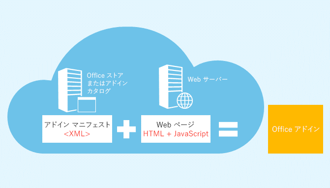

# <a name="onenote-javascript-api-programming-overview"></a>OneNote の JavaScript API のプログラミングの概要

OneNote では、OneNote Online アドインの JavaScript API が導入されています。OneNote オブジェクトを操作する作業ウィンドウ アドイン、コンテンツ アドイン、アドイン コマンドを作成し、Web サービスや他の Web ベースのリソースに接続できます。

> [!NOTE]
> AppSource にアドインを[公開](../publish/publish.md)し、Office エクスペリエンスで利用できるようにする予定がある場合は、[AppSource の検証ポリシー](https://docs.microsoft.com/office/dev/store/validation-policies)に準拠していることを確認してください。たとえば、検証に合格するには、定義したメソッドをサポートするすべてのプラットフォームでアドインが動作する必要があります (詳細については、[セクション 4.12](https://docs.microsoft.com/office/dev/store/validation-policies#4-apps-and-add-ins-behave-predictably) と [Office アドインを使用できるホストおよびプラットフォーム](../overview/office-add-in-availability.md)のページを参照してください)。

## <a name="components-of-an-office-add-in"></a>Office アドインのコンポーネント

アドインは、2 つの基本コンポーネントで構成されます。

- Web ページと必要な任意の JavaScript、CSS、他のファイルを含む **Web アプリケーション**。これらのファイルは、Web サーバーか、Microsoft Azure などの Web ホスティング サービスでホストされます。OneNote Online では、Web アプリケーションはブラウザー コントロールや iFrame で表示されます。
    
- アドインの Web ページの URL とアドインの任意のアクセス要件、設定、機能を指定する **XML マニフェスト**。このファイルは、クライアントに保存されます。OneNote アドインは、他の Office アドインと同じ[マニフェスト](../develop/add-in-manifests.md)形式を使います。

**Office アドイン = マニフェスト + Web ページ**



## <a name="using-the-javascript-api"></a>JavaScript API の使用

アドインは、ホスト アプリケーションのランタイム コンテキストを使って、JavaScript API にアクセスします。API には次の 2 つの階層があります。 

- **アプリケーション** オブジェクトを通じてアクセスされる、OneNote 固有の操作のための**ホスト固有の API**。
- **ドキュメント** オブジェクトを通じてアクセスされ、Office アプリケーション全体で共有される**共通 API**。

### <a name="accessing-the-host-specific-api-through-the-application-object"></a>*アプリケーション* オブジェクトを使ったホスト固有の API へのアクセス

**アプリケーション** オブジェクトを使って、**ノートブック**、**セクション**、**ページ**などの OneNote オブジェクトにアクセスします。 ホスト固有の API を使うと、プロキシ オブジェクトでバッチ操作を実行できます。 基本的な流れは、以下のようになります。 

1. コンテキストからアプリケーション インスタンスを取得します。

2. 操作する OneNote オブジェクトを表すプロキシを作成します。プロキシ オブジェクトのプロパティの読み取りや書き込みを行い、メソッドを呼び出すことにより、プロキシ オブジェクトを同期的に操作します。 

3. プロキシで**読み込み**を呼び出し、パラメーターで指定されたプロパティ値を設定します。この呼び出しは、コマンドのキューに追加されます。

   > [!NOTE]
   > API へのメソッドの呼び出し (`context.application.getActiveSection().pages;` など) も、キューに追加されます。

4. キューに置かれたすべてのコマンドをキューに置かれた順序で実行するには、**context.sync** を呼び出します。これにより、実行中のスクリプトと実際のオブジェクトの間の状態が同期されます。また、読み込まれた OneNote オブジェクトのプロパティを取得して、スクリプトで使います。追加のアクションのチェーン処理には、返された約束オブジェクトを使うことができます。

例: 

```js
function getPagesInSection() {
    OneNote.run(function (context) {
        
        // Get the pages in the current section.
        var pages = context.application.getActiveSection().pages;
        
        // Queue a command to load the id and title for each page.            
        pages.load('id,title');
        
        // Run the queued commands, and return a promise to indicate task completion.
        return context.sync()
            .then(function () {
                
                // Read the id and title of each page. 
                $.each(pages.items, function(index, page) {
                    var pageId = page.id;
                    var pageTitle = page.title;
                    console.log(pageTitle + ': ' + pageId); 
                });
            })
            .catch(function (error) {
                app.showNotification("Error: " + error);
                console.log("Error: " + error);
                if (error instanceof OfficeExtension.Error) {
                    console.log("Debug info: " + JSON.stringify(error.debugInfo));
                }
            });
    });
}
```

[API リファレンス](https://docs.microsoft.com/office/dev/add-ins/reference/overview/onenote-add-ins-javascript-reference)では、サポートされている OneNote オブジェクトと操作を見つけることができます。

### <a name="accessing-the-common-api-through-the-document-object"></a>*ドキュメント* オブジェクトを使った共通 API へのアクセス

**ドキュメント** オブジェクトを使って、[getSelectedDataAsync](https://docs.microsoft.com/javascript/api/office/office.document#getselecteddataasync-coerciontype--options--callback-) メソッドや [setSelectedDataAsync](https://docs.microsoft.com/javascript/api/office/office.document#setselecteddataasync-data--options--callback-) メソッドなどの共通 API にアクセスします。 


次に例を示します。  

```js
function getSelectionFromPage() {
    Office.context.document.getSelectedDataAsync(
        Office.CoercionType.Text,
        { valueFormat: "unformatted" },
        function (asyncResult) {
            var error = asyncResult.error;
            if (asyncResult.status === Office.AsyncResultStatus.Failed) {
                console.log(error.message);
            }
            else $('#input').val(asyncResult.value);
        });
}
```
OneNote アドインは、次の共通 API のみをサポートします。

| API | メモ |
|:------|:------|
| [Office.context.document.getSelectedDataAsync](https://docs.microsoft.com/javascript/api/office/office.document#getselecteddataasync-coerciontype--options--callback-) | **Office.CoercionType.Text** と **Office.CoercionType.Matrix** のみ |
| [Office.context.document.setSelectedDataAsync](https://docs.microsoft.com/javascript/api/office/office.document#setselecteddataasync-data--options--callback-) | **Office.CoercionType.Text**、**Office.CoercionType.Image**、**Office.CoercionType.Html** のみ | 
| 
  [var mySetting = Office.context.document.settings.get(name);](https://docs.microsoft.com/javascript/api/office/office.settings#get-name-) | 設定はコンテンツ アドインによってのみサポートされます | 
| 
  [Office.context.document.settings.set(name, value);](https://docs.microsoft.com/javascript/api/office/office.settings#set-name--value-) | 設定はコンテンツ アドインによってのみサポートされます | 
| [Office.EventType.DocumentSelectionChanged](https://docs.microsoft.com/javascript/api/office/office.documentselectionchangedeventargs) ||

一般に、ホスト固有の API でサポートされていない操作を行う場合は、共通 API のみを使います。 共通 API の使用の詳細については、Office アドインの[ドキュメント](../overview/office-add-ins.md)と[リファレンス](../reference/javascript-api-for-office.md)をご覧ください。


<a name="om-diagram"></a>
## <a name="onenote-object-model-diagram"></a>OneNote のオブジェクト モデル図 
次の図では、OneNote JavaScript API で現在使用可能なものが示されます。

  


## <a name="see-also"></a>関連項目

- [最初の OneNote アドインをビルドする](onenote-add-ins-getting-started.md)
- [OneNote JavaScript API リファレンス](https://docs.microsoft.com/office/dev/add-ins/reference/overview/onenote-add-ins-javascript-reference)
- [Rubric Grader のサンプル](https://github.com/OfficeDev/OneNote-Add-in-Rubric-Grader)
- [Office アドイン プラットフォームの概要](../overview/office-add-ins.md)
