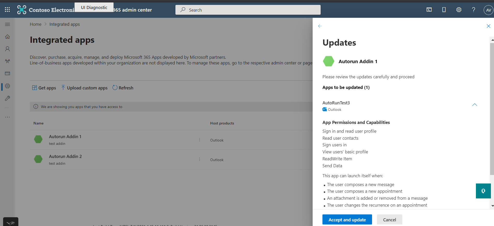

# <a name="appsource-listing-options-for-your-event-based-outlook-add-in"></a>イベント ベースのアドインの AppSource Outlookオプション

現時点では、エンド ユーザーがイベント ベースの機能にアクセスするには、組織の管理者がアドインを展開する必要があります。 エンド ユーザーが AppSource から直接アドインを取得した場合は、イベント ベースのライセンス認証を制限しています。 たとえば、Contoso アドインにノードの下に少なくとも 1 つが定義された拡張ポイントが含まれる場合、アドインの自動呼び出しは、アドインが組織の管理者によってエンド ユーザーにインストールされた場合にのみ発生します。それ以外の場合、アドインの自動呼び出しはブロックされます。 `LaunchEvent` `LaunchEvent Type` `LaunchEvents` アドイン マニフェストの例の次の抜粋を参照してください。

```xml
...
<ExtensionPoint xsi:type="LaunchEvent">
  <LaunchEvents>
    <LaunchEvent Type="OnNewMessageCompose" FunctionName="onMessageComposeHandler"/>
    ...
```

エンド ユーザーまたは管理者は、AppSource またはアプリ内ストアを通じてアドインをOfficeできます。 アドインのプライマリ シナリオまたはワークフローでイベント ベースのアクティブ化が必要な場合は、管理者の展開で使用できるアドインを制限できます。 この制限を有効にするには、フライト コードの URL を指定できます。 フライト コードのおかげで、これらの特別な URL を持つエンド ユーザーだけがリストにアクセスできます。 URL の例を次に示します。

`https://appsource.microsoft.com/product/office/WA200002862?flightCodes=EventBasedTest1`

ユーザーと管理者は、フライト コードが有効になっているときに、AppSource またはアプリ内 Office ストアでアドインを名前で明示的に検索することはできません。 アドインの作成者は、アドインの展開のために、これらのフライト コードを組織の管理者と非公開で共有できます。

> [!NOTE]
> エンド ユーザーはフライト コードを使用してアドインをインストールすることができますが、アドインにはイベント ベースのライセンス認証は含めかねない。

## <a name="specify-a-flight-code"></a>フライト コードの指定

アドインに必要なフライト コードを指定するには、アドインを発行するときに、その情報を Notes **for certification** で共有します。 _**重要**:_ フライト コードでは大文字と小文字が区別されます。


## <a name="deploy-add-in-with-flight-code"></a>フライト コードを使用してアドインを展開する

フライト コードが設定された後、アプリ認定チームから URL を受け取る。 その後、URL を管理者と非公開で共有できます。

アドインを展開するには、管理者は次の手順を使用できます。

- 管理者アカウントで admin.microsoft.com または AppSource.com にサインインMicrosoft 365します。 アドインでシングル サインオン (SSO) が有効になっている場合は、グローバル管理者資格情報が必要です。
- フライト コードの URL を Web ブラウザーに開きます。
- アドインの一覧ページで、[今すぐ取得] **を選択します**。 統合アプリ ポータルにリダイレクトする必要があります。

## <a name="unrestricted-appsource-listing"></a>無制限の AppSource リスト

重要なシナリオでイベント ベースのライセンス認証を使用しないアドイン (つまり、アドインが自動呼び出しなしで正常に動作する) 場合は、特別なフライト コードを使用せずに AppSource でアドインを一覧に表示する方法を検討してください。 エンド ユーザーが AppSource からアドインを取得した場合、ユーザーに対して自動ライセンス認証は行わなきます。 ただし、作業ウィンドウや UI レス コマンドなど、アドインの他のコンポーネントを使用できます。

> [!IMPORTANT]
> これは一時的な制限です。 今後は、アドインを直接取得するエンド ユーザーに対してイベント ベースのアドインのアクティブ化を有効にする予定です。

## <a name="update-existing-add-ins-to-include-event-based-activation"></a>既存のアドインを更新してイベント ベースのライセンス認証を含める

既存のアドインを更新して、イベント ベースのライセンス認証を含め、検証のために再送信し、制限付きまたは無制限の AppSource リストを必要とするか決定できます。

更新されたアドインが承認されると、以前にアドインを展開した組織の管理者は、管理センターの [統合アプリ] セクションで更新メッセージを受け取ります。 メッセージは、イベント ベースのライセンス認証の変更について管理者にアドバイスします。 管理者が変更を承諾すると、更新プログラムはエンド ユーザーに展開されます。

![[統合されたアプリ] 画面のアプリ更新通知のスクリーンショット。](../images/outlook-deploy-update-notification.png)

アドインを独自にインストールしたエンド ユーザーの場合、イベント ベースのアクティブ化機能は、アドインが更新された後でも機能しません。

## <a name="admin-consent-for-installing-event-based-add-ins"></a>イベント ベースのアドインをインストールする管理者の同意

[統合アプリ] 画面からイベント ベースのアドインが展開されるたびに、管理者は展開ウィザードでアドインのイベント ベースのアクティブ化機能に関する詳細を取得します。 詳細は、[アプリのアクセス **許可と機能] セクションに表示** されます。 管理者は、アドインが自動的にアクティブ化できるすべてのイベントを表示する必要があります。

![新しいアプリを展開するときに、[アクセス許可の要求を受け入れる] 画面のスクリーンショット。](../images/outlook-deploy-accept-permissions-requests.png)

同様に、既存のアドインがイベント ベースの機能に更新された場合、管理者はアドインに "Update Pending" 状態を表示します。 更新されたアドインは、アドインが自動的にアクティブ化できる一連のイベントを含む、[アプリのアクセス許可と機能] セクションに示されている変更に管理者が同意した場合にのみ展開されます。

アドインに新しい情報を追加する度に、管理者は管理ポータルに更新フローを表示し、追加のイベントに同意 `LaunchEvent Type` する必要があります。



## <a name="see-also"></a>関連項目

- [イベント ベースのOutlook用にアドインを構成する](autolaunch.md)
