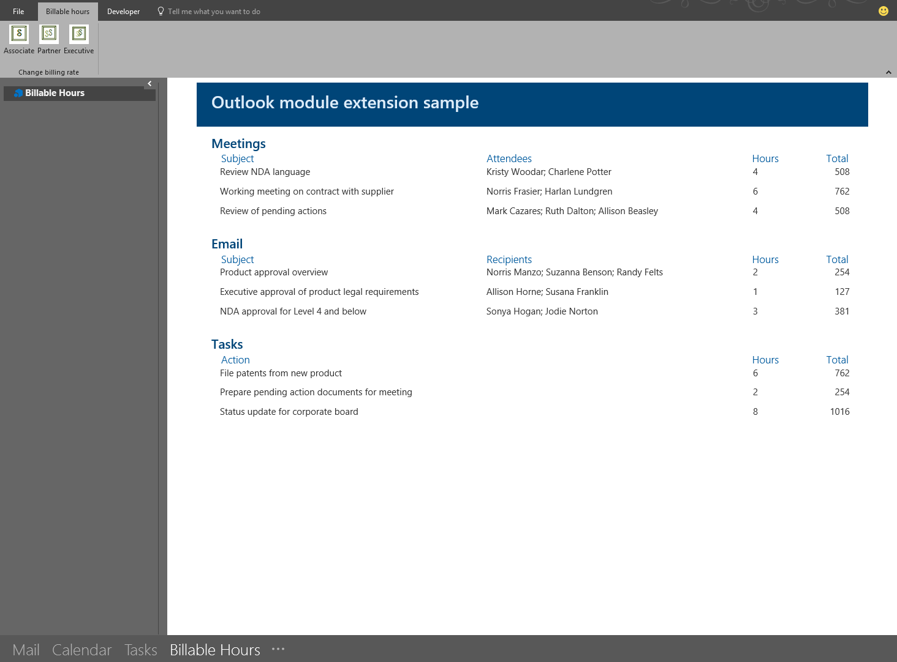

# <a name="module-extension-outlook-add-ins"></a><span data-ttu-id="6d7f1-103">Outlook のモジュール拡張機能アドイン</span><span class="sxs-lookup"><span data-stu-id="6d7f1-103">Module extension Outlook add-ins</span></span>

<span data-ttu-id="6d7f1-104">モジュール拡張機能アドインは、Outlook のナビゲーション バーのメール、タスク、および予定表の横に表示されます。</span><span class="sxs-lookup"><span data-stu-id="6d7f1-104">Module extension add-ins appear in the Outlook navigation bar, right alongside mail, tasks, and calendars.</span></span> <span data-ttu-id="6d7f1-105">モジュール拡張機能は、メールと予定の情報のみ使用することに限定されていません。</span><span class="sxs-lookup"><span data-stu-id="6d7f1-105">A module extension is not limited to using mail and appointment information.</span></span> <span data-ttu-id="6d7f1-106">Outlook の内部で実行することで、ユーザーが Outlook から簡単にビジネスの情報や生産性ツールにアクセスできるようにするアプリケーションを作成できます。</span><span class="sxs-lookup"><span data-stu-id="6d7f1-106">You can create applications that run inside Outlook to make it easy for your users to access business information and productivity tools without ever leaving Outlook.</span></span>

> [!NOTE]
> <span data-ttu-id="6d7f1-107">モジュール拡張機能は、Windows 用 Outlook 2016 以降でのみサポートされています。</span><span class="sxs-lookup"><span data-stu-id="6d7f1-107">Module extensions are only supported by Outlook 2016 or later on Windows.</span></span>  

## <a name="open-a-module-extension"></a><span data-ttu-id="6d7f1-108">モジュール拡張機能を開く</span><span class="sxs-lookup"><span data-stu-id="6d7f1-108">Open a module extension</span></span>

<span data-ttu-id="6d7f1-p102">モジュール拡張機能を開くには、ユーザーは Outlook ナビゲーション バーのモジュール名またはアイコンをクリックします。ユーザーがコンパクト ナビゲーションを選択している場合、ナビゲーション バーには拡張機能がロードされていることを示すアイコンが表示されます。</span><span class="sxs-lookup"><span data-stu-id="6d7f1-p102">To open a module extension, users click on the module's name or icon in the Outlook navigation bar. If the user has compact navigation selected, the navigation bar has an icon that shows an extension is loaded.</span></span>


<span data-ttu-id="6d7f1-112">ユーザーがコンパクト ナビゲーションを使用していない場合、ナビゲーション バーは 2 通りの見え方をします。</span><span class="sxs-lookup"><span data-stu-id="6d7f1-112">If the user is not using compact navigation, the navigation bar has two looks.</span></span> <span data-ttu-id="6d7f1-113">1 つの拡張機能が読み込まれている場合、そのアドインの名前が表示されます。</span><span class="sxs-lookup"><span data-stu-id="6d7f1-113">With one extension loaded, it shows the name of the add-in.</span></span>


<span data-ttu-id="6d7f1-115">複数のアドインが読み込まれている場合は、**[アドイン]** という文字が表示されます。どちらをクリックしても、拡張機能のユーザー インターフェイスが開きます。</span><span class="sxs-lookup"><span data-stu-id="6d7f1-115">When more than one add-in is loaded, it shows the word **Add-ins**. Clicking either will open the extension's user interface.</span></span>


<span data-ttu-id="6d7f1-117">拡張機能をクリックすると、組み込みのモジュールは Outlook によってカスタム モジュールに置き換えられ、そのアドインはユーザーが対話的に操作できるようになります。</span><span class="sxs-lookup"><span data-stu-id="6d7f1-117">When you click on an extension, Outlook replaces the built-in module with your custom module so that your users can interact with the add-in.</span></span> <span data-ttu-id="6d7f1-118">アドインでは Outlook JavaScript API のすべての機能を使用できます。また、Outlook のリボンにコマンド ボタンを作成することで、アドインの内容を対話的に操作できます。</span><span class="sxs-lookup"><span data-stu-id="6d7f1-118">You can use all of the features of the Outlook JavaScript API in your add-in, and can create command buttons in the Outlook ribbon that will interact with the add-in content.</span></span> <span data-ttu-id="6d7f1-119">以下のスクリーンショットは、Outlook のナビゲーション バーに統合され、アドインの内容を更新するリボン コマンドを有するアドインを示しています。</span><span class="sxs-lookup"><span data-stu-id="6d7f1-119">The following screenshot shows an add-in that is integrated in the Outlook navigation bar and has ribbon commands that will update the content of the add-in.</span></span>



## <a name="example"></a><span data-ttu-id="6d7f1-121">例</span><span class="sxs-lookup"><span data-stu-id="6d7f1-121">Example</span></span>

<span data-ttu-id="6d7f1-122">次に示すマニフェスト ファイルのセクションでは、モジュール拡張機能を定義しています。</span><span class="sxs-lookup"><span data-stu-id="6d7f1-122">The following is a section of a manifest file that defines a module extension.</span></span>

```xml
<!-- Add Outlook module extension point -->
<VersionOverrides xmlns="http://schemas.microsoft.com/office/mailappversionoverrides"
                  xsi:type="VersionOverridesV1_0">
  <VersionOverrides xmlns="http://schemas.microsoft.com/office/mailappversionoverrides/1.1"
                    xsi:type="VersionOverridesV1_1">

    <!-- Begin override of existing elements -->
    <Description resid="residVersionOverrideDesc" />

    <Requirements>
      <bt:Sets DefaultMinVersion="1.3">
        <bt:Set Name="Mailbox" />
      </bt:Sets>
    </Requirements>
    <!-- End override of existing elements -->

    <Hosts>
      <Host xsi:type="MailHost">
        <DesktopFormFactor>
          <!-- Set the URL of the file that contains the
                JavaScript function that controls the extension -->
          <FunctionFile resid="residFunctionFileUrl" />

          <!--New Extension Point - Module for a ModuleApp -->
          <ExtensionPoint xsi:type="Module">
            <SourceLocation resid="residExtensionPointUrl" />
            <Label resid="residExtensionPointLabel" />

            <CommandSurface>
              <CustomTab id="idTab">
                <Group id="idGroup">
                  <Label resid="residGroupLabel" />

                  <Control xsi:type="Button" id="group.changeToAssociate">
                    <Label resid="residChangeToAssociateLabel" />
                    <Supertip>
                      <Title resid="residChangeToAssociateLabel" />
                      <Description resid="residChangeToAssociateDesc" />
                    </Supertip>
                    <Icon>
                      <bt:Image size="16" resid="residAssociateIcon16" />
                      <bt:Image size="32" resid="residAssociateIcon32" />
                      <bt:Image size="80" resid="residAssociateIcon80" />
                    </Icon>
                    <Action xsi:type="ExecuteFunction">
                      <FunctionName>changeToAssociateRate</FunctionName>
                    </Action>
                  </Control>
                  
              </Group>
                <Label resid="residCustomTabLabel" />
              </CustomTab>
            </CommandSurface>
          </ExtensionPoint>
        </DesktopFormFactor>
      </Host>
    </Hosts>

    <Resources>
      <bt:Images>
        <bt:Image id="residAddinIcon16" 
                  DefaultValue="https://localhost:8080/Executive-16.png" />
        <bt:Image id="residAddinIcon32" 
                  DefaultValue="https://localhost:8080/Executive-32.png" />
        <bt:Image id="residAddinIcon80" 
                  DefaultValue="https://localhost:8080/Executive-80.png" />
      
        <bt:Image id="residAssociateIcon16" 
                  DefaultValue="https://localhost:8080/Associate-16.png" />
        <bt:Image id="residAssociateIcon32" 
                  DefaultValue="https://localhost:8080/Associate-32.png" />
        <bt:Image id="residAssociateIcon80" 
                  DefaultValue="https://localhost:8080/Associate-80.png" />
      </bt:Images>

      <bt:Urls>
        <bt:Url id="residFunctionFileUrl" 
                DefaultValue="https://localhost:8080/" />
        <bt:Url id="residExtensionPointUrl" 
                DefaultValue="https://localhost:8080/" />
      </bt:Urls>

      <!--Short strings must be less than 30 characters long -->
      <bt:ShortStrings>
        <bt:String id="residExtensionPointLabel" 
                    DefaultValue="Billable Hours" />
        <bt:String id="residGroupLabel" 
                    DefaultValue="Change billing rate" />
        <bt:String id="residCustomTabLabel" 
                    DefaultValue="Billable hours" />

        <bt:String id="residChangeToAssociateLabel" 
                    DefaultValue="Associate" />
      </bt:ShortStrings>

      <bt:LongStrings>
        <bt:String id="residVersionOverrideDesc" 
                    DefaultValue="Version override description" />

        <bt:String id="residChangeToAssociateDesc" 
                    DefaultValue="Change to the associate billing rate: $127/hr" />
      </bt:LongStrings>
    </Resources>
  </VersionOverrides>
</VersionOverrides>
```

## <a name="see-also"></a><span data-ttu-id="6d7f1-123">関連項目</span><span class="sxs-lookup"><span data-stu-id="6d7f1-123">See also</span></span>

- [<span data-ttu-id="6d7f1-124">Outlook アドインのマニフェスト</span><span class="sxs-lookup"><span data-stu-id="6d7f1-124">Outlook add-in manifests</span></span>](manifests.md)
- [<span data-ttu-id="6d7f1-125">Outlook のアドイン コマンド</span><span class="sxs-lookup"><span data-stu-id="6d7f1-125">Add-in commands for Outlook</span></span>](add-in-commands-for-outlook.md)
- [<span data-ttu-id="6d7f1-126">Outlook モジュール拡張機能 "請求対象時間" のサンプル</span><span class="sxs-lookup"><span data-stu-id="6d7f1-126">Outlook module extensions Billable hours sample</span></span>](https://github.com/OfficeDev/Outlook-Add-in-JavaScript-ModuleExtension)
