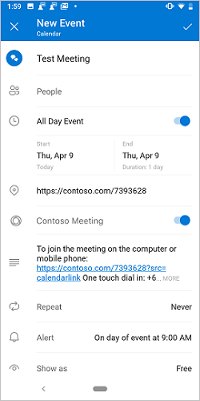

# <a name="create-an-outlook-add-in-for-an-online-meeting-provider"></a>オンライン会議プロバイダーの Outlook アドインを作成する

オンライン会議の設定は、Outlook ユーザーのコア エクスペリエンスであり、 [Outlook を使用して Teams 会議を簡単に作成できます](/microsoftteams/teams-add-in-for-outlook)。 ただし、Microsoft 以外のサービスを使用して Outlook でオンライン会議を作成するのは面倒な場合があります。 この機能を実装することで、サービス プロバイダーは Outlook アドイン ユーザーのオンライン会議の作成と参加エクスペリエンスを合理化できます。

> [!IMPORTANT]
> この機能は、Microsoft 365 サブスクリプションのOutlook on the web、Windows、Mac、Android、および iOS でサポートされています。

この記事では、Outlook アドインを設定して、ユーザーがオンライン会議サービスを使用して会議を整理して参加できるようにする方法について説明します。 この記事では、架空のオンライン会議サービス プロバイダー "Contoso" を使用します。

## <a name="set-up-your-environment"></a>環境を設定する

Office アドイン用 Yeoman ジェネレーターを使用してアドイン プロジェクトを作成する [Outlook クイック スタート](../quickstarts/outlook-quickstart.md?tabs=yeomangenerator) を完了します。

## <a name="configure-the-manifest"></a>マニフェストを構成する

ユーザーがアドインを使用してオンライン会議を作成できるようにするには、マニフェストでノードを構成する **\<VersionOverrides\>** 必要があります。 Outlook on the web、Windows、Mac でのみサポートされるアドインを作成する場合は、ガイダンスとして **[Windows]、[Mac]、[Web**] タブを選択します。 ただし、アドインが Outlook on Android と iOS でもサポートされる場合は、[ **モバイル** ] タブを選択します。

# <a name="windows-mac-web"></a>[Windows、Mac、Web](#tab/non-mobile)

1. コード エディターで、作成した Outlook クイック スタート プロジェクトを開きます。

1. プロジェクトのルートにある **manifest.xml** ファイルを開きます。

1. ノード全体 **\<VersionOverrides\>** (開いているタグと閉じるタグを含む) を選択し、次の XML に置き換えます。

```xml
<VersionOverrides xmlns="http://schemas.microsoft.com/office/mailappversionoverrides" xsi:type="VersionOverridesV1_0">
  <VersionOverrides xmlns="http://schemas.microsoft.com/office/mailappversionoverrides/1.1" xsi:type="VersionOverridesV1_1">
    <Description resid="residDescription"></Description>
    <Requirements>
      <bt:Sets>
        <bt:Set Name="Mailbox" MinVersion="1.3"/>
      </bt:Sets>
    </Requirements>
    <Hosts>
      <Host xsi:type="MailHost">
        <DesktopFormFactor>
          <FunctionFile resid="residFunctionFile"/>
          <ExtensionPoint xsi:type="AppointmentOrganizerCommandSurface">
            <OfficeTab id="TabDefault">
              <Group id="apptComposeGroup">
                <Label resid="residDescription"/>
                <Control xsi:type="Button" id="insertMeetingButton">
                  <Label resid="residLabel"/>
                  <Supertip>
                    <Title resid="residLabel"/>
                    <Description resid="residTooltip"/>
                  </Supertip>
                  <Icon>
                    <bt:Image size="16" resid="icon-16"/>
                    <bt:Image size="32" resid="icon-32"/>
                    <bt:Image size="64" resid="icon-64"/>
                    <bt:Image size="80" resid="icon-80"/>
                  </Icon>
                  <Action xsi:type="ExecuteFunction">
                    <FunctionName>insertContosoMeeting</FunctionName>
                  </Action>
                </Control>
              </Group>
            </OfficeTab>
          </ExtensionPoint>
        </DesktopFormFactor>
      </Host>
    </Hosts>
    <Resources>
      <bt:Images>
        <bt:Image id="icon-16" DefaultValue="https://contoso.com/assets/icon-16.png"/>
        <bt:Image id="icon-32" DefaultValue="https://contoso.com/assets/icon-32.png"/>
        <bt:Image id="icon-48" DefaultValue="https://contoso.com/assets/icon-48.png"/>
        <bt:Image id="icon-64" DefaultValue="https://contoso.com/assets/icon-64.png"/>
        <bt:Image id="icon-80" DefaultValue="https://contoso.com/assets/icon-80.png"/>
      </bt:Images>
      <bt:Urls>
        <bt:Url id="residFunctionFile" DefaultValue="https://contoso.com/commands.html"/>
      </bt:Urls>
      <bt:ShortStrings>
        <bt:String id="residDescription" DefaultValue="Contoso meeting"/>
        <bt:String id="residLabel" DefaultValue="Add a contoso meeting"/>
      </bt:ShortStrings>
      <bt:LongStrings>
        <bt:String id="residTooltip" DefaultValue="Add a contoso meeting to this appointment."/>
      </bt:LongStrings>
    </Resources>
  </VersionOverrides>
</VersionOverrides>
```

# <a name="mobile"></a>[モバイル](#tab/mobile)

ユーザーがモバイル デバイスからオンライン会議を作成できるように、 [MobileOnlineMeetingCommandSurface 拡張ポイント](/javascript/api/manifest/extensionpoint#mobileonlinemeetingcommandsurface) は、親要素 **\<MobileFormFactor\>** の下のマニフェストで構成されます。 この拡張ポイントは、他のフォーム ファクターではサポートされていません。

1. コード エディターで、作成した Outlook クイック スタート プロジェクトを開きます。

1. プロジェクトのルートにある **manifest.xml** ファイルを開きます。

1. ノード全体 **\<VersionOverrides\>** (開いているタグと閉じるタグを含む) を選択し、次の XML に置き換えます。

```xml
<VersionOverrides xmlns="http://schemas.microsoft.com/office/mailappversionoverrides" xsi:type="VersionOverridesV1_0">
  <VersionOverrides xmlns="http://schemas.microsoft.com/office/mailappversionoverrides/1.1" xsi:type="VersionOverridesV1_1">
    <Description resid="residDescription"></Description>
    <Requirements>
      <bt:Sets>
        <bt:Set Name="Mailbox" MinVersion="1.3"/>
      </bt:Sets>
    </Requirements>
    <Hosts>
      <Host xsi:type="MailHost">
        <DesktopFormFactor>
          <FunctionFile resid="residFunctionFile"/>
          <ExtensionPoint xsi:type="AppointmentOrganizerCommandSurface">
            <OfficeTab id="TabDefault">
              <Group id="apptComposeGroup">
                <Label resid="residDescription"/>
                <Control xsi:type="Button" id="insertMeetingButton">
                  <Label resid="residLabel"/>
                  <Supertip>
                    <Title resid="residLabel"/>
                    <Description resid="residTooltip"/>
                  </Supertip>
                  <Icon>
                    <bt:Image size="16" resid="icon-16"/>
                    <bt:Image size="32" resid="icon-32"/>
                    <bt:Image size="64" resid="icon-64"/>
                    <bt:Image size="80" resid="icon-80"/>
                  </Icon>
                  <Action xsi:type="ExecuteFunction">
                    <FunctionName>insertContosoMeeting</FunctionName>
                  </Action>
                </Control>
              </Group>
            </OfficeTab>
          </ExtensionPoint>
        </DesktopFormFactor>

        <MobileFormFactor>
          <FunctionFile resid="residFunctionFile"/>
          <ExtensionPoint xsi:type="MobileOnlineMeetingCommandSurface">
            <Control xsi:type="MobileButton" id="insertMeetingButton">
              <Label resid="residLabel"/>
              <Icon>
                <bt:Image size="25" scale="1" resid="icon-16"/>
                <bt:Image size="25" scale="2" resid="icon-16"/>
                <bt:Image size="25" scale="3" resid="icon-16"/>

                <bt:Image size="32" scale="1" resid="icon-32"/>
                <bt:Image size="32" scale="2" resid="icon-32"/>
                <bt:Image size="32" scale="3" resid="icon-32"/>

                <bt:Image size="48" scale="1" resid="icon-48"/>
                <bt:Image size="48" scale="2" resid="icon-48"/>
                <bt:Image size="48" scale="3" resid="icon-48"/>
              </Icon>
              <Action xsi:type="ExecuteFunction">
                <FunctionName>insertContosoMeeting</FunctionName>
              </Action>
            </Control>
          </ExtensionPoint>
        </MobileFormFactor>
      </Host>
    </Hosts>
    <Resources>
      <bt:Images>
        <bt:Image id="icon-16" DefaultValue="https://contoso.com/assets/icon-16.png"/>
        <bt:Image id="icon-32" DefaultValue="https://contoso.com/assets/icon-32.png"/>
        <bt:Image id="icon-48" DefaultValue="https://contoso.com/assets/icon-48.png"/>
        <bt:Image id="icon-64" DefaultValue="https://contoso.com/assets/icon-64.png"/>
        <bt:Image id="icon-80" DefaultValue="https://contoso.com/assets/icon-80.png"/>
      </bt:Images>
      <bt:Urls>
        <bt:Url id="residFunctionFile" DefaultValue="https://contoso.com/commands.html"/>
      </bt:Urls>
      <bt:ShortStrings>
        <bt:String id="residDescription" DefaultValue="Contoso meeting"/>
        <bt:String id="residLabel" DefaultValue="Add a contoso meeting"/>
      </bt:ShortStrings>
      <bt:LongStrings>
        <bt:String id="residTooltip" DefaultValue="Add a contoso meeting to this appointment."/>
      </bt:LongStrings>
    </Resources>
  </VersionOverrides>
</VersionOverrides>
```

---

> [!TIP]
> Outlook アドインのマニフェストの詳細については、「Outlook アドイン マニフェスト」と [「Outlook](manifests.md) [Mobile 用アドイン コマンドのサポートの追加](add-mobile-support.md)」を参照してください。

## <a name="implement-adding-online-meeting-details"></a>オンライン会議の詳細の追加を実装する

このセクションでは、アドイン スクリプトでユーザーの会議を更新して、オンライン会議の詳細を含める方法について説明します。 次は、サポートされているすべてのプラットフォームに適用されます。

1. 同じクイック スタート プロジェクトから、コード エディターで **ファイル ./src/commands/commands.js** を開きます。

1. **commands.js** ファイルの内容全体を次の JavaScript に置き換えます。

    ```js
    // 1. How to construct online meeting details.
    // Not shown: How to get the meeting organizer's ID and other details from your service.
    const newBody = '<br>' +
        '<a href="https://contoso.com/meeting?id=123456789" target="_blank">Join Contoso meeting</a>' +
        '<br><br>' +
        'Phone Dial-in: +1(123)456-7890' +
        '<br><br>' +
        'Meeting ID: 123 456 789' +
        '<br><br>' +
        'Want to test your video connection?' +
        '<br><br>' +
        '<a href="https://contoso.com/testmeeting" target="_blank">Join test meeting</a>' +
        '<br><br>';

    var mailboxItem;

    // Office is ready.
    Office.onReady(function () {
            mailboxItem = Office.context.mailbox.item;
        }
    );

    // 2. How to define and register a UI-less function named `insertContosoMeeting` (referenced in the manifest)
    //    to update the meeting body with the online meeting details.
    function insertContosoMeeting(event) {
        // Get HTML body from the client.
        mailboxItem.body.getAsync("html",
            { asyncContext: event },
            function (getBodyResult) {
                if (getBodyResult.status === Office.AsyncResultStatus.Succeeded) {
                    updateBody(getBodyResult.asyncContext, getBodyResult.value);
                } else {
                    console.error("Failed to get HTML body.");
                    getBodyResult.asyncContext.completed({ allowEvent: false });
                }
            }
        );
    }
    // Register the function.
    Office.actions.associate("insertContosoMeeting", insertContosoMeeting);

    // 3. How to implement a supporting function `updateBody`
    //    that appends the online meeting details to the current body of the meeting.
    function updateBody(event, existingBody) {
        // Append new body to the existing body.
        mailboxItem.body.setAsync(existingBody + newBody,
            { asyncContext: event, coercionType: "html" },
            function (setBodyResult) {
                if (setBodyResult.status === Office.AsyncResultStatus.Succeeded) {
                    setBodyResult.asyncContext.completed({ allowEvent: true });
                } else {
                    console.error("Failed to set HTML body.");
                    setBodyResult.asyncContext.completed({ allowEvent: false });
                }
            }
        );
    }
    ```

## <a name="testing-and-validation"></a>テストと検証

通常のガイダンスに従って[アドインをテストして検証](testing-and-tips.md)し、Outlook on the web、Windows、または Mac でマニフェストを[サイドロード](sideload-outlook-add-ins-for-testing.md)します。 アドインでモバイルもサポートされている場合は、サイドロード後に Android または iOS デバイスで Outlook を再起動します。 アドインがサイドロードされたら、新しい会議を作成し、Microsoft Teams または Skype トグルが自分の会議に置き換えられていることを確認します。

### <a name="create-meeting-ui"></a>会議 UI を作成する

会議の開催者として、会議を作成すると、次の 3 つの画像のような画面が表示されます。

[](../images/outlook-android-create-online-meeting-off-expanded.png#lightbox) [](../images/outlook-android-create-online-meeting-load-expanded.png#lightbox) [](../images/outlook-android-create-online-meeting-on-expanded.png#lightbox)

### <a name="join-meeting-ui"></a>会議に参加する UI

会議出席者として、会議を表示すると、次の図のような画面が表示されます。

[![Android の [参加会議] 画面。](../images/outlook-android-join-online-meeting-view-1.png)](../images/outlook-android-join-online-meeting-view-1-expanded.png#lightbox)

> [!IMPORTANT]
> **[参加**] ボタンは、Outlook on the web、Mac、Android、および iOS でのみサポートされます。 会議リンクのみが表示されているが、サポートされているクライアントに **[参加** ] ボタンが表示されない場合は、サービスのオンライン会議テンプレートがサーバーに登録されていない可能性があります。 詳細については、「 [オンライン会議テンプレートの登録](#register-your-online-meeting-template) 」セクションを参照してください。

## <a name="register-your-online-meeting-template"></a>オンライン会議テンプレートを登録する

オンライン会議アドインの登録は省略可能です。 会議のリンクに加えて、[ **参加** ] ボタンを会議に表示する場合にのみ適用されます。 オンライン会議アドインを開発し、登録する場合は、次のガイダンスを使用して GitHub の問題を作成します。 登録タイムラインの調整については、お客様にお問い合わせください。

> [!IMPORTANT]
> **[参加**] ボタンは、Outlook on the web、Mac、Android、および iOS でのみサポートされます。

1. 新しい [GitHub の問題](https://github.com/OfficeDev/office-js/issues/new)を作成します。
1. 新しい問題の **タイトル** を [Outlook: my-service のオンライン会議テンプレートを登録する] に設定し、サービス名に `my-service` 置き換えます。
1. 問題本文で、既存のテキストを、この記事の前の「[オンライン会議の詳細の追加](#implement-adding-online-meeting-details)の`newBody`実装」セクションの変数または類似の変数で設定した文字列に置き換えます。
1. [ **新しい問題の送信]** をクリックします。


## <a name="available-apis"></a>使用可能な API

この機能では、次の API を使用できます。

- 予定オーガナイザー API
  - [Office.context.mailbox.item.body](/javascript/api/outlook/office.appointmentcompose?view=outlook-js-preview&preserve-view=true#outlook-office-appointmentcompose-body-member) ([Body.getAsync](/javascript/api/outlook/office.body?view=outlook-js-preview&preserve-view=true#outlook-office-body-getasync-member(1)), [Body.setAsync](/javascript/api/outlook/office.body?view=outlook-js-preview&preserve-view=true#outlook-office-body-setasync-member(1)))
  - [Office.context.mailbox.item.end](/javascript/api/outlook/office.appointmentcompose?view=outlook-js-preview&preserve-view=true#outlook-office-appointmentcompose-end-member) ([Time](/javascript/api/outlook/office.time?view=outlook-js-preview&preserve-view=true))
  - [Office.context.mailbox.item.loadCustomPropertiesAsync](/javascript/api/outlook/office.appointmentcompose?view=outlook-js-preview&preserve-view=true#outlook-office-appointmentcompose-loadcustompropertiesasync-member(1)) ([CustomProperties](/javascript/api/outlook/office.customproperties?view=outlook-js-preview&preserve-view=true))
  - [Office.context.mailbox.item.location](/javascript/api/outlook/office.appointmentcompose?view=outlook-js-preview&preserve-view=true#outlook-office-appointmentcompose-location-member) ([場所](/javascript/api/outlook/office.location?view=outlook-js-preview&preserve-view=true))
  - [Office.context.mailbox.item.optionalAttendees](/javascript/api/outlook/office.appointmentcompose?view=outlook-js-preview&preserve-view=true#outlook-office-appointmentcompose-optionalattendees-member) ([受信者](/javascript/api/outlook/office.recipients?view=outlook-js-preview&preserve-view=true))
  - [Office.context.mailbox.item.requiredAttendees](/javascript/api/outlook/office.appointmentcompose?view=outlook-js-preview&preserve-view=true#outlook-office-appointmentcompose-requiredattendees-member) ([受信者](/javascript/api/outlook/office.recipients?view=outlook-js-preview&preserve-view=true))
  - [Office.context.mailbox.item.start](/javascript/api/outlook/office.appointmentcompose?view=outlook-js-preview&preserve-view=true#outlook-office-appointmentcompose-start-member) ([Time](/javascript/api/outlook/office.time?view=outlook-js-preview&preserve-view=true))
  - [Office.context.mailbox.item.subject](/javascript/api/outlook/office.appointmentcompose?view=outlook-js-preview&preserve-view=true#outlook-office-appointmentcompose-subject-member) ([件名](/javascript/api/outlook/office.subject?view=outlook-js-preview&preserve-view=true))
  - [Office.context.RoamingSettings](/javascript/api/requirement-sets/outlook/preview-requirement-set/office.context?view=outlook-js-preview&preserve-view=true#roamingsettings-roamingsettings) ([RoamingSettings](/javascript/api/outlook/office.roamingsettings?view=outlook-js-preview&preserve-view=true))
- 認証フローを処理する
  - [ダイアログ API](../develop/dialog-api-in-office-add-ins.md)

## <a name="restrictions"></a>制限

いくつかの制限が適用されます。

- オンライン会議サービス プロバイダーにのみ適用されます。
- 管理者がインストールしたアドインのみが会議の作成画面に表示され、既定の Teams または Skype オプションが置き換えられます。 ユーザーがインストールしたアドインはアクティブ化されません。
- アドイン アイコンは、16 進コード `#919191` を使用するか、 [他の色形式](https://convertingcolors.com/hex-color-919191.html)で同等の色を使用してグレースケールにする必要があります。
- 予定オーガナイザー (compose) モードでは、UI レス コマンドは 1 つだけサポートされます。
- アドインは、1 分間のタイムアウト期間内に、予定フォームの会議の詳細を更新する必要があります。 ただし、認証用に開かれたアドインがダイアログ ボックスに費やされた時間は、タイムアウト期間から除外されます。

## <a name="see-also"></a>関連項目

- [Outlook Mobile のアドイン](outlook-mobile-addins.md)
- [Outlook Mobile のアドイン コマンドのサポートを追加する](add-mobile-support.md)
