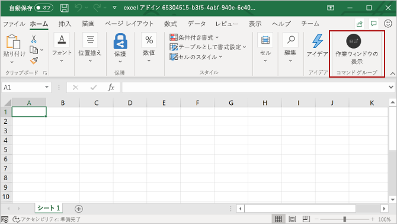
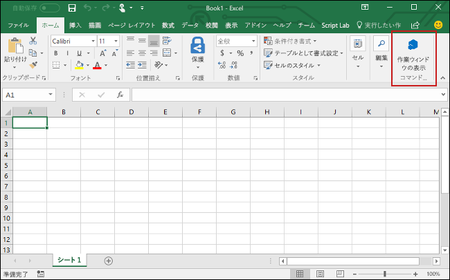

# <a name="build-an-excel-task-pane-add-in"></a><span data-ttu-id="849eb-103">Excel 作業ウィンドウ アドインを作成する</span><span class="sxs-lookup"><span data-stu-id="849eb-103">Build an Excel task pane add-in using Angular</span></span>

<span data-ttu-id="849eb-104">この記事では、Excel の作業ペインアドインを作成するプロセスについて説明します。</span><span class="sxs-lookup"><span data-stu-id="849eb-104">In this article, you'll walk through the process of building an Outlook task pane add-in.</span></span> 

## <a name="create-the-add-in"></a><span data-ttu-id="849eb-105">アドインを作成する</span><span class="sxs-lookup"><span data-stu-id="849eb-105">Create the add-in</span></span>

[!include[Choose your editor](../includes/quickstart-choose-editor.md)]

# <a name="yeoman-generatortabyeomangenerator"></a>[<span data-ttu-id="849eb-106">Yeoman ジェネレーター</span><span class="sxs-lookup"><span data-stu-id="849eb-106">Yeoman generator</span></span>](#tab/yeomangenerator)

### <a name="prerequisites"></a><span data-ttu-id="849eb-107">前提条件</span><span class="sxs-lookup"><span data-stu-id="849eb-107">Prerequisites</span></span>

[!include[Yeoman generator prerequisites](../includes/quickstart-yo-prerequisites.md)]

### <a name="create-the-add-in-project"></a><span data-ttu-id="849eb-108">アドイン プロジェクトの作成</span><span class="sxs-lookup"><span data-stu-id="849eb-108">Create the add-in project</span></span>

[!include[Yeoman generator create project guidance](../includes/yo-office-command-guidance.md)]

- <span data-ttu-id="849eb-109">**Choose a project type: (プロジェクトの種類を選択)** `Office Add-in Task Pane project`</span><span class="sxs-lookup"><span data-stu-id="849eb-109">**Choose a project type:** `Office Add-in Task Pane project`</span></span>
- <span data-ttu-id="849eb-110">**Choose a script type: (スクリプトの種類を選択)** `Javascript`</span><span class="sxs-lookup"><span data-stu-id="849eb-110">**Choose a script type:** `Javascript`</span></span>
- <span data-ttu-id="849eb-111">**What would you want to name your add-in?: (アドインの名前を何にしますか)**</span><span class="sxs-lookup"><span data-stu-id="849eb-111">**What do you want to name your add-in?**</span></span> `My Office Add-in`
- <span data-ttu-id="849eb-112">**Which Office client application would you like to support?: (どの Office クライアント アプリケーションをサポートしますか)**</span><span class="sxs-lookup"><span data-stu-id="849eb-112">**Which Office client application would you like to support?**</span></span> `Excel`


<span data-ttu-id="849eb-114">ウィザードを完了すると、ジェネレーターによってプロジェクトが作成されて、サポートしているノード コンポーネントがインストールされます。</span><span class="sxs-lookup"><span data-stu-id="849eb-114">After you complete the wizard, the generator will create the project and install supporting Node components.</span></span>

[!include[Yeoman generator next steps](../includes/yo-office-next-steps.md)]

### <a name="explore-the-project"></a><span data-ttu-id="849eb-115">プロジェクトを確認する</span><span class="sxs-lookup"><span data-stu-id="849eb-115">Explore the project</span></span>

[!include[Yeoman generator add-in project components](../includes/yo-task-pane-project-components-js.md)]

### <a name="try-it-out"></a><span data-ttu-id="849eb-116">試してみる</span><span class="sxs-lookup"><span data-stu-id="849eb-116">Try it out</span></span>

1. <span data-ttu-id="849eb-117">プロジェクトのルート フォルダーに移動します。</span><span class="sxs-lookup"><span data-stu-id="849eb-117">Navigate to the root folder of the project.</span></span>

    ```command&nbsp;line
    cd "My Office Add-in"
    ```

2. [!include[Start server section](../includes/quickstart-yo-start-server-excel.md)] 

3. <span data-ttu-id="849eb-118">Excel で、**[ホーム]** タブを選択し、リボンの **[作業ウィンドウの表示]** ボタンをクリックして、アドインの作業ウィンドウを開きます。</span><span class="sxs-lookup"><span data-stu-id="849eb-118">In Excel, choose the **Home** tab, and then choose the **Show Taskpane** button in the ribbon to open the add-in task pane.</span></span>

    

4. <span data-ttu-id="849eb-120">ワークシート内で任意のセルの範囲を選択します。</span><span class="sxs-lookup"><span data-stu-id="849eb-120">Select any range of cells in the worksheet.</span></span>

5. <span data-ttu-id="849eb-121">作業ウィンドウの下部で、**[実行]** リンクを選択して、選択範囲の色を黄色に設定します。</span><span class="sxs-lookup"><span data-stu-id="849eb-121">At the bottom of the task pane, choose the **Run** link to set the color of the selected range to yellow.</span></span>

    

# <a name="visual-studiotabvisualstudio"></a>[<span data-ttu-id="849eb-123">Visual Studio</span><span class="sxs-lookup"><span data-stu-id="849eb-123">Visual Studio</span></span>](#tab/visualstudio)

### <a name="prerequisites"></a><span data-ttu-id="849eb-124">前提条件</span><span class="sxs-lookup"><span data-stu-id="849eb-124">Prerequisites</span></span>

[!include[Quick Start prerequisites](../includes/quickstart-vs-prerequisites.md)]

### <a name="create-the-add-in-project"></a><span data-ttu-id="849eb-125">アドイン プロジェクトの作成</span><span class="sxs-lookup"><span data-stu-id="849eb-125">Create the add-in project</span></span>

1. <span data-ttu-id="849eb-126">[Visual Studio] メニュー バーで、**[ファイル]**  >  **[新規作成]**  >  **[プロジェクト]** の順に選択します。</span><span class="sxs-lookup"><span data-stu-id="849eb-126">On the Visual Studio menu bar, choose  **File** > **New** > **Project**.</span></span>

2. <span data-ttu-id="849eb-127">**[Visual C#]** または **[Visual Basic]** の下にあるプロジェクトの種類の一覧で、**[Office/SharePoint]** を展開して、**[アドイン]** を選択し、プロジェクトの種類として **[Excel Web アドイン]** を選択します。</span><span class="sxs-lookup"><span data-stu-id="849eb-127">In the list of project types under **Visual C#** or **Visual Basic**, expand  **Office/SharePoint**, choose **Add-ins**, and then choose **Excel Web Add-in** as the project type.</span></span> 

3. <span data-ttu-id="849eb-128">プロジェクトに名前を付けて、**[OK]** を選択します。</span><span class="sxs-lookup"><span data-stu-id="849eb-128">Name the project, and then choose **OK**.</span></span>

4. <span data-ttu-id="849eb-129">**[Office アドインの作成]** ダイアログ ウィンドウで、**[新機能を Excel に追加する]** を選択してから、**[完了]** を選択してプロジェクトを作成します。</span><span class="sxs-lookup"><span data-stu-id="849eb-129">In the **Create Office Add-in** dialog window, choose **Add new functionalities to Excel**, and then choose **Finish** to create the project.</span></span>

5. <span data-ttu-id="849eb-p101">Visual Studio によってソリューションとその 2 つのプロジェクトが作成され、**ソリューション エクスプローラー**に表示されます。**Home.html** ファイルが Visual Studio で開かれます。</span><span class="sxs-lookup"><span data-stu-id="849eb-p101">Visual Studio creates a solution and its two projects appear in **Solution Explorer**. The **Home.html** file opens in Visual Studio.</span></span>

### <a name="explore-the-visual-studio-solution"></a><span data-ttu-id="849eb-132">Visual Studio ソリューションについて理解する</span><span class="sxs-lookup"><span data-stu-id="849eb-132">Explore the Visual Studio solution</span></span>

[!include[Description of Visual Studio projects](../includes/quickstart-vs-solution.md)]

### <a name="update-the-code"></a><span data-ttu-id="849eb-133">コードを更新する</span><span class="sxs-lookup"><span data-stu-id="849eb-133">Update the code</span></span>

1. <span data-ttu-id="849eb-p102">**Home.html** では、アドインの作業ウィンドウにレンダリングされる HTML を指定します。 **Home.html** で、`<body>` 要素を次のマークアップに置き換えて、ファイルを保存します。</span><span class="sxs-lookup"><span data-stu-id="849eb-p102">**Home.html** specifies the HTML that will be rendered in the add-in's task pane. In **Home.html**, replace the `<body>` element with the following markup and save the file.</span></span>

    ```html
    <body class="ms-font-m ms-welcome">
        <div id="content-header">
            <div class="padding">
                <h1>Welcome</h1>
            </div>
        </div>
        <div id="content-main">
            <div class="padding">
                <p>Choose the button below to set the color of the selected range to green.</p>
                <br />
                <h3>Try it out</h3>
                <button class="ms-Button" id="set-color">Set color</button>
            </div>
        </div>
    </body>
    ```

2. <span data-ttu-id="849eb-p103">Web アプリケーション プロジェクトのルートにあるファイル **Home.js** を開きます。 このファイルは、アドイン用のスクリプトを指定します。 すべての内容を次のコードに置き換え、ファイルを保存します。</span><span class="sxs-lookup"><span data-stu-id="849eb-p103">Open the file **Home.js** in the root of the web application project. This file specifies the script for the add-in. Replace the entire contents with the following code and save the file.</span></span> 

    ```js
    'use strict';

    (function () {

        Office.onReady(function() {
            // Office is ready
            $(document).ready(function () {
                // The document is ready
                $('#set-color').click(setColor);
            });
        });

        function setColor() {
            Excel.run(function (context) {
                var range = context.workbook.getSelectedRange();
                range.format.fill.color = 'green';

                return context.sync();
            }).catch(function (error) {
                console.log("Error: " + error);
                if (error instanceof OfficeExtension.Error) {
                    console.log("Debug info: " + JSON.stringify(error.debugInfo));
                }
            });
        }
    })();
    ```

3. <span data-ttu-id="849eb-p104">Web アプリケーション プロジェクトのルートにあるファイル **Home.css** を開きます。 このファイルは、アドイン用のユーザー設定のスタイルを指定します。 すべての内容を次のコードに置き換え、ファイルを保存します。</span><span class="sxs-lookup"><span data-stu-id="849eb-p104">Open the file **Home.css** in the root of the web application project. This file specifies the custom styles for the add-in. Replace the entire contents with the following code and save the file.</span></span> 

    ```css
    #content-header {
        background: #2a8dd4;
        color: #fff;
        position: absolute;
        top: 0;
        left: 0;
        width: 100%;
        height: 80px; 
        overflow: hidden;
    }

    #content-main {
        background: #fff;
        position: fixed;
        top: 80px;
        left: 0;
        right: 0;
        bottom: 0;
        overflow: auto; 
    }

    .padding {
        padding: 15px;
    }
    ```

### <a name="update-the-manifest"></a><span data-ttu-id="849eb-142">マニフェストを更新する</span><span class="sxs-lookup"><span data-stu-id="849eb-142">Update the manifest</span></span>

1. <span data-ttu-id="849eb-143">アドイン プロジェクト内の XML マニフェスト ファイルを開きます。</span><span class="sxs-lookup"><span data-stu-id="849eb-143">Open the XML manifest file in the add-in project.</span></span> <span data-ttu-id="849eb-144">このファイルは、アドインの設定と機能を定義します。</span><span class="sxs-lookup"><span data-stu-id="849eb-144">This file defines the add-in's settings and capabilities.</span></span>

2. <span data-ttu-id="849eb-p106">`ProviderName` 要素にはプレースホルダー値が含まれています。 それを自分の名前に置き換えます。</span><span class="sxs-lookup"><span data-stu-id="849eb-p106">The `ProviderName` element has a placeholder value. Replace it with your name.</span></span>

3. <span data-ttu-id="849eb-p107">`DefaultValue` 要素の `DisplayName` 属性にはプレースホルダー値が含まれています。 これは、**My Office Add-in** に置き換えてください。</span><span class="sxs-lookup"><span data-stu-id="849eb-p107">The `DefaultValue` attribute of the `DisplayName` element has a placeholder. Replace it with **My Office Add-in**.</span></span>

4. <span data-ttu-id="849eb-p108">`DefaultValue` 要素の `Description` 属性にはプレースホルダー値が含まれています。 これは、**A task pane add-in for Excel** に置き換えてください。</span><span class="sxs-lookup"><span data-stu-id="849eb-p108">The `DefaultValue` attribute of the `Description` element has a placeholder. Replace it with **A task pane add-in for Excel**.</span></span>

5. <span data-ttu-id="849eb-151">ファイルを保存します。</span><span class="sxs-lookup"><span data-stu-id="849eb-151">Save the file.</span></span>

    ```xml
    ...
    <ProviderName>John Doe</ProviderName>
    <DefaultLocale>en-US</DefaultLocale>
    <!-- The display name of your add-in. Used on the store and various places of the Office UI such as the add-ins dialog. -->
    <DisplayName DefaultValue="My Office Add-in" />
    <Description DefaultValue="A task pane add-in for Excel"/>
    ...
    ```

### <a name="try-it-out"></a><span data-ttu-id="849eb-152">試してみる</span><span class="sxs-lookup"><span data-stu-id="849eb-152">Try it out</span></span>

1. <span data-ttu-id="849eb-p109">Visual Studio を使用して、新しく作成した Excel アドインをテストします。そのために、**F5** キーを押すか **[開始]** ボタンをクリックして、リボンに **[作業ウィンドウの表示]** アドイン ボタンが表示された Excel を起動します。アドインは IIS 上でローカルにホストされます。</span><span class="sxs-lookup"><span data-stu-id="849eb-p109">Using Visual Studio, test the newly created Excel add-in by pressing **F5** or choosing the **Start** button to launch Excel with the **Show Taskpane** add-in button displayed in the ribbon. The add-in will be hosted locally on IIS.</span></span>

2. <span data-ttu-id="849eb-155">Excel で、**[ホーム]** タブを選択し、リボンの **[作業ウィンドウの表示]** ボタンをクリックして、アドインの作業ウィンドウを開きます。</span><span class="sxs-lookup"><span data-stu-id="849eb-155">In Excel, choose the **Home** tab, and then choose the **Show Taskpane** button in the ribbon to open the add-in task pane.</span></span>

    

3. <span data-ttu-id="849eb-157">ワークシート内で任意のセルの範囲を選択します。</span><span class="sxs-lookup"><span data-stu-id="849eb-157">Select any range of cells in the worksheet.</span></span>

4. <span data-ttu-id="849eb-158">作業ウィンドウで、**[色の設定]** ボタンをクリックして、選択範囲の色を緑に設定します。</span><span class="sxs-lookup"><span data-stu-id="849eb-158">In the task pane, choose the **Set color** button to set the color of the selected range to green.</span></span>

    

---

## <a name="next-steps"></a><span data-ttu-id="849eb-160">次の手順</span><span class="sxs-lookup"><span data-stu-id="849eb-160">Next steps</span></span>

<span data-ttu-id="849eb-161">おめでとうございます! これで Excel 作業ウィンドウ アドインを作成できました。</span><span class="sxs-lookup"><span data-stu-id="849eb-161">Congratulations, you've successfully created an Excel task pane add-in using Angular!</span></span> <span data-ttu-id="849eb-162">次に、Excel アドインの機能の詳細について説明します。Excel アドインのチュートリアルに従って、より複雑なアドインをビルドします。</span><span class="sxs-lookup"><span data-stu-id="849eb-162">Next, learn more about the capabilities of an Excel add-in and build a more complex add-in by following along with the Excel add-in tutorial.</span></span>

> [!div class="nextstepaction"]
> [<span data-ttu-id="849eb-163">Excel アドインのチュートリアル</span><span class="sxs-lookup"><span data-stu-id="849eb-163">Excel add-in tutorial</span></span>](../tutorials/excel-tutorial.md)

## <a name="see-also"></a><span data-ttu-id="849eb-164">関連項目</span><span class="sxs-lookup"><span data-stu-id="849eb-164">See also</span></span>

* [<span data-ttu-id="849eb-165">Excel アドインのチュートリアル</span><span class="sxs-lookup"><span data-stu-id="849eb-165">Excel add-in tutorial</span></span>](../tutorials/excel-tutorial-create-table.md)
* [<span data-ttu-id="849eb-166">Excel JavaScript API を使用した基本的なプログラミングの概念</span><span class="sxs-lookup"><span data-stu-id="849eb-166">Fundamental programming concepts with the Excel JavaScript API</span></span>](../excel/excel-add-ins-core-concepts.md)
* [<span data-ttu-id="849eb-167">Excel アドインのコード サンプル</span><span class="sxs-lookup"><span data-stu-id="849eb-167">Excel add-in code samples</span></span>](https://developer.microsoft.com/office/gallery/?filterBy=Samples,Excel)
* [<span data-ttu-id="849eb-168">Excel JavaScript API リファレンス</span><span class="sxs-lookup"><span data-stu-id="849eb-168">Excel JavaScript API reference</span></span>](/office/dev/add-ins/reference/overview/excel-add-ins-reference-overview)
