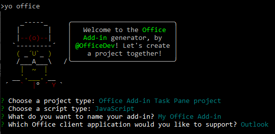
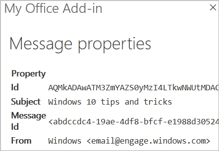

# <a name="build-your-first-outlook-add-in"></a>最初の Outlook アドインをビルドする

この記事では、選択したメッセージのプロパティを、少なくとも 1 つ表示する Outlook 作業ウィンドウ アドインを作成するプロセスについて説明します。

## <a name="create-the-add-in"></a>アドインを作成する

[Office アドイン用の Yeoman ジェネレーター](https://github.com/OfficeDev/generator-office) または Visual Studio を使用して Office アドインを作成することができます。 Yeoman ジェネレーターでは Visual Studio Code またはその他のエディターで管理できる Node.js プロジェクトを作成します。一方、Visual Studio では Visual Studio のソリューションを作成します。 使用する方のタブを選択し、手順に従ってアドインを作成してローカルでテストします。

# <a name="yeoman-generator"></a>[Yeoman ジェネレーター](#tab/yeomangenerator)

### <a name="prerequisites"></a>前提条件

[!include[Set up requirements](../includes/set-up-dev-environment-beforehand.md)]

- [Node.js](https://nodejs.org/) (最新 [LTS](https://nodejs.org/about/releases) バージョン)

- 最新バージョンの [Yeoman](https://github.com/yeoman/yo) と [Office アドイン用の Yeoman ジェネレーター](https://github.com/OfficeDev/generator-office)。これらのツールをグローバルにインストールするには、コマンド プロンプトから次のコマンドを実行します。

    ```command&nbsp;line
    npm install -g yo generator-office
    ```

    > [!NOTE]
    > Yeomanのジェネレーターを過去に取付けている場合でも、npmからのパッケージを最新のバージョンにすることをお勧めします。

### <a name="create-the-add-in-project"></a>アドイン プロジェクトの作成

1. [!include[Yeoman generator create project guidance](../includes/yo-office-command-guidance.md)]

    - **Choose a project type: (プロジェクトの種類を選択)** - `Office Add-in Task Pane project`

    - **Choose a script type: (スクリプトの種類を選択)** - `JavaScript`

    - **What would you want to name your add-in?: (アドインの名前を何にしますか)** - `My Office Add-in`

    - **Which Office client application would you like to support?: (どの Office クライアント アプリケーションをサポートしますか)** - `Outlook`

    

    ウィザードを完了すると、ジェネレーターによってプロジェクトが作成されて、サポートしているノード コンポーネントがインストールされます。

    [!include[Yeoman generator next steps](../includes/yo-office-next-steps.md)]

1. Web アプリケーション プロジェクトのルート フォルダーに移動します。

    ```command&nbsp;line
    cd "My Office Add-in&quot;
    ```

### <a name=&quot;explore-the-project&quot;></a>プロジェクトを探究する

Yeomanジェネレーターで作成したアドインプロジェクトには、原型となる作業ペインアドインのサンプルコードが含まれています。

- プロジェクトのルートディレクトリにある **./ manifest.xml** ファイルは、アドインの設定と機能性を定義します。
- **./src/taskpane/taskpane.html** ファイルには、作業ペイン用のHTMLマークアップが含まれています。
- **./src/taskpane/taskpane.css** ファイルには、作業ペインのコンテンツに適用されるCSSが含まれています。
- **./src/taskpane/taskpane.js** ファイルには、作業ペインとOutlookの間のやり取りを容易にするOffice JavaScript APIコードが含まれています。

### <a name=&quot;update-the-code&quot;></a>コードを更新する

1. コードエディタで、**./src/taskpane/taskpane.html** ファイルを開き、全体の`<main>`要素（一部の`<body>`要素）を次のマークアップに置き換えます。 この新しいマークアップは、**./src/taskpane/taskpane.js** のスクリプトがデータを書き込む場所にラベルを追加します。

    ```html
    <main id=&quot;app-body&quot; class=&quot;ms-welcome__main&quot; style=&quot;display: none;&quot;>
        <h2 class=&quot;ms-font-xl&quot;> Discover what Office Add-ins can do for you today! </h2>
        <p><label id=&quot;item-subject&quot;></label></p>
        <div role=&quot;button&quot; id=&quot;run&quot; class=&quot;ms-welcome__action ms-Button ms-Button--hero ms-font-xl&quot;>
            <span class=&quot;ms-Button-label&quot;>Run</span>
        </div>
    </main>
    ```

1. コード エディターでファイル **./src/taskpane/taskpane.js** を開き、次のコードを `run` 関数内に追加します。 このコードはOffice JavaScript APIを使用して現在のメッセージへの参照を取得し、その`subject`プロパティ値を作業ペインに書き込みます。

    ```js
    // Get a reference to the current message
    var item = Office.context.mailbox.item;

    // Write message property value to the task pane
    document.getElementById(&quot;item-subject").innerHTML = "<b>Subject:</b> <br/>" + item.subject;
    ```

### <a name="try-it-out"></a>試してみる

> [!NOTE]
> 開発の最中でも、OfficeアドインはHTTPではなくHTTPSを使用する必要があります。 次のコマンドを実行した後に証明書をインストールするように求められた場合は、Yeoman ジェネレーターによって提供される証明書をインストールするプロンプトを受け入れます。 変更を行うには、管理者としてコマンド プロンプトまたはターミナルを実行する必要がある場合もあります。

1. プロジェクトのルート ディレクトリから次のコマンドを実行します。 このコマンドを実行すると、ローカル Web サーバーが (まだ実行されていない場合) 起動し、アドインがサイドロードされます。

    ```command&nbsp;line
    npm start
    ```

1. 「[テスト用に Outlook アドインをサイドロードする](../outlook/sideload-outlook-add-ins-for-testing.md)」の手順に従って Outlook アドインをサイドロードします。

1. Outlook で、[閲覧ウィンドウ](https://support.microsoft.com/office/2fd687ed-7fc4-4ae3-8eab-9f9b8c6d53f0)でメッセージを表示するか、独自のウィンドウでメッセージを開きます。

1. **ホーム** タブ（または新しいウィンドウでメッセージを開いた場合は **メッセージ** タブ）を選択し、リボンの **タスクパネルの表示** ボタンを選択、アドインの作業ペインを開きます。

    

    > [!NOTE]
    > 作業ウィンドウで、「このアドインを localhost から開くことはできません」 というエラーが表示される場合は、[「トラブルシューティングの記事」](/office/troubleshoot/office-suite-issues/cannot-open-add-in-from-localhost) に記載されている手順に従ってください。

1. 作業ペインの下部までスクロールし、**実行** リンクを選択してメッセージを作業ペインに書き込みます。

    

    

### <a name="next-steps"></a>次の手順

おめでとうございます、最初のOutlook作業ペインアドインの作成に成功しました。 次に、Outlook アドインの機能の詳細説明と、より複雑なアドインを作成する方法について、「[Outlook アドインのチュートリアル](../tutorials/outlook-tutorial.md)」をご覧ください。

# <a name="visual-studio"></a>[Visual Studio](#tab/visualstudio)

### <a name="prerequisites"></a>前提条件

- **Office/SharePoint 開発** ワークロードがインストールされている [Visual Studio 2019](https://www.visualstudio.com/vs/)

    > [!NOTE]
    > 既に Visual Studio 2019 がインストールされている場合は、[Visual Studio インストーラー](/visualstudio/install/modify-visual-studio)を使用して、**Office/SharePoint 開発** ワークロードがインストールされていることを確認してください。

- Microsoft 365

    > [!NOTE]
    > Microsoft 365 サブスクリプションをお持ちでない場合は、[Microsoft 365 開発者プログラム](https://developer.microsoft.com/office/dev-program)に新規登録すると、無料のサブスクリプションを取得できます。

### <a name="create-the-add-in-project"></a>アドイン プロジェクトの作成

1. [Visual Studio] メニュー バーで、**[ファイル]**  >  **[新規作成]**  >  **[プロジェクト]** の順に選択します。

1. **[Visual C#]** または **[Visual Basic]** の下にあるプロジェクトの種類の一覧で、**[Office/SharePoint]** を展開し、**[アドイン]** を選択し、プロジェクトの種類として **[Outlook Web アドイン]** を選択します。

1. プロジェクトに名前を付けて、**[OK]** を選択します。

1. ソリューションが Visual Studio によって作成され、2 つのプロジェクトが **ソリューション エクスプローラー** に表示されます。 **MessageRead.html** ファイルが Visual Studio で開きます。

### <a name="explore-the-visual-studio-solution"></a>Visual Studio ソリューションについて理解する

ウィザードの完了後、Visual Studio によって 2 つのプロジェクトを含むソリューションが作成されます。

|**プロジェクト**|**説明**|
|:-----|:-----|
|アドイン プロジェクト|アドインを記述するすべての設定を含む XML マニフェスト ファイルのみが含まれます。これらの設定は、Office アプリケーションがアドインをアクティブ化するタイミングと、アドインの表示場所を決定するのに役立ちます。すぐにプロジェクトを実行し、アドインを使用できるように、Visual Studio によってこのファイルのコンテンツが生成されます。これらの設定は、XML ファイルを変更することによっていつでも変更できます。|
|Web アプリケーション プロジェクト|Office 対応の HTML および JavaScript ページを開発するために必要なすべてのファイルとファイル参照を含むアドインのコンテンツ ページが含まれます。アドインを開発している間、Visual Studio は Web アプリケーションをローカル IIS サーバー上でホストします。アドインを発行する準備が整ったら、この Web アプリケーション プロジェクトを Web サーバーに展開する必要があります。|

### <a name="update-the-code"></a>コードを更新する

1. **MessageRead.html** は、アドインの作業ウィンドウにレンダリングされる HTML を指定します。 **MessageRead.html** で、`<body>` 要素を次のマークアップに置き換えて、ファイルを保存します。
 
    ```HTML
    <body class="ms-font-m ms-welcome">
        <div class="ms-Fabric content-main">
            <h1 class="ms-font-xxl">Message properties</h1>
            <table class="ms-Table ms-Table--selectable">
                <thead>
                    <tr>
                        <th>Property</th>
                        <th>Value</th>
                    </tr>
                </thead>
                <tbody>
                    <tr>
                        <td><strong>Id</strong></td>
                        <td class="prop-val"><code><label id="item-id"></label></code></td>
                    </tr>
                    <tr>
                        <td><strong>Subject</strong></td>
                        <td class="prop-val"><code><label id="item-subject"></label></code></td>
                    </tr>
                    <tr>
                        <td><strong>Message Id</strong></td>
                        <td class="prop-val"><code><label id="item-internetMessageId"></label></code></td>
                    </tr>
                    <tr>
                        <td><strong>From</strong></td>
                        <td class="prop-val"><code><label id="item-from"></label></code></td>
                    </tr>
                </tbody>
            </table>
        </div>
    </body>
    ```

1. Web アプリケーション プロジェクトのルートにあるファイル **MessageRead.js** を開きます。 このファイルは、アドイン用のスクリプトを指定します。 すべての内容を次のコードに置き換え、ファイルを保存します。

    ```js
    'use strict';

    (function () {

        Office.onReady(function () {
            // Office is ready
            $(document).ready(function () {
                // The document is ready
                loadItemProps(Office.context.mailbox.item);
            });
        });

        function loadItemProps(item) {
            // Write message property values to the task pane
            $('#item-id').text(item.itemId);
            $('#item-subject').text(item.subject);
            $('#item-internetMessageId').text(item.internetMessageId);
            $('#item-from').html(item.from.displayName + " &lt;" + item.from.emailAddress + "&gt;");
        }
    })();
    ```

1. Web アプリケーション プロジェクトのルートにあるファイル **MessageRead.css** を開きます。 このファイルは、アドイン用のユーザー設定のスタイルを指定します。 すべての内容を次のコードに置き換え、ファイルを保存します。

    ```CSS
    html,
    body {
        width: 100%;
        height: 100%;
        margin: 0;
        padding: 0;
    }

    td.prop-val {
        word-break: break-all;
    }

    .content-main {
        margin: 10px;
    }
    ```

### <a name="update-the-manifest"></a>マニフェストを更新する

1. アドイン プロジェクト内の XML マニフェスト ファイルを開きます。 このファイルは、アドインの設定と機能を定義します。

1. `ProviderName` 要素にはプレースホルダー値が含まれています。 それを自分の名前に置き換えます。

1. `DisplayName` 要素の `DefaultValue` 属性にはプレースホルダー値が含まれています。 それを `My Office Add-in` に置き換えます。

1. `Description` 要素の `DefaultValue` 属性にはプレースホルダー値が含まれています。 それを `My First Outlook add-in` に置き換えます。

1. ファイルを保存します。

    ```xml
    ...
    <ProviderName>John Doe</ProviderName>
    <DefaultLocale>en-US</DefaultLocale>
    <!-- The display name of your add-in. Used on the store and various places of the Office UI such as the add-ins dialog. -->
    <DisplayName DefaultValue="My Office Add-in" />
    <Description DefaultValue="My First Outlook add-in"/>
    ...
    ```

### <a name="try-it-out"></a>試してみる

1. Visual Studio を使用して、F5 キーを押すか **[スタート]** ボタンをクリックして、新しく作成された Outlook アドインをテストします。 アドインは IIS 上でローカルにホストされます。

1. **[Exchange 電子メールアカウントに接続する]** ダイアログ ボックスで、[Microsoft アカウント](https://account.microsoft.com/account)の電子メール アドレスとパスワードを入力し、**[接続]** を選択します。 Outlook.com のログイン ページがブラウザに表示されたら、前回と同じ資格情報を使用して、メール アカウントにログインします。

    > [!NOTE]
    > **[Exchange 電子メールアカウントに接続]** ダイアログ ボックスで繰り返しサインインが求められる場合、または承認されていないというエラーが表示される場合は、Microsoft 365 テナントのアカウントの基本認証が無効になっている可能性があります。 このアドインをテストするには、Web アドイン プロジェクトのプロパティ ダイアログで **[多要素認証を使用する]** プロパティを True に設定した後でもう一度サインインするか、代わりに [Microsoft アカウント](https://account.microsoft.com/account) を使用してサインインしてください。

1. Outlook on the web で、メッセージを選択または開きます。

1. メッセージ内で、アドインのボタンが表示されているオーバーフロー メニューの省略記号を探します。

    

1. オーバーフロー メニュー内でアドインのボタンを探します。

    

1. ボタンをクリックしてアドインの作業ウィンドウを開きます。

    

    > [!NOTE]
    > 作業ウィンドウが読み込まれない場合、同じコンピューター上のブラウザーで作業ウィンドウを開いて確認してください。

### <a name="next-steps"></a>次の手順

おめでとうございます、最初のOutlook作業ペインアドインの作成に成功しました。 次に、「[Visual Studio を使用して Office アドインを開発する](../develop/develop-add-ins-visual-studio.md)」を参照してください。

---
