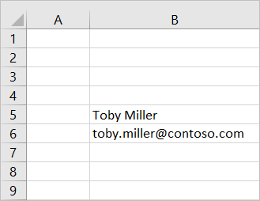

# <a name="use-the-yeoman-generator-to-create-an-office-add-in-that-uses-single-sign-on-preview"></a>Yeoman ジェネレーターを使用して、シングル サインオンを使用する Office アドインを作成する (プレビュー)

この記事では、可能な場合シングル サインオン (SSO) を使用し、SSO がサポートされていない場合は別のユーザー認証方法を使用する Excel、Word、または PowerPoint 用の Office アドインを作成するプロセスを説明します。 

> [!TIP]
> このクイック スタートを完了する前に、「[Office アドインのシングル サインオンを有効化する](../develop/sso-in-office-add-ins.md)」を参照して、Office アドインの SSO に関する基本的な概念を確認してください。 
 
Yeoman ジェネレーターは、Azure 内で SSO を構成するために必要な手順を自動化し、SSO を使用するために必要なコードを生成することで、SSO アドインの作成プロセスを簡素化します。 Yeoman ジェネレーターが自動化する手順を手動で完了する方法についての詳細は、「[シングル サインオンを使用する Node.js Office アドインを作成する](../develop/create-sso-office-add-ins-nodejs.md)」チュートリアルを参照してください。

## <a name="prerequisites"></a>前提条件

* [Node.js](https://nodejs.org) (バージョン 10.15.0 以降)

* 最新バージョンの [Yeoman](https://github.com/yeoman/yo) と [Office アドイン用の Yeoman ジェネレーター](https://github.com/OfficeDev/generator-office)。これらのツールをグローバルにインストールするには、コマンド プロンプトから次のコマンドを実行します。

    ```command&nbsp;line
    npm install -g yo generator-office
    ```

    [!include[note to update Yeoman generator](../includes/note-yeoman-generator-update.md)]

[!include[additional prerequisites](../includes/sso-tutorial-prereqs.md)]

## <a name="create-the-add-in-project"></a>アドイン プロジェクトの作成

> [!TIP]
> Yeoman ジェネレーターは、Excel、Word、または PowerPoint 用の SSO が有効な Office アドインを作成でき、JavaScript または TypeScript のスクリプト タイプで作成できます。 次の手順では、`JavaScript` と `Excel` を指定しますが、使用しているシナリオに最適なスクリプト タイプと Office クライアント アプリケーションを選択する必要があります。

[!include[Yeoman generator create project guidance](../includes/yo-office-command-guidance.md)]

- **Choose a project type: (プロジェクトの種類を選択)** `Office Add-in Task Pane project supporting single sign-on`
- **Choose a script type: (スクリプトの種類を選択)** `Javascript`
- **What would you want to name your add-in?: (アドインの名前を何にしますか)** `My SSO Office Add-in`
- **Which Office client application would you like to support?: (どの Office クライアント アプリケーションをサポートしますか)** `Excel`


ウィザードを完了すると、ジェネレーターによってプロジェクトが作成されて、サポートしているノード コンポーネントがインストールされます。

[!include[Yeoman generator next steps](../includes/yo-office-next-steps.md)]

## <a name="explore-the-project"></a>プロジェクトを確認する

Yeoman ジェネレーターで作成したアドイン プロジェクトには、SSO が有効な作業ウィンドウ アドインのコードが含まれています。

- プロジェクトのルートディレクトリにある **./ manifest.xml**ファイルは、アドインの設定と機能性を定義します。

- **./src/taskpane/taskpane.html**ファイルには、作業ペイン用のHTMLマークアップが含まれています。
- **./src/taskpane/taskpane.css**ファイルには、作業ウィンドウ内のコンテンツに適用される CSS が含まれています。
- **./src/taskpane/taskpane.js**ファイルには、作業ウィンドウと Office のホスト アプリケーションの間のやり取りを容易にする Office JavaScript API コードが含まれています。

- **./src/helpers/documentHelper.js** ファイルは、Office JavaScript ライブラリを使用して、Microsoft Graph から Office ドキュメントにデータを追加します。
- **./src/helpers/fallbackauthdialog.html** ファイルは、フォールバック認証方法の JavaScript を読み込む UI を使用しないページです。
- **./src/helpers/fallbackauthdialog.js** ファイルには、msal.js でユーザーにサインオンするフォールバック認証方法の JavaScript が含まれています。
- **./src/helpers/fallbackauthhelper.js** ファイルには、SSO 認証がサポートされていないシナリオでフォールバック認証方法を呼び出す作業ウィンドウの JavaScript が含まれています。
- **./src/helpers/ssoauthhelper.js** ファイルには、SSO API `getAccessToken` へのJavaScript 呼び出しが含まれ、ブートストラップ トークンの受信し、Microsoft Graph へのアクセス トークンのブートストラップ トークン交換の開始、データのための Microsoft Graph への呼び出しを行います。

- **./ENV** ファイルはプロジェクトのルート ディレクトリにあり、アドイン プロジェクトで使用される定数を定義します。
    > [!NOTE]
    > このファイルで定義されている定数の一部は、SSO プロセスを容易するために使用されます。 このファイルの値を、特定のシナリオに合わせて更新できます。 たとえば、アドインで `User.Read` 以外のものが必要な場合は、このファイルを更新して別の範囲を指定できます。

## <a name="configure-sso"></a>SSO を構成する

この時点では、アドイン プロジェクトが作成され、SSO プロセスを容易するために必要なコードが含まれています。 次の手順を完了して、アドインの SSO を構成します。

1. プロジェクトのルート フォルダーに移動します。

    ```command&nbsp;line
    cd "My SSO Office Add-in"
    ```

2. 次のコマンドを実行して、アドインの SSO を構成します。

    ```command&nbsp;line
    npm run configure-sso
    ```

    > [!WARNING]
    > このコマンドは、テナントが 2 要素認証を要求するように構成されている場合、失敗します。 このシナリオでは、「[シングル サインオンを使用する Node.js Office アドインを作成する](../develop/create-sso-office-add-ins-nodejs.md)」チュートリアルで説明されているように、Azure アプリの登録および SSO の構成手順を手動で完了する必要があります。

3. Web ブラウザー ウィンドウが開き、Azure にサインインするように指示されます。 Office 365 管理者の資格情報を使用して Azure にサインインします。 これらの資格情報を使用して Azure に新しいアプリケーションが登録され、SSO に必要な設定が構成されます。

    > [!NOTE]
    > この手順で、管理者以外の資格情報を使用して Azure にサインインした場合、`configure-sso` スクリプトは、組織内のユーザーにアドインの管理者の同意を提供しません。 そのため、SSO はアドインのユーザーは使用できず、サインインするように求められます。

4. 資格情報を入力したら、ブラウザー ウィンドウを閉じ、コマンド プロンプトに戻ります。 SSO の構成プロセスが続行されると、コンソールに書き込まれたステータス メッセージが表示されます。 コンソール メッセージで説明されているように、Yeoman ジェネレーターが作成したアドイン プロジェクト内のファイルは、SSO プロセスで必要なデータで自動的に更新されます。

## <a name="try-it-out"></a>試してみる

1. SSO の構成プロセスが完了したら、次のコマンドを実行してプロジェクトを構築し、ローカル Web サーバーを起動して以前に選択した Office クライアント アプリケーションにアドインをサイドロードします。

    > [!NOTE]
    > 開発の最中でも、OfficeアドインはHTTPではなくHTTPSを使用する必要があります。 次のコマンドを実行した後に証明書をインストールするように求められた場合は、Yeoman ジェネレーターによって提供される証明書をインストールするプロンプトを受け入れます。

    ```command&nbsp;line
    npm start
    ```

2. 前のコマンド (Excel、Word、PowerPoint など) を実行したときに開く Office クライアント アプリケーションで、[前のセクション](#configure-sso)の手順 3 で SSO を構成している間に Azure の接続に使用した Office 365 管理者アカウントと同じ Office 365 組織のメンバーであるユーザーでサインインしていることを確認します。 これにより、SSO を正常に実行するための適切な条件が確立されます。 

3. Office クライアント アプリケーションで、[**ホーム**] タブを選択し、リボンの [**作業ウィンドウの表示**] ボタンをクリックして、アドインの作業ウィンドウを開きます。 次の画像は、Excel のこのボタンを示しています。

    

4. 作業ウィンドウの下部にある [**マイ ユーザー プロファイルの情報を取得する**] ボタンを選択して、SSO プロセスを開始します。 

    > [!NOTE] 
    > この時点でまだ Office にサインインしていない場合は、サインインするように求められます。 前に説明したように、SSO を正常に実行するには、[前のセクション](#configure-sso)の手順 3 で SSO を構成している間に Azure の接続に使用した Office 365 管理者アカウントと同じ Office 365 組織のメンバーであるユーザーでサインインしている必要があります。

5. アドインの代わりにアクセス許可を要求するダイアログ ウィンドウが表示される場合は、SSO はシナリオでサポートされず、代わりにアドインが別のユーザー認証方法に戻っていることを意味します。 これは、テナント管理者がアドインが Microsoft Graph にアクセスするための同意を与えていない場合、または有効な Microsoft アカウントまたは Office 365 (「職場または学校」) アカウントで Office にサインインしていない場合に発生することがあります。 ダイアログ ウィンドウで [**同意する**] ボタンを選択して続行します。

    

    > [!NOTE]
    > ユーザーがこのアクセス許可の要求を受け入れると、今後再びプロンプトが表示されることはありません。

6. アドインは、サインインしたユーザーのプロファイル情報を取得し、ドキュメントに書き込みます。 次の画像は、Excel ワークシートに書き込まれたプロファイル情報の例を示します。

    

## <a name="next-steps"></a>次の手順

おめでとうございます。可能な場合 SSO を使用し、SSO がサポートされていない場合は別のユーザー認証方法を使用する作業ウィンドウ アドインを正常に作成しました。 Yeoman ジェネレーターが自動的に完了した SSO の構成手順、および SSO プロセスを容易にするコードの詳細については、「[シングル サインオンを使用する Node.js Office アドインを作成する](../develop/create-sso-office-add-ins-nodejs.md)」を参照してください。

## <a name="see-also"></a>関連項目

- [Office アドインのシングル サインオンを有効化する](../develop/sso-in-office-add-ins.md)
- [シングル サインオンを使用する Node.js Office アドインを作成する](../develop/create-sso-office-add-ins-nodejs.md)
- [シングル サインオン (SSO) のエラー メッセージのトラブルシューティング](../develop/troubleshoot-sso-in-office-add-ins.md)