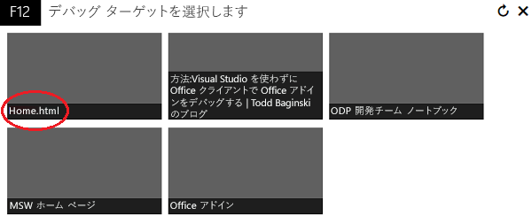

# Windows 10 で F12 開発者ツールを使用してアドインをデバッグするDebug add-ins using F12 developer tools on Windows 10

Windows 10 に含まれている F12 開発者ツールにより、web ページのデバッグ、テスト、および高速化ができます。それらを使用すれば、Visual Studio などの IDE を使用していない場合や、アドインを IDE の外部で実行中に問題を調査する必要がある場合に、Office アドインの開発とデバッグを行うことも可能です。アドインの実行後、F12 開発者ツールを起動できます。The F12 developer tools included in Windows 10 help you debug, test, and speed up your webpages. You can also use them to develop and debug Office Add-ins, if you are not using an IDE like Visual Studio, or if you need to investigate a problem while running your add-in outside the IDE. You can start the F12 developer tools after your add-in is running.

この記事では、Windows 10 で F12 開発者ツールのデバッガー ツールを使用して、Office アドインをテストする方法を説明します。AppSource からのアドイン、また他の場所から追加したアドインもテストできます。F12 ツールは独自のウィンドウに表示され、Visual Studio を使用しません。This article shows how you how to use the Debugger tool from the F12 developer tools in Windows 10 to test your Office Add-in. You can test add-ins from AppSource or add-ins that you have added from other locations. The F12 tools display in a separate window and do not use Visual Studio.

> [!NOTE]
> デバッガーは、Windows 10 および Internet Explorer 上の F12 開発者ツールの一部です。Windows の以前のバージョンにはデバッガーは含まれません。The Debugger is part of the F12 developer tools in Windows 10 and Internet Explorer. Earlier versions of Windows do not include the Debugger. 

## 前提条件Prerequisites

以下のソフトウェアが必要です。You need the following software:

- Windows 10 に含まれる F12 開発者ツール。The F12 developer tools, which are included in Windows 10. 
    
- アドインをホストする Office クライアント アプリケーション。The Office client application that hosts your add-in. 
    
- アドイン。Your add-in. 

## デバッガーの使用Using the Debugger

次の例では、AppSource から Word と無料のアドインを使用します。This example uses Word and a free add-in from AppSource.

1. Word を起動し、空白の文書を選択します。Open Word and choose a blank document. 
    
2. アドイン グループの **[挿入]** タブで、**[ストア]** をクリックし、QR4Office アドインを選択します。(ストアやアドイン カタログから、追加のアドインを読み込むことができます。)On the **Insert** tab, in the Add-ins group, choose **Store** and select the QR4Office add-in. (You can load any add-in from the Store or your add-in catalog.)
    
3. Office のバージョンに対応する F12 開発者ツールを起動します。Launch the F12 development tools that corresponds to your version of Office:
    
   - 32 ビット版の Office の場合は、C:\Windows\System32\F12\IEChooser.exe を使用します。For the 32-bit version of Office, use C:\Windows\System32\F12\F12Chooser.exe
    
   - 64 ビット版の Office の場合は、C:\Windows\SysWOW64\F12\IEChooser.exe を使用します。For the 64-bit version of Office, use C:\Windows\SysWOW64\F12\F12Chooser.exe
    
   IEChooser を起動すると、[デバッグするターゲットの選択] という名前の別ウィンドウに、デバッグの対象になりうるアプリケーションが表示されます。When you launch F12Chooser, a separate window named "Choose target to debug" displays the possible applications to debug. デバッグするアプリケーションを選択します。Select the application that you are interested in. 独自のアドインを記述している場合、アドインを展開した Web サイトを選択します。ローカル ホストの URL も選択できます。If you are writing your own add-in, select the website where you have the add-in deployed, which might be a localhost URL. 
    
   たとえば、**home.html** を選択します。For example, select **home.html**. 
    
   

4. F12 ウィンドウで、デバッグするファイルを選択します。In the F12 window, select the file you want to debug.
    
   ファイルを選択するには、**スクリプト** (左側) ウィンドウの上にあるフォルダー アイコンを選択します。ドロップダウン リストに利用可能なファイルが表示されます。home.js を選択します。To select the file, choose the folder icon above the  **script** (left) pane. The dropdown list shows the available files. Select home.js.
    
5. ブレークポイントを設定します。Set the breakpoint.
    
   home.js にブレークポイントを設定するには、_textChanged_ 関数内の行 144 を選択します。その行の左側と **[コールスタックとブレークポイント]** (右下) ウィンドウの対応する行に赤い点が表示されます。ブレークポイントを設定するその他の方法については、「[デバッガーを使用して実行中の JavaScript を検査する](https://docs.microsoft.com/previous-versions/windows/internet-explorer/ie-developer/samples/dn255007(v=vs.85))」を参照してください。To set the breakpoint in home.js, choose line 144, which is in the  _textChanged_ function. You will see a red dot to the left of the line and a corresponding line in the **Callstack and Breakpoints** (bottom right) pane. For other ways to set a breakpoint, see [Inspect running JavaScript with the Debugger](https://docs.microsoft.com/previous-versions/windows/internet-explorer/ie-developer/samples/dn255007(v=vs.85)). 
    
   

6. アドインを実行して、ブレークポイントをトリガーします。Run your add-in to trigger the breakpoint.
    
   [QR4Office] ウィンドウの上部にある [URL] テキスト ボックスを選択して、テキストを変更します。デバッガー内の **[コールスタックとブレークポイント]** ウィンドウで、ブレークポイントがトリガーされ、さまざまな情報を示していることがわかります。結果を確認するには、F12 ツールの更新が必要な場合があります。Choose the URL textbox in the upper part of the QR4Office pane to change the text. In the Debugger, in the **Callstack and Breakpoints** pane, you'll see that the breakpoint has triggered and shows various information. You might need to refresh the F12 tool to see the results.
    
   

## 関連項目See also

- [デバッガーを使用して実行中の JavaScript を検査する](https://docs.microsoft.com/previous-versions/windows/internet-explorer/ie-developer/samples/dn255007(v=vs.85))[Inspect running JavaScript with the Debugger](https://docs.microsoft.com/previous-versions/windows/internet-explorer/ie-developer/samples/dn255007(v=vs.85))
- [F12 開発者ツールの使用](https://docs.microsoft.com/previous-versions/windows/internet-explorer/ie-developer/samples/bg182326(v=vs.85))[Using the F12 developer tools](https://docs.microsoft.com/previous-versions/windows/internet-explorer/ie-developer/samples/bg182326(v=vs.85))
    
