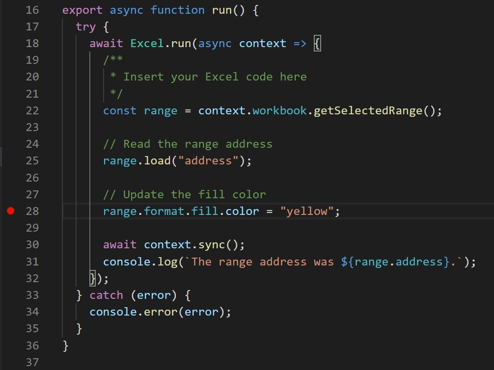

# <a name="microsoft-office-add-in-debugger-extension-for-visual-studio-code"></a><span data-ttu-id="a9df9-103">Visual Studio Code の Microsoft Office アドインデバッガーの拡張機能</span><span class="sxs-lookup"><span data-stu-id="a9df9-103">Microsoft Office Add-in Debugger Extension for Visual Studio Code</span></span>

<span data-ttu-id="a9df9-104">Visual Studio コード用の Microsoft Office アドインデバッガー拡張機能を使用すると、エッジランタイムに対して Office アドインをデバッグできます。</span><span class="sxs-lookup"><span data-stu-id="a9df9-104">The Microsoft Office Add-in Debugger Extension for Visual Studio Code allows you to debug your Office Add-in against the Edge runtime.</span></span>

<span data-ttu-id="a9df9-105">このデバッグモードは動的なので、コードの実行中にブレークポイントを設定できます。</span><span class="sxs-lookup"><span data-stu-id="a9df9-105">This debugging mode is dynamic, allowing you to set breakpoints while code is running.</span></span> <span data-ttu-id="a9df9-106">デバッグセッションを失わずに、デバッガーがアタッチされている間は、コード内の変更をすぐに表示できます。</span><span class="sxs-lookup"><span data-stu-id="a9df9-106">You can see changes in your code immediately while the debugger is attached, all without losing your debugging session.</span></span> <span data-ttu-id="a9df9-107">コードの変更も引き続き行われるため、コードに対する複数の変更の結果を確認できます。</span><span class="sxs-lookup"><span data-stu-id="a9df9-107">Your code changes also persist, so you can see the results of multiple changes to your code.</span></span> <span data-ttu-id="a9df9-108">次の図は、この拡張機能の動作を示しています。</span><span class="sxs-lookup"><span data-stu-id="a9df9-108">The following image shows this extension in action.</span></span>


## <a name="prerequisites"></a><span data-ttu-id="a9df9-110">前提条件</span><span class="sxs-lookup"><span data-stu-id="a9df9-110">Prerequisites</span></span>

- <span data-ttu-id="a9df9-111">[Visual Studio Code](https://code.visualstudio.com/) (管理者として実行する必要があります)</span><span class="sxs-lookup"><span data-stu-id="a9df9-111">[Visual Studio Code](https://code.visualstudio.com/) (must be run as an administrator)</span></span>
- [<span data-ttu-id="a9df9-112">Node.js (バージョン10以降)</span><span class="sxs-lookup"><span data-stu-id="a9df9-112">Node.js (version 10+)</span></span>](https://nodejs.org/)
- <span data-ttu-id="a9df9-113">Windows 10</span><span class="sxs-lookup"><span data-stu-id="a9df9-113">Windows 10</span></span>
- [<span data-ttu-id="a9df9-114">Microsoft Edge</span><span class="sxs-lookup"><span data-stu-id="a9df9-114">Microsoft Edge</span></span>](https://www.microsoft.com/edge)

<span data-ttu-id="a9df9-115">これらの手順では、コマンドラインを使用して基本的な JavaScript を理解し、Yo Office ジェネレーターを使用する前に Office アドインプロジェクトを作成していることを前提としています。</span><span class="sxs-lookup"><span data-stu-id="a9df9-115">These instructions assume you have experience using the command line, understand basic JavaScript, and have created an Office add-in project before using the Yo Office generator.</span></span> <span data-ttu-id="a9df9-116">これを実行していない場合は、この[Excel Office アドインのチュートリアル](../tutorials/excel-tutorial.md)のように、チュートリアルの1つにアクセスすることを検討してください。</span><span class="sxs-lookup"><span data-stu-id="a9df9-116">If you haven't done this before, consider visiting one of our tutorials, like this [Excel Office Add-in tutorial](../tutorials/excel-tutorial.md).</span></span>

## <a name="install-and-use-the-debugger"></a><span data-ttu-id="a9df9-117">デバッガーをインストールして使用する</span><span class="sxs-lookup"><span data-stu-id="a9df9-117">Install and use the debugger</span></span>

1. <span data-ttu-id="a9df9-118">アドインプロジェクトを作成する必要がある場合は、 [Yo Office ジェネレーターを使用して](https://docs.microsoft.com/office/dev/add-ins/quickstarts/excel-quickstart-jquery?tabs=yeomangenerator)プロジェクトを作成します。</span><span class="sxs-lookup"><span data-stu-id="a9df9-118">If you need to create an add-in project, [use the Yo Office generator to create one](https://docs.microsoft.com/office/dev/add-ins/quickstarts/excel-quickstart-jquery?tabs=yeomangenerator).</span></span> <span data-ttu-id="a9df9-119">コマンドライン内のプロンプトに従って、プロジェクトを設定します。</span><span class="sxs-lookup"><span data-stu-id="a9df9-119">Follow the prompts within the command line to set up your project.</span></span> <span data-ttu-id="a9df9-120">必要に応じて、任意の言語やプロジェクトの種類を選択できます。</span><span class="sxs-lookup"><span data-stu-id="a9df9-120">You can choose any language or type of project to suit your needs.</span></span>

> <span data-ttu-id="a9df9-121">!ことプロジェクトが既に存在する場合は、手順1をスキップし、手順2に進みます。</span><span class="sxs-lookup"><span data-stu-id="a9df9-121">![NOTE] If you already have a project, skip step 1 and move to step 2.</span></span>

2. <span data-ttu-id="a9df9-122">管理者としてコマンドプロンプトを開きます。</span><span class="sxs-lookup"><span data-stu-id="a9df9-122">Open a command prompt as administrator.</span></span>
   <span data-ttu-id="a9df9-123"></span><span class="sxs-lookup"><span data-stu-id="a9df9-123"></span></span>

3. <span data-ttu-id="a9df9-124">プロジェクトディレクトリに移動します。</span><span class="sxs-lookup"><span data-stu-id="a9df9-124">Navigate to your project directory.</span></span>

4. <span data-ttu-id="a9df9-125">次のコマンドを実行して、Visual Studio Code で管理者としてプロジェクトを開きます。</span><span class="sxs-lookup"><span data-stu-id="a9df9-125">Run the following command to open your project in Visual Studio Code as an administrator.</span></span>

```command&nbsp;line
code .
```

<span data-ttu-id="a9df9-126">Visual Studio コードが開いたら、プロジェクトフォルダーに手動で移動します。</span><span class="sxs-lookup"><span data-stu-id="a9df9-126">Once Visual Studio Code is open, navigate manually to the project folder.</span></span>

> [!TIP]
> <span data-ttu-id="a9df9-127">Visual Studio Code を管理者として開くには、Visual Studio Code を Windows で検索した後、そのコードを開くときに [**管理者として実行**] オプションを選択します。</span><span class="sxs-lookup"><span data-stu-id="a9df9-127">To open Visual Studio Code as an administrator, select the **run as administrator** option when opening Visual Studio Code after searching for it in Windows.</span></span>

5. <span data-ttu-id="a9df9-128">VS コード内で、 **CTRL + SHIFT + X**を選択して [拡張バー] を開きます。</span><span class="sxs-lookup"><span data-stu-id="a9df9-128">Within VS Code, select **CTRL + SHIFT + X** to open the Extensions bar.</span></span> <span data-ttu-id="a9df9-129">「Microsoft Office アドインデバッガー」拡張機能を検索してインストールします。</span><span class="sxs-lookup"><span data-stu-id="a9df9-129">Search for the "Microsoft Office Add-in Debugger" extension and install it.</span></span>

6. <span data-ttu-id="a9df9-130">プロジェクトの vscode フォルダーで、**起動. json**ファイルを開きます。</span><span class="sxs-lookup"><span data-stu-id="a9df9-130">In the .vscode folder of your project, open the **launch.json** file.</span></span> <span data-ttu-id="a9df9-131">次のコードをセクションに追加し `configurations` ます。</span><span class="sxs-lookup"><span data-stu-id="a9df9-131">Add the following code to the `configurations` section:</span></span>

```JSON
{
  "type": "office-addin",
  "request": "attach",
  "name": "Attach to Office Add-ins",
  "port": 9222,
  "trace": "verbose",
  "url": "https://localhost:3000/taskpane.html?_host_Info=HOST$Win32$16.01$en-US$$$$0",
  "webRoot": "${workspaceFolder}",
  "timeout": 45000
}
```

7. <span data-ttu-id="a9df9-132">先ほどコピーした JSON のセクションで、[url] セクションを見つけます。</span><span class="sxs-lookup"><span data-stu-id="a9df9-132">In the section of JSON you just copied, find the "url" section.</span></span> <span data-ttu-id="a9df9-133">この URL では、大文字のホストテキストを Office アドインのホストアプリケーションに置き換える必要があります。</span><span class="sxs-lookup"><span data-stu-id="a9df9-133">In this URL, you will need to replace the uppercase HOST text with the host application for your Office add-in.</span></span> <span data-ttu-id="a9df9-134">たとえば、Office アドインが excel 用の場合、URL の値は " https://localhost:3000/taskpane.html?_host_Info= <strong>excel</strong>$Win 32 $ 16.01 $ en-us $ \$ \$ \$ 0" になります。</span><span class="sxs-lookup"><span data-stu-id="a9df9-134">For example, if your Office add-in is for Excel, your URL value would be "https://localhost:3000/taskpane.html?_host_Info=<strong>Excel</strong>$Win32$16.01$en-US$\$\$\$0".</span></span>

8. <span data-ttu-id="a9df9-135">コマンドプロンプトを開き、自分がプロジェクトのルートフォルダーにあることを確認します。</span><span class="sxs-lookup"><span data-stu-id="a9df9-135">Open the command prompt and ensure you are at the root folder of your project.</span></span> <span data-ttu-id="a9df9-136">コマンドを実行し `npm start` て、開発サーバーを起動します。</span><span class="sxs-lookup"><span data-stu-id="a9df9-136">Run the command `npm start` to start the dev server.</span></span> <span data-ttu-id="a9df9-137">アドインが Office クライアントに読み込まれたら、作業ウィンドウを開きます。</span><span class="sxs-lookup"><span data-stu-id="a9df9-137">When your add-in loads in the Office client, open the task pane.</span></span>

9. <span data-ttu-id="a9df9-138">Visual Studio Code に戻り、[**表示] > [デバッグ**] を選択するか、 **CTRL + SHIFT + D キー**を押してデバッグビューに切り替えます。</span><span class="sxs-lookup"><span data-stu-id="a9df9-138">Return to Visual Studio Code and choose **View > Debug** or enter **CTRL + SHIFT + D** to switch to debug view.</span></span>

10. <span data-ttu-id="a9df9-139">デバッグオプションで、[ **Office アドインにアタッチ**] を選択します。**F5 キーを押す**か、メニューからデバッグを**開始し >** デバッグを開始してデバッグを開始します。</span><span class="sxs-lookup"><span data-stu-id="a9df9-139">From the Debug options, choose **Attach to Office Add-ins**. Select **F5** or choose **Debug -> Start Debugging** from the menu to begin debugging.</span></span>

11. <span data-ttu-id="a9df9-140">プロジェクトの作業ウィンドウファイルにブレークポイントを設定します。</span><span class="sxs-lookup"><span data-stu-id="a9df9-140">Set a breakpoint in your project's task pane file.</span></span> <span data-ttu-id="a9df9-141">VS コードでブレークポイントを設定するには、コード行の横にあるカーソルを使用して、表示される赤い円を選択します。</span><span class="sxs-lookup"><span data-stu-id="a9df9-141">You can set breakpoints in VS Code by hovering next to a line of code and selecting the red circle which appears.</span></span>



12. <span data-ttu-id="a9df9-143">アドインを実行します。</span><span class="sxs-lookup"><span data-stu-id="a9df9-143">Run your add-in.</span></span> <span data-ttu-id="a9df9-144">ブレークポイントにヒットしたことが表示され、ローカル変数を調べることができます。</span><span class="sxs-lookup"><span data-stu-id="a9df9-144">You will see that breakpoints have been hit and you can inspect local variables.</span></span>

## <a name="see-also"></a><span data-ttu-id="a9df9-145">関連項目</span><span class="sxs-lookup"><span data-stu-id="a9df9-145">See also</span></span>

* [<span data-ttu-id="a9df9-146">Office アドインのテストとデバッグ</span><span class="sxs-lookup"><span data-stu-id="a9df9-146">Test and debug Office Add-ins</span></span>](test-debug-office-add-ins.md)

* [<span data-ttu-id="a9df9-147">Windows 10 で開発者ツールを使用してアドインをデバッグする</span><span class="sxs-lookup"><span data-stu-id="a9df9-147">Debug add-ins using developer tools on Windows 10</span></span>](debug-add-ins-using-f12-developer-tools-on-windows-10.md)

* [<span data-ttu-id="a9df9-148">作業ウィンドウからデバッガーをアタッチする</span><span class="sxs-lookup"><span data-stu-id="a9df9-148">Attach a debugger from the task pane</span></span>](attach-debugger-from-task-pane.md)
