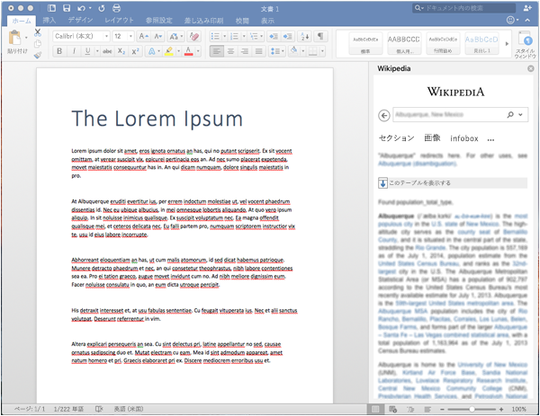

# テスト用に iPad と Mac で Office アドインをサイドロードする

Office on iOS でアドインの実行状態を確認するには、iTunes を利用してアドインのマニフェストを iPad にサイドロードするか、Office on Mac でアドインのマニフェストを直接サイドロードします。このアクションでは、実行中にブレークポイントを設定したり、アドインのコードをデバッグしたりできませんが、その動作を確認したり、UI が使いやすいかどうかや、適切にレンダリングされているかどうかを確認できます。

> [!NOTE]
> Outlook アドインをサイドロードするには、「[テストのために Outlook アドインをサイドロードする](../outlook/sideload-outlook-add-ins-for-testing.md)」をご参照ください。

## Office on iOS の前提条件

- [iTunes](https://www.apple.com/itunes/download/) がインストールされた Windows または Mac コンピューター。
  > [!IMPORTANT]
  > macOS [Catalina](#sideload-an-add-in-on-excel-or-word-on-ipad-using-macos-catalina)を実行している場合[、iTunes](https://support.apple.com/HT210200)は使用できなくなったので、この記事の後半の「Excel または word on iPad のアドインをサイドロードする」セクションの指示に従ってください。

- iOS 8.2 以降iPadインストールされている iOS  8.2 以降Excel同期ケーブルがインストールされている場合。 

- テスト対象アドインのマニフェスト .xml ファイル。

## Office on Mac の前提条件

- [Office on Mac](https://products.office.com/buy/compare-microsoft-office-products?tab=omac) がインストールされていて OS X v10.10 "Yosemite" を実行している Mac。

- Word on Mac バージョン 15.18 (160109)。

- Excel on Mac バージョン 15.19 (160206)。

- PowerPoint on Mac バージョン 15.24 (160614)

- テスト対象アドインのマニフェスト .xml ファイル。

## iTunes を使用して、Excelまたは Word のアドインiPad読み込む

1. 同期ケーブルを使用し、iPad をコンピューターに接続します。 コンピューターに初めてiPad接続する場合は、このコンピューターの信頼を求める **メッセージが表示されます。** **[信頼する]** を選択して続行します。

2. iTunes で、メニュー バーの下にある **[iPad]** のアイコンをクリックします。

3. iTunes の左側の **[設定]** で、**[App]** をクリックします。

4. iTunes の右側で、**[ファイル共有]** までスクロールしてから、**[アドイン]** 列で **[Excel]** または **[Word]** をクリックします。

5. [ファイル] または **[Word** ドキュメントExcel] 列の下部にある [ファイルの追加] を選択し、サイドロードするアドインのマニフェスト .xml ファイルを選択します。

6. iPad で Excel または Word アプリを開きます。 アプリまたは word Excelが既に実行されている場合は、[ホーム] ボタンを選択し、アプリを閉じて再起動します。

7. ドキュメントを開きます。

8. [**挿入] タブで**  [アドイン] を選択します([挿入] タブで、[アドイン] ボタンが表示されるまで水平方向にスクロール **する必要** がある場合があります)。サイドロードされたアドインは、アドイン UI の **[開発者**] 見出しの下 **に挿入** できます。

    

## macOS Catalina を使用して、Excelまたは Word のiPadをサイドロードする

> [!IMPORTANT]
> macOS Catalina の導入により [、Apple](https://support.apple.com/HT210200) は Mac で iTunes を廃止し、アプリを Finder にサイドロードするために必要な統合機能 **を廃止しました**。

1. 同期ケーブルを使用し、iPad をコンピューターに接続します。 コンピューターに初めてiPad接続する場合は、このコンピューターの信頼を求める **メッセージが表示されます。** **[信頼する]** を選択して続行します。 また、これが新しいファイルか、または復元iPadを求めらる場合があります。

2. Finder の [場所]**で**、メニュー バー **iPadアイコンを** 選択します。

3. [Finder] ウィンドウの上部にある [ファイル] をクリックし、[ファイル] または **[Word]** **Excelを探****します**。

4. 別の Finder ウィンドウから、サイド ロードするアドインの manifest.xml ファイルを、最初の **Finder** ウィンドウの Excel または **Word** ファイルにドラッグ アンド ドロップします。

5. iPad で Excel または Word アプリを開きます。 アプリまたは word Excelが既に実行されている場合は、[ホーム] ボタンを選択し、アプリを閉じて再起動します。

6. ドキュメントを開きます。

7. [**挿入] タブで**  [アドイン] を選択します([挿入] タブで、[アドイン] ボタンが表示されるまで水平方向にスクロール **する必要** がある場合があります)。サイドロードされたアドインは、アドイン UI の **[開発者**] 見出しの下 **に挿入** できます。

    

## Office on Mac にアドインをサイドロードする

1. ターミナル **を** 開き、アドインのマニフェスト ファイルを保存する次のいずれかのフォルダーに移動します。 `wef` フォルダーがコンピューター上に存在しない場合は、作成します。

    - Word の場合: `/Users/<username>/Library/Containers/com.microsoft.Word/Data/Documents/wef`
    - Excel の場合: `/Users/<username>/Library/Containers/com.microsoft.Excel/Data/Documents/wef`
    - PowerPoint の場合: `/Users/<username>/Library/Containers/com.microsoft.Powerpoint/Data/Documents/wef`

2. コマンド (ピリオドまたはドットを含む) を使用して **Finder** `open .` でフォルダーを開きます。 アドインのマニフェスト ファイルをこのフォルダーにコピーします。

    

3. Word を起動し、ドキュメントを開きます。既に起動している場合は、Word を再起動します。

4. Word で、[**アドインの挿入**] [自分のアドイン] (ドロップダウン メニュー) を選択し、アドイン  >    >  を選択します。

    ![Mac 上の [Officeアドイン]](../images/my-add-ins-wikipedia.png)

    > [!IMPORTANT]
    > サイドロードしたアドインは [個人用アドイン] ダイアログには表示されません。ドロップダウン メニュー内にのみ表示されます (**[挿入]** タブの [個人用アドイン] の右にある小さい下向き矢印)。サイドロードしたアドインは、このメニューの見出し **[開発者向けアドイン]** の下に一覧表示されます。

5. アドインが Word に表示されることを確認します。

    

## サイドロードされたアドインを削除する

以前にサイドロードされたアドインを削除するには、コンピューター上Officeキャッシュをクリアします。 各プラットフォームとアプリケーションのキャッシュをクリアする方法の詳細については、「キャッシュをクリアする」[の記事Office参照してください](clear-cache.md)。

## 関連項目

- [Mac で Office アドインをデバッグする](debug-office-add-ins-on-ipad-and-mac.md)
- [テスト用に Outlook アドインをサイドロードする](../outlook/sideload-outlook-add-ins-for-testing.md)
