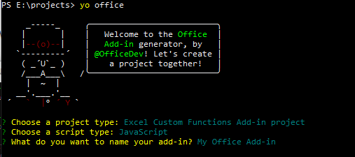

# <a name="tutorial-share-data-and-events-between-excel-custom-functions-and-the-task-pane-preview"></a>チュートリアル: Excel カスタム関数と作業ウィンドウの間でデータとイベントを共有する (プレビュー)

Excel カスタム関数と作業ウィンドウはグローバル データを共有し、互いに関数呼び出しを行うことができます。 カスタム関数が作業ウィンドウで機能するようにプロジェクトを構成するには、この記事の指示に従ってください。

> [!NOTE]
> この記事で説明する機能は現在プレビュー中であり、変更される可能性があります。 これらを運用環境で使用することは現在サポートされていません。 この記事のプレビュー機能は、Windows 上の Excel でのみ使用できます。 プレビュー機能を試すには、[Office Insider に参加する](https://insider.office.com/join)必要があります。  プレビュー機能を試す良い方法は、Office 365 サブスクリプションを使用することです。 Office 365 サブスクリプションをまだお持ちでない場合は、[Office 365 Developer Program](https://developer.microsoft.com/office/dev-program) に参加することで入手できます。

## <a name="create-the-add-in-project"></a>アドイン プロジェクトの作成

Yeoman ジェネレーターを使用して、Excel アドイン プロジェクトを作成します。 次のコマンドを実行し、プロンプトに次の回答を入力します。

```command&nbsp;line
yo office
```

- プロジェクトの種類を選択する:  **Excel カスタム関数アドイン プロジェクト**
- スクリプトの種類を選択する:  **JavaScript**
- アドインの名前を何にしますか?  **個人用 Office アドイン**



ウィザードを完了すると、ジェネレーターによってプロジェクトが作成され、サポートしているノード コンポーネントがインストールされます。

## <a name="configure-the-manifest"></a>マニフェストを構成する

1. Visual Studio Code を開始して [**個人用 Office アドイン**] プロジェクトを開きます。
2. **manifest.xml** ファイルを開きます。
3. 次のコードに示ように、**CustomFunctionsRuntime** バージョン **1.2** を使用するように `<Requirements>` ションを変更します。
    
    ```xml
    <Requirements> 
    <Sets DefaultMinVersion="1.1">
    <Set Name="CustomFunctionsRuntime" MinVersion="1.2"/>
    </Sets>
    </Requirements>
    ```
    
4. ブックの `<Host>` 要素の下に、次の `<Runtimes>` セクションを追加します。 作業ウィンドウを閉じてもカスタム関数が引き続き機能するように、有効期間は**長く**する必要があります。
    
    ```xml
    <Hosts>
    <Host xsi:type="Workbook">
    <Runtimes>
    <Runtime resid="TaskPaneAndCustomFunction.Url" lifetime="long" />
    </Runtimes>
    ```
    
5. `<Page>` 要素で、ソースの場所を **Functions.Page.Url** から **TaskPaneAndCustomFunction.Url** に変更します。

    ```xml
    <AllFormFactors>
    ...
    <Page>
    <SourceLocation resid="TaskPaneAndCustomFunction.Url"/>
    </Page>
    ...
    ```

6. `<DesktopFormFactor>` セクションで、**TaskPaneAndCustomFunction.Url** を使用するように、**Command.Url** から **FunctionFile** を変更します。
    
    ```xml
    <DesktopFormFactor>
    <GetStarted>
    ...
    </GetStarted>
    <FunctionFile resid="TaskPaneAndCustomFunction.Url"/>
    ```
    
7. `<Action>` セクションで、ソースの場所を **Taskpane.Url** から **TaskPaneAndCustomFunction.Url** に変更します。
    
    ```xml
    <Action xsi:type="ShowTaskpane">
    <TaskpaneId>ButtonId1</TaskpaneId>
    <SourceLocation resid="TaskPaneAndCustomFunction.Url"/>
    </Action>
    ```
    
8. **taskpane.html** を指す **TaskPaneAndCustomFunction.Url** の新しい **Url ID** を追加します。
     
    ```xml
    <bt:Urls>
    <bt:Url id="Functions.Script.Url" DefaultValue="https://localhost:3000/dist/functions.js"/>
    ...
    <bt:Url id="TaskPaneAndCustomFunction.Url" DefaultValue="https://localhost:3000/taskpane.html"/>
    ...
    ```
    
9. 変更を保存してプロジェクトを再ビルドします。
    
    ```command&nbsp;line
    npm run build
    ```

## <a name="share-state-between-custom-function-and-task-pane-code"></a>カスタム関数と作業ウィンドウのコードの間で状態を共有する 

カスタム関数が作業ウィンドウのコードと同じコンテキストで実行されるようになったため、**ストレージ** オブジェクトを使用せずに状態を直接共有できます。 次の手順は、カスタム関数と作業ウィンドウのコードの間でグローバル変数を共有する方法を示します。

### <a name="create-custom-functions-to-get-or-store-shared-state"></a>共有状態を取得または保存するカスタム関数を作成する

1. Visual Studio Code でファイル **src/functions/functions.js** を開きます。
2. 1 行目で、次のコードを一番上に挿入します。 これにより、**sharedState** という名前のグローバル変数が初期化されます。
    
    ```js
    window.sharedState = "empty";
    ```
    
3. 次のコードを追加して、値を **sharedState** 変数に保存するカスタム関数を作成します。
    
    ```js
    /**
    * Saves a string value to shared state with the task pane
    * @customfunction STOREVALUE
    * @param {string} value String to write to shared state with task pane.
    * @return {string} A success value
    */
    function storeValue(sharedValue) {
    window.sharedState = sharedValue;
    return "value stored";
    }
    ```
    
4. 次のコードを追加して、**sharedState** 変数の現在の値を取得するカスタム関数を作成します。

    ```js
    /**
    * Gets a string value from shared state with the task pane
    * @customfunction GETVALUE
    * @returns {string} String value of the shared state with task pane.
    */
    function getValue() {
    return window.sharedState;
    }
    ```
    
5. ファイルを保存します。

### <a name="create-task-pane-controls-to-work-with-global-data"></a>グローバル データを操作する作業ウィンドウのコントロールを作成する 

1. ファイル **src/taskpane/taskpane.html** を開きます。
2. 終了 `</main>` 要素の後に、次の HTML を追加します。 HTML は、グローバル データの取得または保存に使用される 2 つのテキスト ボックスとボタンを作成します。

    ```html
    <ol>
    <li>Enter a value to send to the custom function and select <strong>Store</strong>.</li>
    <li>Enter <strong>=CONTOSO.GETVALUE()</strong>strong> into a cell to retrieve it.</li>
    <li>To send data to the task pane, in a cell, enter <strong>=CONTOSO.STOREVALUE("new value")</strong></li>
    <li>Select <strong>Get</strong> to display the value in the task pane.</li>
    </ol>
    <p>Store new value to shared state</p>
    <div>
    <input type="text" id="storeBox" />
    <button onclick="storeSharedValue()">Store</button>
    </div>
     
    <p>Get shared state value</p>
    <div>
    <input type="text" id="getBox" />
    <button onclick="getSharedValue()">Get</button>
    </div>
    ```
    
3. `<body>` 要素の前に、次のスクリプトを追加します。 このコードは、ユーザーがグローバル データを保存または取得するときにボタンのクリック イベントを処理します。
    
    ```js
    <script>
    function storeSharedValue() {
    let sharedValue = document.getElementById('storeBox').value;
    window.sharedState = sharedValue;
    }
    
    function getSharedValue() {
    document.getElementById('getBox').value = window.sharedState;
    }</script>
    ```
    
4. ファイルを保存します。
5. プロジェクトをビルドする
    
    ```command&nbsp;line
    npm run build 
    ```

### <a name="try-sharing-data-between-the-custom-functions-and-task-pane"></a>カスタム関数と作業ウィンドウの間でデータの共有を試す

- 次のコマンドを使用してプロジェクトを開始します。

    ```command&nbsp;line
    npm run start
    ```

Excel が起動したら、作業ウィンドウのボタンを使用して共有データを保存または取得できます。 カスタム関数のセルに `=CONTOSO.GETVALUE()` を入力して、同じ共有データを取得します。 または `=CONTOSO.STOREVALUE(“new value”)` を使用して、共有データを新しい値に変更します。

> [!NOTE]
> この記事で示すように、プロジェクトを構成すると、カスタム機能と作業ウィンドウのコンテキストが共有されます。 カスタム関数から Office API を呼び出すことはできません。 ドキュメントを操作する必要がある場合は、[onCalculated イベント](https://docs.microsoft.com/javascript/api/excel/excel.worksheet?view=excel-js-preview#event-details)で Office API の呼び出しを実装します。

