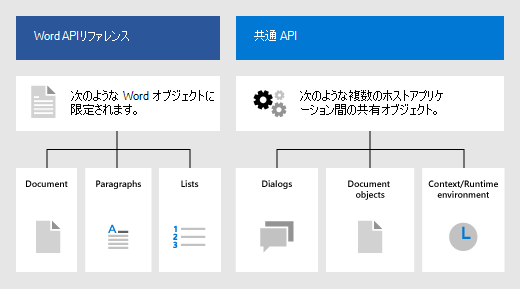

# Office アドインの Word JavaScript オブジェクト モデルWord JavaScript object model in Office Add-ins

この記事では、[Word JavaScript API](../reference/overview/word-add-ins-reference-overview.md) を使用してアドインを構築するための基本的な概念について説明します。API を使用するための基本的なコア コンセプトを紹介します。This article describes concepts that are fundamental to using the [Word JavaScript API](../reference/overview/word-add-ins-reference-overview.md) to build add-ins. It introduces core concepts that are fundamental to using the API.

> [!IMPORTANT]
> Word API の非同期性と、ドキュメントでの動作方法については、「[アプリケーション固有の API モデルの使用](../develop/application-specific-api-model.md)」を参照してください。See [Using the application-specific API model](../develop/application-specific-api-model.md) to learn about the asynchronous nature of the Word APIs and how they work with the document.

## Word 用の Office.js APIOffice.js APIs for Word

Word アドインは、次の 2 つの JavaScript オブジェクト モデルを含む Office JavaScript API を使用して、Excel のオブジェクトを操作します:A Word add-in interacts with objects in Excel by using the Office JavaScript API, which includes two JavaScript object models:

* **Word JavaScript API**: [Word JavaScript API](../reference/overview/word-add-ins-reference-overview.md) には、ドキュメント、範囲、テーブル、リスト、フォーマットなどにアクセスするために使用できる厳密に型指定されたオブジェクトが用意されています。**Word JavaScript API**: The [Word JavaScript API](../reference/overview/word-add-ins-reference-overview.md) provides strongly-typed objects that you can use to access the document, ranges, tables, lists, formatting, and more.

* **共通 API**: [共通 API](/javascript/api/office) を使用して、UI、ダイアログ、クライアント設定など、複数のタイプの Office アプリケーションに共通の機能にアクセスできます。**Common APIs**: The [Common API](/javascript/api/office) can be used to access features such as UI, dialogs, and client settings that are common across multiple types of Office applications.

Word を対象にしたアドインでは、機能の大部分を Word JavaScript API を使用して開発する可能性がありますが、共通 API のオブジェクトも使用します。While you'll likely use the Word JavaScript API to develop the majority of functionality in add-ins that target Word, you'll also use objects in the Common API. 例:For example:

* [コンテキスト](/javascript/api/office/office.context): `Context` オブジェクトは、アドインのランタイム環境を表し、API の主要なオブジェクトへのアクセスを提供します。[Context](/javascript/api/office/office.context): The `Context` object represents the runtime environment of the add-in and provides access to key objects of the API. これは `contentLanguage` や `officeTheme` などのドキュメント構成の詳細で構成され、`host` や `platform` などのアドインのランタイム環境に関する情報も提供します。It consists of document configuration details such as `contentLanguage` and `officeTheme` and also provides information about the add-in's runtime environment such as `host` and `platform`. さらに、`requirements.isSetSupported()` メソッドも提供されます。これを使用すると、指定した要件セットが、アドインが実行されている Excel アプリケーションでサポートされているかどうかを確認できます。Additionally, it provides the `requirements.isSetSupported()` method, which you can use to check whether a specified requirement set is supported by the Excel application where the add-in is running.
* [ドキュメント](/javascript/api/office/office.document): `Document` オブジェクトは `getFileAsync()` メソッドを提供します。これを使用すると、アドインが実行されている Word ファイルをダウンロードできます。[Document](/javascript/api/office/office.document): The `Document` object provides the `getFileAsync()` method, which you can use to download the Word file where the add-in is running.

## Word 固有のオブジェクト モデルWord-specific object model

Word API について理解するには、ドキュメントの構成要素が互いにどのように関連しているかを理解する必要があります。To understand the Word APIs, you must understand how the components of a document are related to one another.

* **ドキュメント** には **セクション** と、設定やカスタム XML パーツなどのドキュメントレベルのエンティティが含まれます。The **Document** contains the **Section**s, and document-level entities such as settings and custom XML parts.
* **セクション** には **本文** が含まれます。A **Section** contains a **Body**.
* **本文** は、特に **パラグラフ**、**ContentControl**、および **範囲** オブジェクトへのアクセスを提供します。A **Body** gives access to **Paragraph**s, **ContentControl**s, and **Range** objects, among others.
* **範囲** は、テキスト、空白、**テーブル**、画像など、コンテンツの連続した領域を表します。A **Range** represents a contiguous area of content, including text, white space, **Table**s, and images. また、テキストの操作方法のほとんどが含まれます。It also contains most of the text manipulation methods.
* **リスト** は、番号付きまたは箇条書きのリスト内のテキストを表します。A **List** represents text in a numbered or bulleted list.

## 関連項目See also

- [Word JavaScript API の概要Word JavaScript API overview](../reference/overview/word-add-ins-reference-overview.md)
- [最初の Word アドインをビルドするBuild your first Word add-in](../quickstarts/word-quickstart.md)
- [Word アドインのチュートリアルWord add-in tutorial](../tutorials/word-tutorial.md)
- [Word JavaScript API リファレンスWord JavaScript API reference](/javascript/api/word)
